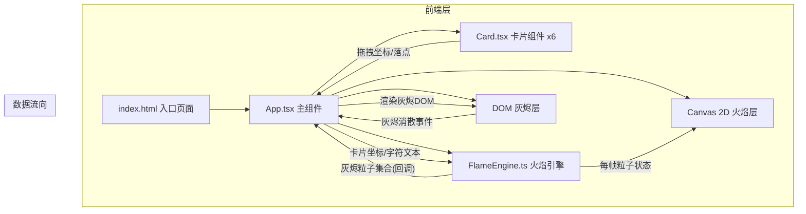

## 1. 架构设计



## 2. 技术描述

- **前端框架**：React 18 + TypeScript（严格模式，目标ES2020）
- **构建工具**：Vite + @vitejs/plugin-react
- **渲染方案**：
  - 火焰粒子：Canvas 2D API（requestAnimationFrame逐帧绘制）
  - 灰烬粒子：DOM元素（便于实时计数和CSS动画）
- **状态管理**：React useState/useRef（组件内局部状态，无需全局库）
- **动画方案**：CSS clip-path动画 + CSS transforms + Canvas粒子系统 + 正弦波扰动算法
- **初始化方式**：Vite react-ts模板

## 3. 路由定义

| 路由 | 用途 |
|-------|---------|
| / | 焚书模拟器主页面（单页应用，无路由跳转） |

## 4. 模块文件结构与调用关系

```
project-root/
├── index.html                    # 入口HTML，全屏meta标签，挂载#root
├── package.json                  # 依赖：react/react-dom/typescript/vite/@vitejs/plugin-react
├── vite.config.js                # Vite构建配置，React插件
├── tsconfig.json                 # TS严格模式，target ES2020
└── src/
    ├── main.tsx                  # React入口，渲染<App />
    ├── App.tsx                   # 主组件
    │   ├── 状态：cards[], ashParticles[], ashCount, burningCardId
    │   ├── 布局：卡片区 + 火焰区(Canvas+扇形) + 计数器 + 重置按钮
    │   ├── 回调：onCardDrop(坐标) → 调用FlameEngine.startBurn()
    │   ├── 回调：onAshDisposed(id) → ashCount++
    │   └── 渲染：<Card/>*6, Canvas火焰层, DOM灰烬层
    ├── Card.tsx                  # 卡片组件
    │   ├── Props：text, position, onDragStart, onDragEnd, onDrop
    │   ├── 拖拽：原生HTML5 Drag API + 鼠标/触摸坐标跟踪
    │   ├── 样式：浅米色、手写体、四角伪元素做旧纹理
    │   ├── 动画：拖拽缩放投影、进入火焰闪烁红光、clip-path卷曲
    │   └── 字符高亮：逐个字符span包裹，按顺序触发高亮→碎裂
    └── FlameEngine.ts            # 火焰引擎类
        ├── Particle接口：{x,y,vx,vy,size,color,alpha,life,type:'flame'|'ash'}
        ├── startBurn(cardRect, text) → 初始化燃烧状态
        ├── update(dt) → 每帧更新粒子(位置/颜色/透明度)，生成灰烬回调
        ├── renderFlame(ctx) → Canvas绘制火焰粒子和扇形层
        ├── getAshParticles() → 返回当前灰烬集合供App渲染
        ├── 粒子生成速率控制：200-300/分钟（~4/秒）
        └── 灰烬正弦扰动：y偏移 += sin(t/T*2π)*A (A=2px, T=3s)
```

## 5. 核心数据模型

### 5.1 TypeScript 类型定义

```typescript
// 卡片状态
interface CardData {
  id: string;
  text: string;
  poemLine: string;
  position: { x: number; y: number };
  originalPosition: { x: number; y: number };
  isBurning: boolean;
  isBurned: boolean;
  burnProgress: number; // 0-1
  charHighlights: boolean[]; // 每个字符是否高亮
}

// 火焰粒子（Canvas绘制）
interface FlameParticle {
  id: string;
  x: number;
  y: number;
  vx: number;
  vy: number;
  size: number; // 1-6px
  color: string; // #FF4500 ~ #8B0000
  alpha: number;
  life: number; // 剩余寿命
  maxLife: number;
}

// 灰烬粒子（DOM绘制）
interface AshParticle {
  id: string;
  char: string; // 原始字符
  x: number;
  y: number;
  startX: number;
  startY: number;
  createdAt: number;
  size: number; // 3px → 1px
  colorPhase: number; // 0-1, 控制颜色从#FFA500→#D3D3D3
  alpha: number;
  driftOffset: number; // 正弦波相位
}

// 火焰引擎输出
interface EngineOutput {
  flameParticles: FlameParticle[];
  newAshParticles: AshParticle[];
  cardBurnProgress: Record<string, number>;
  charIndicesToHighlight: Record<string, number[]>;
}
```

## 6. 关键算法说明

### 6.1 火焰扇形层渲染
```
10层同心扇形，每层角度偏移交错：
- 层i: 角度范围 [i*18°-9°, i*18°+9°]（相对向上180°范围）
- 半径: baseRadius * (1 - i*0.08) 递减
- 颜色: #FF4500 线性插值至 #8B0000（i/9）
- 透明度: 0.6 → 0.15 递减
```

### 6.2 clip-path卷曲动画
```
@keyframes curlBurn {
  0%   { clip-path: polygon(0 0, 100% 0, 100% 100%, 0 100%); }
  100% { clip-path: polygon(10% 0, 90% 0, 100% 100%, 0 100%); }
}
配合卡片y方向平移下沉，模拟从底部向上燃烧卷曲
```

### 6.3 灰烬正弦波扰动
```
每帧更新：
  t = 当前时间 - particle.createdAt
  正弦偏移 = 2 * sin(t / 3000 * 2π)
  renderX = baseX + 正弦偏移 + 线性向上飘移速度 * t
```

### 6.4 灰烬上限管理
```
维护 ashParticles[] 数组，push新灰烬前：
  if (ashParticles.length >= 100) {
    const removed = ashParticles.shift(); // 移除最旧
    if (removed.alpha > 0) onAshDisposed(removed.id); // 计入统计
  }
```
