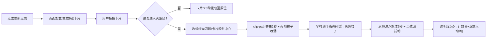

## 1. 产品概述

「纸间余烬」是一款面向文字爱好者的交互式焚书模拟器Web应用，让用户通过拖拽复古文字卡片投入火焰，体验字符被火焰舔舐、化作飘散灰烬的沉浸式美学过程。

- 核心价值：将文字与火焰艺术结合，营造复古神秘的仪式感交互体验
- 目标用户：文字爱好者、美学追求者、互动艺术体验者

## 2. 核心特性

### 2.1 特性模块

1. **主页面**：卡片陈列区、火焰燃烧区、灰烬计数器、重置按钮
2. **卡片系统**：6张复古风格诗句卡片、拖拽交互、燃烧动画
3. **火焰引擎**：Canvas 2D粒子渲染、多层扇形火焰视觉
4. **灰烬系统**：字符碎裂转化、漂浮飘散动画、收集计数

### 2.2 页面详情

| 页面名称 | 模块名称 | 功能描述 |
|-----------|-------------|---------------------|
| 主页面 | 卡片陈列区 | 两行三列布局展示6张复古诗句卡片，支持拖拽 |
| 主页面 | 火焰燃烧区 | 底部中央10层交错扇形火焰，卡片投入后吸附燃烧 |
| 主页面 | 灰烬计数器 | 右上角实时显示已收集灰烬数量，计数时带放大动画 |
| 主页面 | 重置按钮 | 左上角半透明"重新点燃"按钮，恢复全部卡片并清零计数 |
| 主页面 | 火焰粒子Canvas | 全屏Canvas，渲染火焰粒子（200-300/分钟）和燃烧特效 |
| 主页面 | 灰烬DOM层 | 灰烬粒子以DOM元素漂浮，上限100个，超出移除最旧 |

## 3. 核心流程

用户进入页面 → 看到6张复古卡片整齐排列 → 拖拽任意卡片向下移动 → 卡片进入火焰区域时边缘红光闪烁 → 卡片自动吸附至火焰中心 → 卡片从底部开始卷曲（clip-path动画2秒）→ 火焰粒子从卡片底部喷涌 → 字符逐个高亮碎裂并转化为发光灰烬 → 灰烬向上漂浮飘散并淡出（6秒）→ 灰烬完全消散时计数器+1并放大回弹 → 用户可点击"重新点燃"重置一切

## 4. 用户界面设计

### 4.1 设计风格

- **主色系**：深色渐变背景 #1A0A00 → #0D0500（垂直），火焰 #FF4500 → #8B0000，灰烬 #FFA500 → #D3D3D3
- **卡片风格**：浅米色底 (#F5E6C8)、茶褐色手写体 (#3D2914)、四角做旧纹理、尺寸160x220px
- **按钮风格**：圆角矩形、半透明深暗红 rgba(139,0,0,0.7)、悬停变 rgba(139,0,0,0.9)
- **字体**：手写体/楷体风格（营造复古氛围）
- **布局**：桌面端卡片两行三列（间距40px），移动端单列缩小（120x165px）
- **火焰视觉**：10层交错半透明扇形构成圆弧，内红外深

### 4.2 页面设计概览

| 页面名称 | 模块名称 | UI元素 |
|-----------|-------------|-------------|
| 主页面 | 卡片陈列区 | 居中排列、两行三列、间距40px、浅米色卡片 |
| 主页面 | 火焰燃烧区 | 底部中央、高度30%/移动35%、宽度80%、圆弧扇形层叠 |
| 主页面 | 卡片拖拽态 | scale(1.05)、box-shadow加深(0 8px 12px rgba(0,0,0,0.5)) |
| 主页面 | 火焰接触态 | 红光闪烁(0.1s周期/2s)、金色光晕(border-radius:50%径向渐变/1s) |
| 主页面 | 灰烬计数器 | 右上角固定、文字放大回弹(scale(1.5)→1, 0.3s) |
| 主页面 | 重置按钮 | 左上角固定、圆角矩形、半透明深红、hover变深 |

### 4.3 响应式

- **桌面优先**：默认布局两行三列，卡片160x220px，火焰占底部30%高度
- **移动适配**：宽度<768px时，卡片单列缩小至120x165px，火焰高度提升至35%
- **触控优化**：拖拽响应延时≤16ms，触控区域适配手指操作

### 4.4 性能约束

- 火焰粒子渲染保持60FPS（Canvas逐帧绘制）
- 灰烬粒子数量上限100个（超出时移除最旧）
- 拖拽响应延时不超过16ms
- 火焰粒子生成速率：200-300个/分钟，大小1-6px随机
