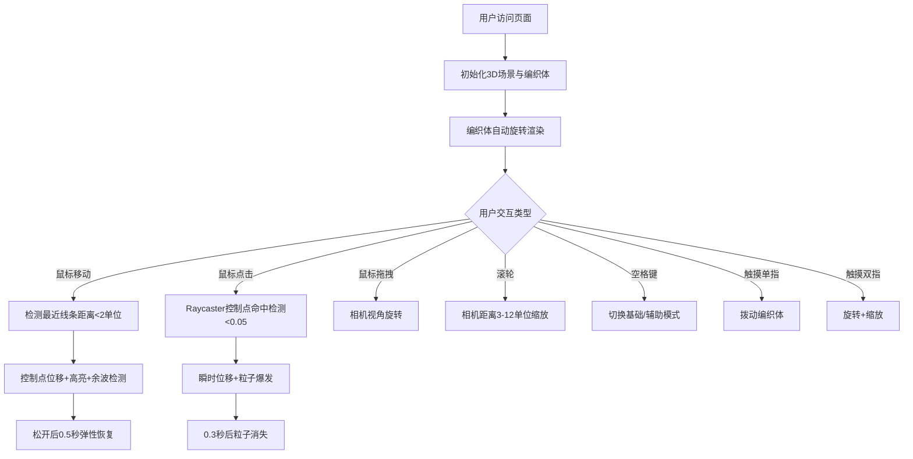

## 1. 产品概述

编织拓扑三维交互可视化应用，通过Three.js在浏览器中构建由弹性线条交织而成的动态编织体，为用户提供沉浸式空间触觉反馈模拟体验。解决传统网格动态可视化缺乏空间层次和触觉反馈的问题，适用于设计展示、创意交互、艺术装置等场景。

## 2. 核心特性

### 2.1 用户角色
本产品无需注册，所有访问用户均可获得完整体验。

| 角色 | 访问方式 | 核心权限 |
|------|----------|----------|
| 普通用户 | 浏览器直接访问 | 自由交互、切换模式、完整3D体验 |

### 2.2 功能模块

1. **3D主场景**: 编织体渲染、自动旋转、深空背景
2. **鼠标/触摸交互系统**: 控制点拨动、点击粒子、余波效果、弹性恢复
3. **视觉反馈系统**: 色彩渐变、粗细动态映射、高亮提示
4. **模式切换系统**: 基础模式/辅助模式（控制点引导球）
5. **UI信息系统**: 交互模式显示、拨动计数、实时FPS监测
6. **相机控制系统**: 旋转视角、滚轮缩放、距离限制

### 2.3 页面详情

| 页面名称 | 模块名称 | 功能描述 |
|---------|---------|----------|
| 主页面 | 3D编织体渲染 | 200条弹性线条双层编织，16控制点/线，5x5单位尺寸 |
| 主页面 | 鼠标交互 | 距离<2单位触发位移，最大偏移0.3，松开0.5秒弹性恢复 |
| 主页面 | 余波效果 | 鼠标快速划过时正弦波动0.1单位，持续0.8秒 |
| 主页面 | 点击交互 | Raycaster精确到控制点0.05范围，位移0.5，10粒子扩散0.3秒 |
| 主页面 | 色彩系统 | 纵向#FF6B6B→#4ECDC4渐变，拨动时#FFD93D高亮0.3秒 |
| 主页面 | 粗细映射 | 距中心半径线性0.08→0.16单位 |
| 主页面 | 相机控制 | 拖拽旋转、滚轮3-12单位缩放 |
| 主页面 | 模式切换 | 空格键切换基础/辅助模式（半透明0.03单位引导球，透明度0.2） |
| 主页面 | UI显示 | 左上交互模式+拨动数，右下FPS（60绿/30-59橙/<30红） |
| 主页面 | 整体旋转 | 绕Y轴每30秒一圈 |

## 3. 核心流程

## 4. 用户界面设计

### 4.1 设计风格
- **主色调**: 深空背景#0a0a1a，编织体暖红#FF6B6B到青绿#4ECDC4纵向渐变，交互高亮#FFD93D
- **字体**: Arial无衬线字体，清晰现代
- **视觉层次**: 深空背景→半透明引导球→编织体线条→UI浮层
- **动效风格**: 弹性物理感、流畅波动、粒子迸发、柔和过渡

### 4.2 页面设计概览

| 页面名称 | 模块名称 | UI元素 |
|---------|---------|--------|
| 主页面 | 深空背景 | #0a0a1a纯色，居中聚焦编织体 |
| 主页面 | 编织体 | 彩色弹性线条，双层交错，整体缓缓自转 |
| 主页面 | 引导球 | 控制点位置半透明白色小球，仅辅助模式显示 |
| 主页面 | 粒子效果 | 点击时彩色小粒子随机方向扩散 |
| 主页面 | 左上UI | 半透明卡片，交互模式（拨动/点击）+ 拨动数量统计 |
| 主页面 | 右下FPS | 动态颜色数字（绿/橙/红） |
| 主页面 | 光标 | 悬停控制点时切换手形指针 |

### 4.3 响应式设计
- **桌面优先**: 标准全屏3D渲染，鼠标+键盘交互
- **移动端适配**: 触摸事件映射（单指拨动、双指旋转缩放）
- **自适应布局**: UI元素相对定位，编织体随窗口尺寸自动调整

### 4.4 3D场景指引
- **环境**: 深空纯色背景，无HDRI，聚焦主体表现
- **光照**: 基础环境光+定向光，确保线条颜色清晰可见
- **相机**: 初始距离8单位，观察Y轴0高度，支持OrbitControls
- **构图**: 编织体居中，占屏幕核心视觉区域，UI浮于边角不遮挡
- **交互**: 鼠标Raycaster精确命中、控制点位移物理模拟、余波传递效果
- **性能**: InstancedMesh/LineSegments减少Draw Call<50，FPS稳定60
- **资产**: 纯程序化生成，无需外部3D资产，顶点总数<8000
