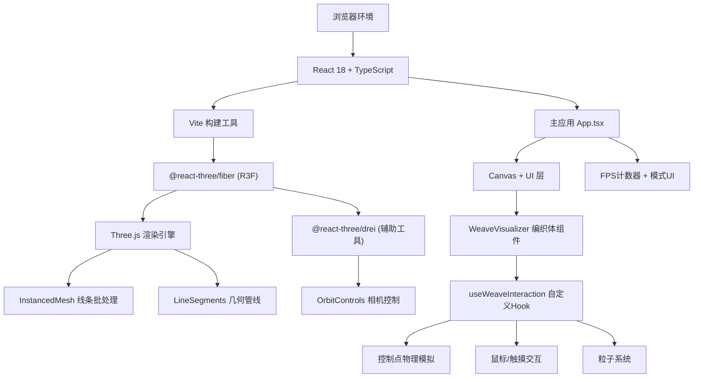

## 1. 架构设计



## 2. 技术说明

- **前端框架**: React@18 + TypeScript@5（严格模式）
- **构建工具**: Vite@5 + @vitejs/plugin-react
- **3D引擎**: Three.js@0.160 + @react-three/fiber@8 + @react-three/drei@9
- **状态管理**: React useState/useRef（轻量级场景，无需zustand）
- **渲染管线**: LineSegments + BufferGeometry 批处理线条，InstancedMesh 渲染控制点引导球
- **交互检测**: Three.js Raycaster 精确射线检测
- **物理模拟**: 自定义弹性恢复算法（弹簧阻尼模型，非物理引擎）
- **无后端**: 纯前端应用，所有逻辑客户端执行

## 3. 路由定义

本应用为单页全屏3D应用，无多路由需求。

| 路由 | 用途 |
|------|------|
| / | 主应用页面：编织体3D场景 + UI浮层 |

## 4. 核心数据结构

### 4.1 类型定义

```typescript
interface ControlPoint {
  id: string;
  basePosition: THREE.Vector3;  // 初始位置
  currentPosition: THREE.Vector3;  // 当前位置
  velocity: THREE.Vector3;  // 速度（弹性恢复用）
  targetOffset: THREE.Vector3;  // 目标偏移（交互时设置）
  isHighlighted: boolean;  // 是否高亮
  highlightTime: number;  // 高亮剩余时间(秒)
  rippleOffset: number;  // 余波相位
  rippleTime: number;  // 余波剩余时间
}

interface WeaveLine {
  id: string;
  layer: 0 | 1;  // 0=水平层, 1=垂直层
  orientation: 'horizontal' | 'vertical';
  baseColor: THREE.Color;  // 基线颜色
  controlPoints: ControlPoint[];  // 16个控制点
  lineThickness: number;  // 线粗（计算好的值）
  wasTouched: boolean;  // 是否被拨动过（用于统计）
}

interface Particle {
  id: string;
  position: THREE.Vector3;
  velocity: THREE.Vector3;
  color: THREE.Color;
  size: number;  // 0.02-0.05
  life: number;  // 剩余寿命0-1
}

type InteractionMode = 'pluck' | 'click';
type DisplayMode = 'basic' | 'assist';

interface WeaveInteractionState {
  lines: WeaveLine[];
  particles: Particle[];
  interactionMode: InteractionMode;
  displayMode: DisplayMode;
  touchedLineCount: number;
}
```

### 4.2 常量配置

```typescript
const CONFIG = {
  GRID_SIZE: 5,           // 整体5x5单位
  GRID_STEP: 0.5,         // 控制点间隔0.5
  CONTROL_POINTS: 16,     // 每条线16个控制点
  LINES_PER_LAYER: 100,   // 每层100条线（2层共200条）
  INTERACT_DISTANCE: 2,   // 交互触发距离<2单位
  MAX_PLUCK_OFFSET: 0.3,  // 拨动最大偏移0.3
  CLICK_OFFSET: 0.5,      // 点击瞬时位移0.5
  RECOVER_TIME: 0.5,      // 弹性恢复0.5秒
  HIGHLIGHT_TIME: 0.3,    // 高亮持续0.3秒
  RIPPLE_AMPLITUDE: 0.1,  // 余波幅度0.1
  RIPPLE_DURATION: 0.8,   // 余波持续0.8秒
  HIT_RADIUS: 0.05,       // 点击命中半径0.05
  PARTICLE_COUNT: 10,     // 每次点击10粒子
  PARTICLE_LIFE: 0.3,     // 粒子寿命0.3秒
  MIN_LINE_THICKNESS: 0.08,
  MAX_LINE_THICKNESS: 0.16,
  ROTATION_PERIOD: 30,    // 每30秒自转一圈
  MIN_CAMERA_DISTANCE: 3,
  MAX_CAMERA_DISTANCE: 12,
  GUIDE_SPHERE_SIZE: 0.03,
  GUIDE_SPHERE_OPACITY: 0.2,
  COLOR_TOP: '#FF6B6B',   // 暖红（顶部）
  COLOR_BOTTOM: '#4ECDC4',// 青绿（底部）
  COLOR_HIGHLIGHT: '#FFD93D', // 高亮黄
  BG_COLOR: '#0a0a1a',    // 深空背景
};
```

## 5. 性能优化策略

### 5.1 渲染优化
- **LineSegments 批处理**: 所有200条线条合并到单个 BufferGeometry，一次 Draw Call
- **InstancedMesh 引导球**: 3200个控制点引导球使用实例化渲染，1次 Draw Call
- **总 Draw Call ≤ 5**: 线条(1) + 引导球(1) + 粒子(1) + 光照(2)，远小于50限制
- **顶点总数预算**: 200线×15段×2顶点 = 6000 < 8000限制

### 5.2 计算优化
- **useRef 存储数据**: 大数组（控制点/粒子）存ref避免re-render
- **requestAnimationFrame 单循环**: R3F useFrame统一驱动所有动画
- **空间加速**: 层+索引O(1)访问线条，避免每帧全量遍历
- **快速距离检查**: 距离平方比较避免sqrt运算

### 5.3 内存预算
- 峰值目标: < 200MB
- 主要消耗: Three.js 几何体缓冲(约30MB) + React组件(约10MB) + 浏览器基础(约80MB)

## 6. 项目文件结构

```
auto47/
├── package.json              # 依赖配置
├── vite.config.js            # Vite配置
├── tsconfig.json             # TS严格模式配置
├── index.html                # 入口HTML
└── src/
    ├── App.tsx               # 主应用：Canvas + UI
    ├── hooks/
    │   └── useWeaveInteraction.ts   # 核心交互Hook
    └── components/
        └── WeaveVisualizer.tsx       # 编织体3D渲染组件
```

## 7. 关键算法说明

### 7.1 编织体生成
- 水平层(层0): 100条水平线沿Y轴分布，每条含16个控制点沿X轴排列，Z=-0.01
- 垂直层(层1): 100条垂直线沿X轴分布，每条含16个控制点沿Y轴排列，Z=+0.01
- 控制点位置: basePosition = (i * step - size/2, j * step - size/2, layer_offset)
- 线粗计算: thickness = lerp(0.08, 0.16, radius / maxRadius)

### 7.2 弹性恢复模拟
- 弹簧模型: position += velocity * dt
- 阻尼恢复: velocity += -k * offset - damping * velocity
- 参数校准: k=80, damping=8，确保0.5秒内收敛

### 7.3 余波传播
- 检测到快速移动时rippleTime = 0.8，相位随控制点索引递增
- 每帧: offset = sin(phase + time*10) * amplitude * (rippleTime/duration)
- 沿线条法线方向叠加

### 7.4 命中检测
- 鼠标射线NDC坐标转换
- 遍历最近线条 → 计算射线上点到控制点距离
- 距离<0.05即命中，返回最近控制点

### 7.5 色彩插值
- 纵向位置归一化: t = (y + 2.5) / 5 → [0,1]
- Color.lerpColors(COLOR_TOP, COLOR_BOTTOM, t)
- 高亮时瞬时切到COLOR_HIGHLIGHT，0.3秒线性褪色回基色
