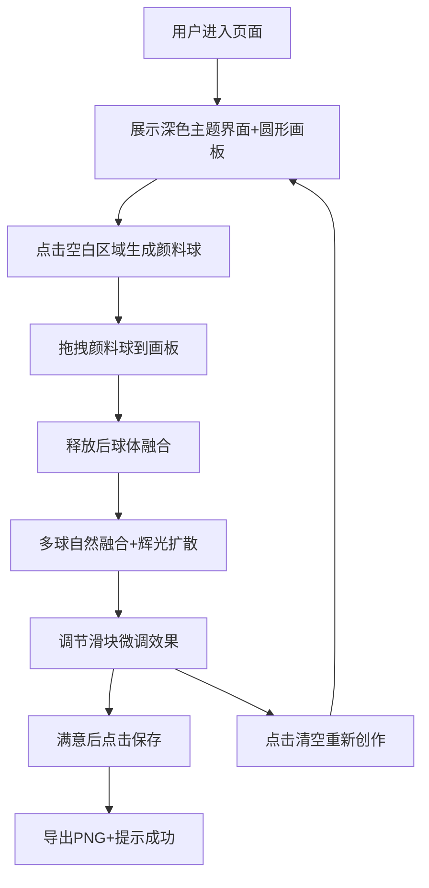

## 1. 产品概述

「辉光调色盘」是一款基于浏览器的交互式色彩混合与形态生成应用，解决传统颜色选择器在展示色彩间平滑过渡和动态形态缺乏沉浸感的问题。用户通过拖拽彩色颜料球到圆形画板中，体验自然的色彩融合与辉光晕染效果，创造流动的彩色艺术作品。

- 核心价值：将枯燥的颜色选择转化为沉浸式的艺术创作体验
- 目标用户：设计师、艺术爱好者、创意工作者、普通用户

## 2. 核心功能

### 2.1 功能模块

1. **画板区域**：颜料球生成、拖拽交互、色彩融合渲染、辉光扩散、纹理粒子
2. **控制面板**：亮度调节滑块、扩散速度滑块、纹理复杂度滑块
3. **操作按钮**：清空画板、保存PNG图片、保存成功提示

### 2.2 页面详情

| 页面名称 | 模块名称 | 功能描述 |
|---------|---------|---------|
| 主页面 | 颜料球生成 | 点击画板外空白区域生成随机颜色颜料球（6种鲜明色系），初始半径20px |
| 主页面 | 拖拽交互 | 按住鼠标拖拽颜料球移动，拖拽时产生半透明辉光拖尾效果（0.3秒淡出） |
| 主页面 | 色彩融合 | 距离小于球心距之和时开始融合，10个中间色采样点渐变，柔和羽化模糊8px |
| 主页面 | 辉光扩散 | 融合区域缓慢扩散（1-10px/秒可调），整体亮度可调（0.5-2.0倍） |
| 主页面 | 纹理粒子 | 辉光内部叠加细碎光点（2-6px随机大小），呼吸闪烁动画（0.5-1.5秒周期） |
| 主页面 | 亮度控制 | 滑块调节辉光整体亮度（0.5-2.0，默认1.0） |
| 主页面 | 扩散控制 | 滑块调节扩散速度（1-10px/秒） |
| 主页面 | 纹理控制 | 滑块调节光点密度（0-100） |
| 主页面 | 清空功能 | 一键恢复黑色初始背景 |
| 主页面 | 保存功能 | 导出800x800px PNG图片，保存后弹出提示条2秒后消失 |

## 3. 核心流程

## 4. 用户界面设计

### 4.1 设计风格

- **主色调**：深色背景 #1A1A2E，霓虹色系（红#FF3366、橙#FF9933、黄#FFD700、绿#33CC66、蓝#3399FF、紫#9933FF）
- **辅助渐变色**：环形边框 #FF6B6B → #6BCBFF（180度渐变），按钮 #667eea → #764ba2
- **字体**：现代无衬线字体，标题 letter-spacing 4px，字号 28px（移动端20px）
- **按钮样式**：圆形按钮（直径50px），渐变填充，hover时亮度+20% + scale放大，0.2s过渡
- **滑块样式**：渐变轨道（深灰#333→功能色），带内阴影圆形滑块头
- **整体风格**：深色霓虹、沉浸感、现代科技感，所有元素带 0.3s ease 平滑过渡动画

### 4.2 页面设计概览

| 页面名称 | 模块名称 | UI元素 |
|---------|---------|--------|
| 主页面 | 标题区 | 居中白色大标题「辉光调色盘」，字母间距4px，顶部留白 |
| 主页面 | 画板区 | 800x800px圆形画板（border-radius:50%），环形渐变边框，黑色底 |
| 主页面 | 滑块控件 | 一行排列，左侧图标+数值显示，渐变轨道，圆形滑块头 |
| 主页面 | 操作按钮 | 底部居中两个圆形按钮（清空/保存），蓝紫渐变，hover动画 |
| 主页面 | 提示条 | 底部弹出半透明提示，2秒自动消失 |

### 4.3 响应式设计

- **桌面端（≥900px）**：画板800x800px，控件一行排列，标题28px
- **移动端（<900px）**：画板缩小为400x400px，控件变为两行，标题20px
- **触控优化**：颜料球拖拽区域增大，按钮触控目标≥44px

### 4.4 性能指标

- **渲染帧率**：60fps稳定，20个颜料球同时融合时≥55fps
- **交互延迟**：鼠标拖拽颜料球延迟≤50ms
- **渲染技术**：Canvas 2D硬件加速，离屏缓冲优化融合计算
