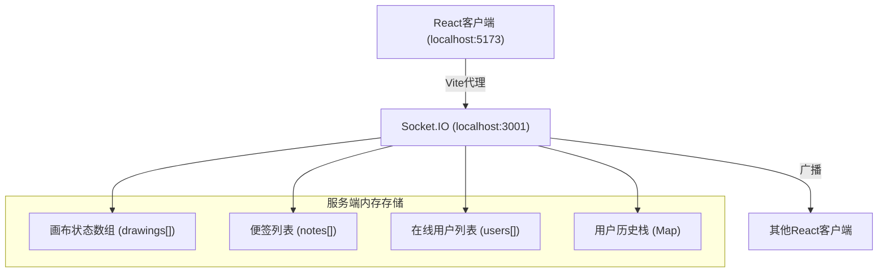

## 1. 架构设计



## 2. 技术描述
- **前端**：React 18 + TypeScript + Vite
- **实时通信**：Socket.IO 客户端/服务端
- **后端**：Express 4 + Socket.IO + TypeScript (ts-node)
- **数据存储**：服务端内存临时存储
- **启动脚本**：npm run dev（同时启动前后端，concurrently）

## 3. 目录结构

```
.
├── package.json
├── vite.config.js
├── tsconfig.json
├── index.html
└── src/
    ├── server/
    │   └── index.ts              # Express+Socket.IO服务端
    └── client/
        ├── main.tsx              # React入口
        ├── App.tsx               # 主组件，Socket.IO集成
        ├── Canvas.tsx            # Canvas绘制模块
        ├── NotePad.tsx           # 便签组件
        ├── Toolbar.tsx           # 顶部工具条
        ├── Sidebar.tsx           # 右侧侧边栏
        ├── CursorLayer.tsx       # 光标同步层
        ├── types.ts              # 共享类型定义
        ├── socket.ts             # Socket.IO客户端实例
        └── styles.css            # 全局样式
```

## 4. 共享类型定义

```typescript
// 绘图工具类型
type ToolType = 'pencil' | 'rectangle' | 'circle';

// 绘图指令
interface DrawCommand {
  id: string;
  userId: string;
  tool: ToolType;
  color: string;
  strokeWidth: number;
  fill?: boolean;
  fillAlpha?: number;
  points?: { x: number; y: number }[];  // pencil路径
  startX?: number;
  startY?: number;
  endX?: number;
  endY?: number;  // rectangle/circle
  timestamp: number;
  undone?: boolean;
}

// 便签
interface Note {
  id: string;
  userId: string;
  x: number;
  y: number;
  content: string;
  color: string;
}

// 用户
interface User {
  id: string;
  name: string;
  color: string;
  cursor?: { x: number; y: number };
}
```

## 5. Socket.IO事件定义

| 事件名 | 方向 | 数据 | 说明 |
|--------|------|------|------|
| `join` | C→S | { name: string } | 用户加入 |
| `userList` | S→C | User[] | 用户列表更新 |
| `draw` | C→S | DrawCommand | 发送绘图指令 |
| `draw` | S→C | DrawCommand | 广播绘图指令 |
| `drawBatch` | S→C | DrawCommand[] | 历史绘图数据 |
| `undo` | C→S | { userId: string } | 撤销请求 |
| `undoBroadcast` | S→C | { userId: string; commandId: string } | 撤销广播 |
| `clearCanvas` | C→S | - | 清空画布 |
| `canvasCleared` | S→C | - | 画布清空广播 |
| `addNote` | C→S | Note | 添加便签 |
| `addNote` | S→C | Note | 广播便签添加 |
| `updateNote` | C→S | Note | 更新便签（位置/内容） |
| `updateNote` | S→C | Note | 广播便签更新 |
| `deleteNote` | C→S | { id: string } | 删除便签 |
| `deleteNote` | S→C | { id: string } | 广播便签删除 |
| `noteBatch` | S→C | Note[] | 历史便签数据 |
| `cursorMove` | C→S | { x: number; y: number } | 光标移动 |
| `cursorUpdate` | S→C | { userId: string; x: number; y: number } | 光标同步 |
| `disconnect` | C→S | - | 用户断开 |
```
