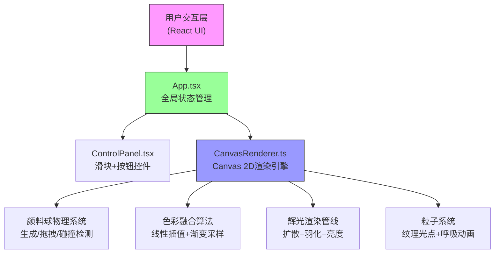

## 1. 架构设计



## 2. 技术栈说明

- **前端框架**：React 18 + TypeScript（严格模式）
- **构建工具**：Vite 5 + @vitejs/plugin-react
- **渲染引擎**：Canvas 2D API（原生高性能绘制）
- **样式方案**：内联样式 + CSS-in-JS（React style属性）
- **目标标准**：ES2020，原生支持现代浏览器

## 3. 文件组织结构

| 文件路径 | 职责说明 |
|---------|---------|
| `package.json` | 项目依赖配置（react/react-dom/typescript/vite/@vitejs/plugin-react），启动脚本 `npm run dev` |
| `vite.config.js` | Vite构建配置，启用React插件，优化开发服务器 |
| `tsconfig.json` | TypeScript配置，严格模式，target ES2020，JSX: react-jsx |
| `index.html` | 入口HTML，含viewport meta标签，挂载点 `<div id="root">` |
| `src/App.tsx` | 主组件：管理颜料球数组、滑块状态（亮度/扩散/纹理），渲染布局，处理事件回调 |
| `src/CanvasRenderer.ts` | Canvas渲染核心类：封装所有绘制逻辑、物理模拟、事件绑定，对外暴露 render() 和事件接口 |
| `src/ControlPanel.tsx` | 控制面板组件：三个渐变滑块（亮度/扩散速度/纹理）+ 数值显示，向父组件抛 onChange 事件 |

## 4. 核心数据结构

### 4.1 颜料球 (PaintBall)

```typescript
interface PaintBall {
  id: number;
  x: number;           // 圆心x坐标
  y: number;           // 圆心y坐标
  radius: number;      // 半径（初始20px）
  color: string;       // 颜色（6种固定色之一）
  velocityX: number;   // x方向速度（扩散用）
  velocityY: number;   // y方向速度（扩散用）
  isDragging: boolean; // 是否正在拖拽
  baseRadius: number;  // 基础半径（扩散计算用）
}
```

### 4.2 纹理粒子 (TextureParticle)

```typescript
interface TextureParticle {
  x: number;
  y: number;
  size: number;          // 2-6px随机
  color: string;
  brightness: number;    // 0.5-1.5倍
  phase: number;         // 呼吸相位
  cycle: number;         // 呼吸周期 0.5-1.5秒
}
```

### 4.3 拖尾效果 (TrailPoint)

```typescript
interface TrailPoint {
  x: number;
  y: number;
  radius: number;
  color: string;
  opacity: number;   // 0.6→0 渐变
  birthTime: number; // 用于计算存活时间
}
```

## 5. 渲染管线说明

### 5.1 每帧渲染步骤 (60fps)

```
requestAnimationFrame
  ↓
1. 更新物理状态
   - 更新拖尾透明度（0.3秒衰减）
   - 颜料球扩散（扩散速度 × 时间增量）
   - 粒子呼吸动画更新
  ↓
2. 碰撞融合检测
   - 两两计算球心距
   - 距离 < 半径和 → 标记融合对
   - 生成10个中间色采样点（线性插值）
  ↓
3. 离屏缓冲绘制
   - 清空离屏canvas
   - 绘制单个颜料球（径向渐变 + blur 8px羽化）
   - 绘制融合区域渐变（10段线性插值）
   - 绘制拖尾效果
   - 绘制纹理粒子（呼吸透明度）
  ↓
4. 合成到主画布
   - 应用亮度全局系数（globalAlpha 或 filter）
   - drawImage 离屏canvas → 主canvas
  ↓
下一帧
```

### 5.2 关键算法

**色彩线性插值（10个中间色）**：
```
for i in 0..9:
  t = i / 9
  R = R1 + (R2-R1) × t
  G = G1 + (G2-G1) × t
  B = B1 + (B2-B1) × t
```

**羽化模糊**：Canvas `filter: blur(8px)` 或径向渐变alpha衰减

**扩散计算**：每帧 `radius += diffSpeed × deltaTime / 1000 × (baseFactor)`

## 6. 事件绑定机制

CanvasRenderer 暴露以下接口给 App.tsx：

- `bindCanvas(canvas: HTMLCanvasElement)`: 绑定canvas元素，初始化上下文
- `onMouseDown(x, y)`: 处理按下（开始拖拽 / 检测点击空白生成新球）
- `onMouseMove(x, y)`: 处理拖拽移动
- `onMouseUp(x, y)`: 处理释放
- `render()`: 手动触发重绘
- `setBrightness(v)`: 更新亮度参数
- `setDiffusionSpeed(v)`: 更新扩散速度参数
- `setTextureDensity(v)`: 更新纹理密度参数
- `clear()`: 清空画板
- `exportImage(): string`: 返回 dataURL PNG (800x800)

## 7. 性能优化策略

1. **离屏双缓冲**：使用 OffscreenCanvas 或第二个 canvas 进行绘制，最后一次性合成，避免频繁重绘闪烁
2. **脏矩形裁剪**：仅重绘变化区域（颜料球扩散范围 + 拖尾范围）
3. **融合计算缓存**：每帧只计算位置变化的球对融合
4. **粒子对象池**：纹理粒子预分配，避免频繁GC
5. **requestAnimationFrame**：严格跟随浏览器刷新率，使用 deltaTime 保证动画速度一致
6. **CSS will-change**：对canvas和按钮设置 will-change: transform 提升合成层性能
