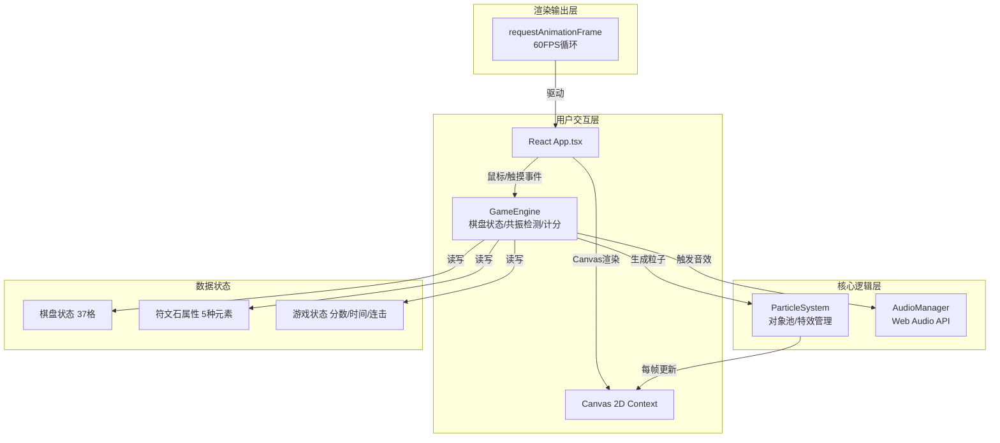

## 1. 架构设计



---

## 2. 技术描述

- **前端框架**：React 18 + TypeScript
- **构建工具**：Vite 5 + @vitejs/plugin-react
- **渲染引擎**：Canvas 2D API（游戏实体、粒子特效）
- **音频引擎**：Web Audio API（OscillatorNode + GainNode 合成八音盒音效）
- **状态管理**：GameEngine 内部状态机 + React useState（UI层状态）
- **动画驱动**：requestAnimationFrame（60FPS 游戏循环）
- **无后端**：纯前端实现，无需服务器

---

## 3. 核心数据结构定义

### 3.1 元素属性枚举

```typescript
enum ElementType {
  FIRE = 'fire',      // 火 - 523Hz
  WATER = 'water',    // 水 - 659Hz
  WIND = 'wind',      // 风 - 784Hz
  EARTH = 'earth',    // 土 - 440Hz
  LIGHT = 'light',    // 光 - 880Hz
}
```

### 3.2 符文石对象

```typescript
interface Rune {
  id: string;
  element: ElementType;
  row: number;
  col: number;
  isGolden: boolean;        // 金色高分符文
  energyMultiplier: number; // 能量吸收后的得分倍率
  energyUntil: number;      // 能量效果截止时间戳
  animating: boolean;       // 是否在动画中
  targetX?: number;         // 动画目标坐标
  targetY?: number;
  flashPhase?: number;      // 闪烁相位
  isBeingRemoved?: boolean; // 是否正在被消除
}
```

### 3.3 六边形坐标系统（偏移坐标系）

```typescript
// 棋盘布局：7行，奇数行6格、偶数行5格
// 行号 0: [5格]  row 0
// 行号 1: [6格]  row 1
// 行号 2: [5格]  row 2
// 行号 3: [6格]  row 3
// 行号 4: [5格]  row 4
// 行号 5: [6格]  row 5
// 行号 6: [5格]  row 6
// 总计: 5+6+5+6+5+6+5 = 37格

interface HexCoord {
  row: number;  // 0-6
  col: number;  // 取决于行数
}
```

### 3.4 游戏状态

```typescript
interface GameState {
  status: 'idle' | 'playing' | 'ended';
  score: number;
  combo: number;              // 连续消除次数
  timeLeft: number;           // 剩余秒数
  boardRotation: number;      // 棋盘旋转角度（度）
  playbackSpeed: number;      // 播放速度 1x / 2x
  lastResonanceElements: ElementType[];  // 最近3次不同属性共振记录
  lastResonanceTime: number;  // 上次共振时间戳（用于3秒窗口检测）
  resonanceTypesTriggered: Set<ElementType>;  // 触发过的共振种类
  tideActivated: boolean;     // 元素潮汐是否已激活待触发
}
```

---

## 4. 共振检测算法

### 4.1 相邻定义（六边形6方向）

```typescript
// 偶数行 (0,2,4,6) 的相邻偏移：
//   [row-1, col-1] [row-1, col]
// [row, col-1]        [row, col+1]
//   [row+1, col-1] [row+1, col]
//
// 奇数行 (1,3,5) 的相邻偏移：
//   [row-1, col] [row-1, col+1]
// [row, col-1]        [row, col+1]
//   [row+1, col] [row+1, col+1]
```

### 4.2 形状匹配规则

| 形状 | 要求 | 检测策略 |
|-----|------|---------|
| 直线 | 连续3颗同属性，六边形直线方向共6种 | 对每个符文沿6方向延伸2格检测 |
| 三角形 | 3颗同属性构成紧邻等边三角形 | 枚举每个符文与其相邻对，检查第三点 |
| 菱形 | 4颗同属性构成对称菱形 | 基于中心+上下+左右的对称检测 |

---

## 5. 粒子系统设计

### 5.1 粒子对象（对象池）

```typescript
interface Particle {
  active: boolean;
  x: number; y: number;
  vx: number; vy: number;
  life: number; maxLife: number;
  color: string;
  size: number;
  type: 'explode' | 'vortex' | 'halo';
  angle?: number;
  radius?: number;
}
```

### 5.2 对象池优化

- 预分配 500 个 Particle 对象
- 分配/回收仅改变 active 标志，避免 GC
- 每帧遍历 active 粒子更新，跳过 inactive

---

## 6. 文件组织结构

```
auto49/
├── package.json
├── vite.config.js
├── tsconfig.json
├── index.html
└── src/
    ├── index.tsx          # React 入口
    ├── App.tsx            # 主组件：UI组装、事件绑定、渲染循环
    ├── GameEngine.ts      # 核心：棋盘/拖拽/共振/计分/潮汐
    ├── ParticleSystem.ts  # 粒子：爆炸/旋涡/光环 + 对象池
    └── AudioManager.ts    # 音效：Web Audio 八音盒合成
```

---

## 7. 渲染管线（每帧执行顺序）

```
1. GameEngine.update(dt)
   ├─ 更新倒计时
   ├─ 更新符文石过渡动画（0.3s插值）
   ├─ 更新闪烁相位（6Hz脉动）
   └─ 更新能量倍率倒计时

2. ParticleSystem.update(dt)
   ├─ 爆炸粒子：匀速运动 + 淡出
   ├─ 旋涡粒子：螺旋向心 + 收缩
   └─ 光环粒子：半径递增 + 旋转

3. Render to Canvas
   ├─ 清空画布
   ├─ 绘制星空背景
   ├─ 绘制棋盘格（带旋转变换）
   ├─ 绘制符文石（底色+符号+发光+倍率指示）
   ├─ 绘制粒子层
   └─ 绘制元素潮汐光环/旋涡

4. AudioManager.update()
   └─ 调度待播放音效队列
```
