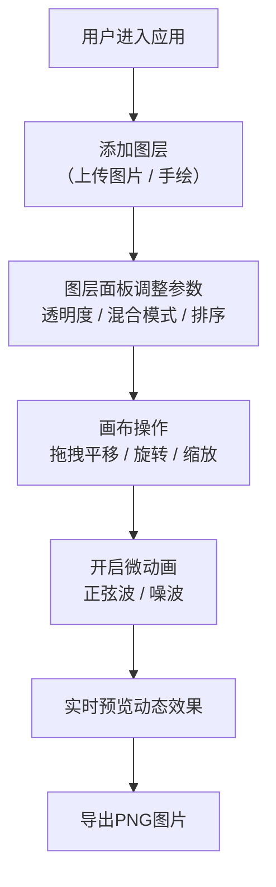

## 1. 产品概述

「活态拼贴·图层工坊」是一款面向拼贴艺术爱好者的浏览器端创意工具，支持用户通过多层动态纹理、照片和手绘线条叠加创作「活态拼贴画」。每层元素可独立变换、调整混合模式，并添加微动动画产生呼吸般的缓慢运动感。

- 目标用户：拼贴艺术爱好者、视觉创作者、设计师
- 核心价值：零门槛实现专业级多层拼贴效果，让静态作品「活起来」

## 2. 核心功能

### 2.1 功能模块
1. **主画布区域**：Canvas 2D渲染、图层变换手柄、手绘模式、图层点击选择
2. **图层面板**：图层缩略图列表、拖拽排序、参数调节控件、混合模式选择、微动画开关
3. **工具栏**：添加图片图层按钮、切换手绘模式、导出PNG、重置所有图层

### 2.2 页面详情
| 页面名称 | 模块名称 | 功能描述 |
|-----------|-------------|---------------------|
| 主工作区 | 画布渲染 | 使用Canvas 2D按图层顺序合成，支持globalCompositeOperation混合模式，实时响应图层参数变化 |
| 主工作区 | 变换控制 | 选中图层显示虚线边框+旋转/缩放手柄，支持拖拽平移、旋转、缩放，实时预览效果 |
| 主工作区 | 手绘功能 | 切换到手绘模式后可在空白区域绘制线条，绘制完成自动生成新图层 |
| 图层面板 | 图层列表 | 显示所有图层缩略图（80x80px），支持点击选中、拖拽改变z轴顺序 |
| 图层面板 | 透明度控制 | Material Design风格滑条，范围0-100%，实时更新图层透明度 |
| 图层面板 | 混合模式 | 下拉选择框：Normal/Multiply/Screen/Overlay/Darken/Lighten |
| 图层面板 | 微动画设置 | 开关按钮+类型选择（正弦波/噪波）+振幅(1-20px)+频率(0.1-5Hz) |
| 工具栏 | 图层操作 | 上传图片（≤8MB jpg/png）、切换手绘、导出1920x1080 PNG、重置画布 |

## 3. 核心流程

### 主用户流程
用户打开应用 → 添加图片图层或手绘 → 在右侧面板调整图层顺序/透明度/混合模式 → 在画布上拖拽/旋转/缩放图层 → 为图层开启微动画并调节参数 → 导出PNG作品

## 4. 用户界面设计

### 4.1 设计风格
- **主色调**：深灰画布背景 #1e1e1e，面板浅灰 #f5f5f5，主题蓝 #4a90d9
- **强调色**：微动画指示绿 #4caf50，手柄悬浮 #357abd
- **字体**：标题使用 Playfair Display，正文使用 Source Sans Pro（Google Fonts）
- **控件风格**：Material Design，圆角4px，过渡动画0.3s ease
- **视觉细节**：选中图层2px蓝色虚线边框（0.5s闪烁动画），微动画开启时缩略图右下角10x10px旋转绿点（1.5s/圈）

### 4.2 页面布局
| 区域 | 位置 | 尺寸 | 说明 |
|-----------|-------------|-------------|-------------|
| 画布区 | 左侧 | 70%宽度 | 深灰背景，居中显示拼贴内容，鼠标交互区 |
| 图层面板 | 右侧 | 280px固定 | 浅灰背景，图层缩略图纵向排列，控件紧凑布局 |
| 工具栏 | 顶部 | 全宽 | 添加图层按钮、手绘切换、导出、重置按钮 |

### 4.3 响应式设计
- 桌面端（≥768px）：左侧70%画布 + 右侧280px面板的左右布局
- 移动端（<768px）：顶部画布自适应 + 底部120px高度的面板，缩略图横向滚动排列
- 触控优化：变换手柄触控区域扩大至40x40px，支持双指缩放旋转

### 4.4 变换手柄规范
- 选中图层显示蓝色虚线边框（2px dashed #4a90d9，0.5s闪烁）
- 四角：缩放手柄（8x8px实心方块#4a90d9，hover变#357abd）
- 顶部外侧：旋转手柄（圆形12px带旋转图标，距边框20px）
- 所有手柄定位跟随图层边界精确计算，考虑旋转角度
