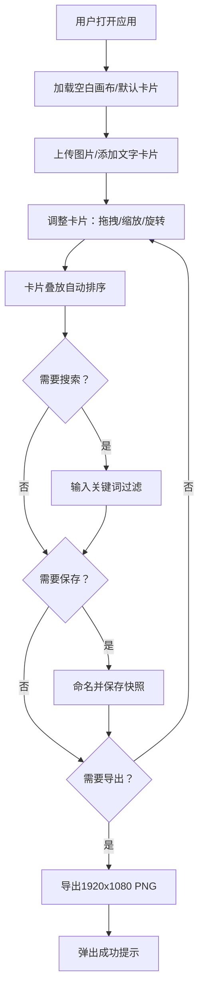

## 1. 产品概述

「浮层札记」是一款面向资料整理爱好者的交互式拼贴墙应用，帮助用户将散落在各处的网页截图、代码片段和手绘笔记以拼贴艺术墙的形式进行整理和展示。用户可自由旋转、缩放、叠放卡片，通过半透明叠放效果探索式地构建视觉叙事。

- 核心目标：提供一个高自由度、富有探索感的数字拼贴工作空间
- 目标用户：资料整理爱好者、设计师、研究者、内容创作者
- 市场价值：填补传统笔记工具线性展示方式与创意拼贴需求之间的空白

## 2. 核心功能

### 2.1 用户角色
| 角色 | 注册方式 | 核心权限 |
|------|---------|---------|
| 普通用户 | 无需注册，本地使用 | 创建/编辑卡片、保存布局快照、导出图片 |

### 2.2 功能模块
1. **主拼贴墙页面**：Canvas渲染的卡片画布、顶部搜索栏、左侧工具栏、侧边快照列表
2. **卡片管理系统**：图片上传、文字卡片生成、标题编辑、背景色选择
3. **交互操作系统**：拖拽移动、滚轮缩放、右键旋转、叠放层级管理
4. **搜索过滤系统**：关键词匹配、淡入淡出动画、发光高亮效果
5. **快照管理系统**：保存布局、快照列表、平滑过渡恢复
6. **导出系统**：高清PNG导出、成功提示模态

### 2.3 页面详情
| 页面名称 | 模块名称 | 功能描述 |
|---------|---------|---------|
| 主拼贴墙页面 | 顶部搜索栏 | 关键词搜索过滤，匹配卡片发光突出，不匹配卡片淡出消失 |
| 主拼贴墙页面 | 左侧工具栏 | 上传图片按钮、添加文字按钮、导出PNG按钮、移动端侧边栏切换 |
| 主拼贴墙页面 | 卡片画布区域 | Canvas 2D渲染所有卡片，支持拖拽、缩放、旋转、半透明叠放 |
| 主拼贴墙页面 | 侧边快照栏 | 快照列表展示，保存当前布局，点击平滑恢复 |
| 主拼贴墙页面 | 卡片编辑浮层 | 编辑标题标签（≤20字符）、选择12色背景色、删除卡片 |
| 主拼贴墙页面 | 导出成功模态 | 提示"导出成功"信息，自动关闭或手动关闭 |

## 3. 核心流程

用户打开应用 → 看到空白拼贴墙（可加载默认示例卡片）→ 通过上传按钮导入图片或添加文字卡片 → 拖拽/滚轮缩放/右键旋转调整卡片位置与形态 → 卡片叠放时自动按Z序排列，上层半透明 → 输入搜索关键词过滤卡片 → 满意后保存命名快照 → 导出高清PNG分享

## 4. 用户界面设计

### 4.1 设计风格
- **主色调**：深色背景 #1A1A2E，卡片白色 #FAFAFA，发光强调 #6C63FF / #FFD700
- **按钮风格**：圆角8px，深色半透明底，悬停上浮效果，0.2s过渡动画
- **字体**：标题使用具有设计感的衬线/艺术字体，正文使用清晰的无衬线字体
- **布局风格**：左侧工具栏（260px）+ 中央全屏Canvas + 顶部搜索栏（居中50%宽）
- **视觉特效**：磨砂玻璃效果（backdrop-filter: blur 12px）、卡片阴影（2px 6px rgba(0,0,0,0.3)）、叠放半透明（60%）

### 4.2 页面设计概览
| 页面名称 | 模块名称 | UI元素 |
|---------|---------|--------|
| 主拼贴墙页面 | 顶部搜索栏 | 宽50%居中，浅边框#3A3A5C，聚焦box-shadow 0 0 12px #6C63FF，圆角12px |
| 主拼贴墙页面 | 左侧工具栏/侧边栏 | 宽260px，磨砂玻璃半透明背景，列表项间距4px，悬停rgba(255,255,255,0.05) |
| 主拼贴墙页面 | 卡片画布 | Canvas全屏渲染，圆角12px卡片，阴影偏移2px模糊6px，12色背景环 |
| 主拼贴墙页面 | 搜索匹配效果 | 发光边框#FFD700，发光半径8px，不匹配卡片0.2s淡出收缩 |
| 主拼贴墙页面 | 过渡动画 | 所有交互0.2-0.4s CSS过渡，布局恢复0.5s平滑过渡 |

### 4.3 响应式设计
- **桌面端（≥768px）**：搜索栏宽50%，侧边栏常驻左侧260px
- **移动端（<768px）**：搜索栏宽80%，侧边栏收起为左上角图标按钮，点击滑入式面板
- **触摸优化**：拖拽支持触摸事件，缩放支持双指捏合

### 4.4 性能设计
- 30张卡片（单张≤800x800px）时稳定≥55fps
- 卡片叠放半透明混合响应≤16ms
- 使用requestAnimationFrame进行Canvas渲染
- 图片尺寸限制与预缩放处理
