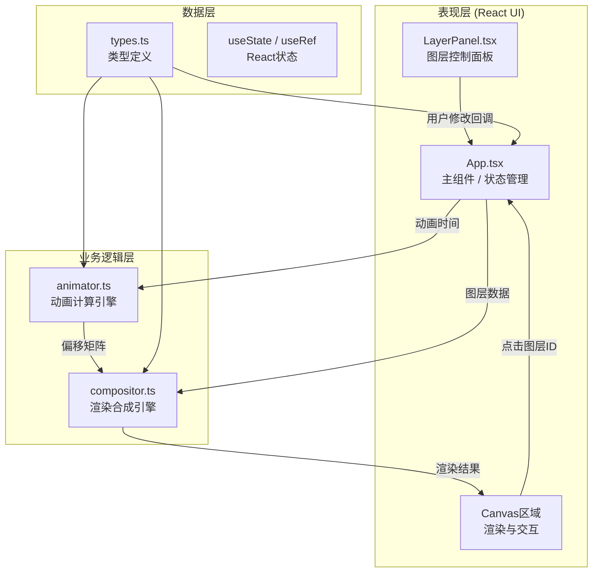
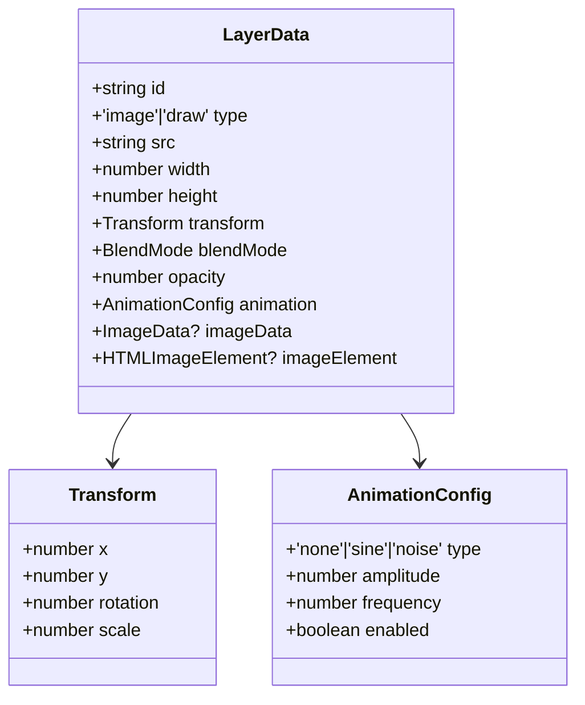

## 1. 架构设计



**数据流向说明：**
1. `types.ts` 定义所有共享数据接口
2. `App.tsx` 维护图层列表 `layers`、选中图层 `selectedId`、动画时间 `timeRef`
3. 用户通过 `LayerPanel.tsx` 修改参数 → 调用 `App` 的回调更新状态
4. 用户在 `Canvas` 上交互（拖拽/旋转/缩放）→ `App` 更新对应图层的 `transform`
5. 渲染循环：`App` 通过 `requestAnimationFrame` 递增时间 → `animator.ts` 计算每层偏移 → `compositor.ts` 合成所有图层 → 结果绘制到主Canvas
6. 画布点击检测：`compositor` 或Canvas点击事件 → 命中测试返回图层ID → `App` 更新 `selectedId`

## 2. 技术描述

- **前端框架**：React@18 + TypeScript@5
- **构建工具**：Vite@5 + @vitejs/plugin-react
- **渲染引擎**：Canvas 2D API（离屏Canvas + globalCompositeOperation）
- **状态管理**：React useState/useReducer + useRef（高频动画数据）
- **无后端、无数据库**：纯前端应用，图片通过FileReader本地读取

## 3. 模块文件结构与调用关系

```
src/
├── types.ts          ← 基础接口定义（被所有模块引用）
├── animator.ts       ← 动画计算，依赖 types.ts
├── compositor.ts     ← 渲染引擎，依赖 types.ts + animator.ts
├── App.tsx           ← 主组件，依赖 types.ts + compositor.ts + animator.ts + LayerPanel.tsx
├── LayerPanel.tsx    ← 图层控制面板，依赖 types.ts
└── main.tsx          ← 入口文件，渲染 App
```

**调用关系：**
- `types.ts`：零依赖
- `animator.ts` → 导入 `types.ts` 的 `AnimationConfig` 接口
- `compositor.ts` → 导入 `types.ts` 的 `LayerData` + 导入 `animator.ts` 的 `computeLayerOffset`
- `LayerPanel.tsx` → 导入 `types.ts` 的 `LayerData` + 接收 `App` 传递的 props
- `App.tsx` → 导入所有模块，作为状态中枢调度

## 4. 数据模型

### 4.1 核心类型定义



### 4.2 类型详细定义

**types.ts 接口清单：**

| 接口名 | 字段 | 类型 | 说明 |
|--------|------|------|------|
| Transform | x | number | 水平偏移（像素） |
| | y | number | 垂直偏移（像素） |
| | rotation | number | 旋转角度（0-360度） |
| | scale | number | 缩放倍数（0.1-3） |
| AnimationConfig | type | 'none'\|'sine'\|'noise' | 动画类型 |
| | amplitude | number | 振幅（1-20px） |
| | frequency | number | 频率（0.1-5Hz） |
| | enabled | boolean | 是否启用 |
| LayerData | id | string | 唯一标识（UUID） |
| | type | 'image'\|'draw' | 图层类型 |
| | src | string | 图片base64或手绘数据URL |
| | width | number | 原始宽度 |
| | height | number | 原始高度 |
| | transform | Transform | 变换参数 |
| | blendMode | BlendMode | 混合模式枚举 |
| | opacity | number | 透明度（0-1） |
| | animation | AnimationConfig | 微动画配置 |
| | imageElement | HTMLImageElement \| null | 预加载的图片对象（运行时） |

**BlendMode 枚举值：**
- `'normal'` → `'source-over'`
- `'multiply'` → `'multiply'`
- `'screen'` → `'screen'`
- `'overlay'` → `'overlay'`
- `'darken'` → `'darken'`
- `'lighten'` → `'lighten'`

## 5. 关键算法

### 5.1 compositor.ts 渲染流程
1. 创建主Canvas（1920x1080或适配尺寸）
2. 遍历图层数组（从底到顶）：
   a. 创建离屏Canvas
   b. 调用 `animator.computeLayerOffset(layer, time)` 获取 `{dx, dy}`
   c. 在离屏Canvas上：`save()` → `translate(centerX+dx, centerY+dy)` → `rotate(rad)` → `scale(scale)` → `drawImage` → `restore()`
   d. 设置主Canvas的 `globalAlpha = layer.opacity`
   e. 设置主Canvas的 `globalCompositeOperation = mapBlendMode(layer.blendMode)`
   f. `drawImage(offscreenCanvas, 0, 0)` 到主Canvas
   g. 重置 `globalAlpha` 和 `globalCompositeOperation`
3. 返回主Canvas上下文或渲染结果

### 5.2 animator.ts 偏移计算
- **正弦波**：`dx = amplitude * Math.sin(2π * frequency * time + idHash)`，`dy` 同理用cos
- **噪波**：使用伪随机函数（基于时间+id的hash），每帧取 -amplitude 到 +amplitude 范围随机值，相邻帧插值平滑
- **none**：返回 `{dx: 0, dy: 0}`

### 5.3 命中测试（点击选择图层）
从顶层图层向下遍历，对每层做变换矩阵反变换判断点击点是否在图层矩形内。

### 5.4 性能优化
- 图片预加载并缓存到 `LayerData.imageElement`
- 离屏Canvas复用（不重新创建，只clear）
- 非动画图层只在参数变化时重绘，动画图层每帧重绘
- 使用 `requestAnimationFrame` 调度，使用 `performance.now()` 计算时间
