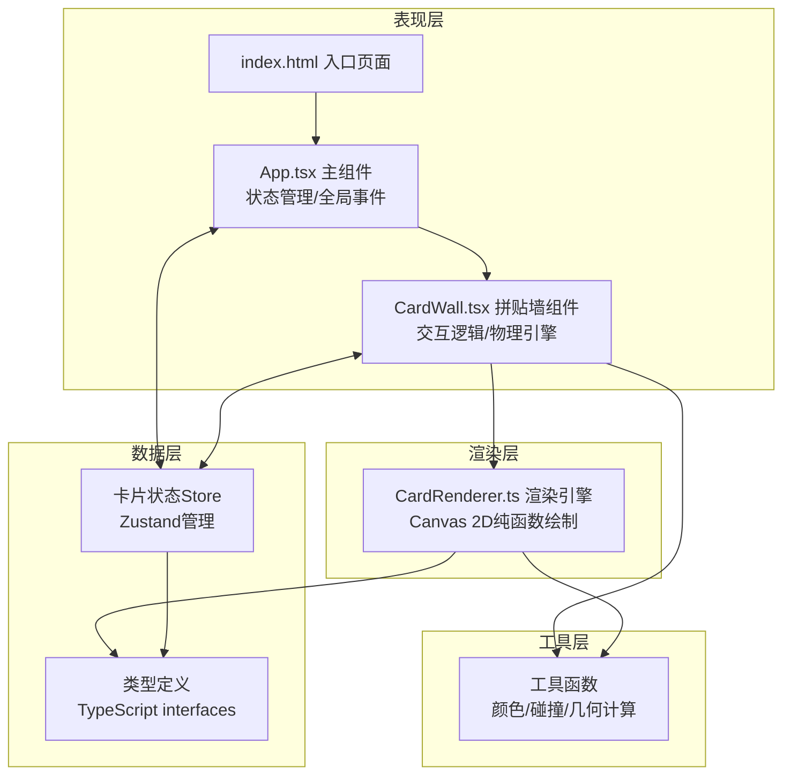
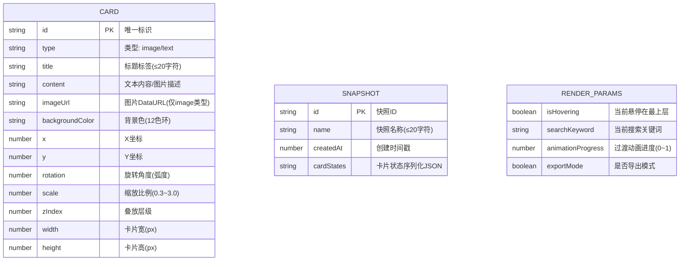

## 1. 架构设计



## 2. 技术描述

- **前端框架**：React@18 + TypeScript@5 + Vite@5
- **构建工具**：Vite（@vitejs/plugin-react）
- **状态管理**：Zustand（轻量级卡片状态Store）
- **渲染引擎**：HTML5 Canvas 2D API（自定义纯函数渲染器）
- **样式方案**：CSS Modules + 内联样式（动画效果）
- **数据持久化**：LocalStorage（保存快照数据）
- **后端**：无（纯前端应用）
- **数据库**：无（使用LocalStorage和内存状态）

## 3. 模块调用关系与数据流向

### 3.1 文件结构
```
├── package.json          # 依赖定义与启动脚本
├── vite.config.js        # Vite构建配置
├── tsconfig.json         # TypeScript严格模式配置
├── index.html            # 入口HTML，全屏Canvas挂载点
└── src/
    ├── App.tsx           # 主组件：卡片集合状态、全局交互、UI布局
    ├── CardWall.tsx      # 拼贴墙：物理逻辑、事件绑定、驱动渲染
    ├── CardRenderer.ts   # 渲染引擎：纯函数Canvas 2D绘制
    ├── types/
    │   └── index.ts      # 类型定义：Card、Snapshot、渲染参数等
    ├── store/
    │   └── useCardStore.ts  # Zustand状态管理
    └── utils/
        ├── geometry.ts   # 几何计算：矩阵变换、AABB碰撞检测
        └── colors.ts     # 12色环预设、颜色工具
```

### 3.2 数据流向
```
用户交互事件
    ↓ (鼠标/触摸/滚轮)
CardWall.tsx → 更新卡片状态（position/rotation/scale/zIndex）
    ↓ setState
Zustand Store (useCardStore)
    ↓ 订阅通知
App.tsx / CardWall.tsx → 触发重新渲染
    ↓ 传递 cards[] 数组
CardRenderer.ts → 遍历 cards，按zIndex排序后逐帧绘制
    ↓ 调用 Canvas 2D API
Canvas DOM → 最终视觉呈现
```

### 3.3 核心调用链
1. **卡片渲染循环**：
   - `CardWall` 组件挂载 → 启动 `requestAnimationFrame` 循环
   - 每帧调用 `CardRenderer.render(ctx, cards, renderParams)`
   - `CardRenderer` 内部：排序 → 遍历 → 矩阵变换 → 绘制背景/图片/文字 → 阴影 → 半透明混合

2. **卡片操控流程**：
   - `mousedown/touchstart` 命中检测 → 记录起始位置与卡片初始状态
   - `mousemove/touchmove` → 计算delta → 更新position/rotation/scale
   - `mouseup/touchend` → 更新zIndex至最上层

3. **搜索过滤流程**：
   - App搜索框 `onChange` → 更新store中searchKeyword
   - CardWall计算匹配状态（title/content包含keyword）
   - CardRenderer根据匹配状态设置opacity动画和发光效果

4. **快照保存/恢复**：
   - 保存：序列化所有卡片 {id, x, y, rotation, scale, zIndex} → 存入LocalStorage
   - 恢复：从LocalStorage读取 → 线性插值动画 → 0.5s内过渡到目标状态

5. **导出PNG流程**：
   - 创建离屏Canvas (1920x1080)
   - 调用 `CardRenderer.render(offscreenCtx, cards, {exportMode: true})`
   - `toDataURL('image/png')` → 创建a标签触发下载 → 显示成功模态

## 4. 数据模型

### 4.1 数据模型定义



### 4.2 TypeScript类型定义

```typescript
export type CardType = 'image' | 'text';

export interface Card {
  id: string;
  type: CardType;
  title: string;
  content: string;
  imageUrl?: string;
  backgroundColor: string;
  x: number;
  y: number;
  rotation: number;
  scale: number;
  zIndex: number;
  width: number;
  height: number;
}

export interface Snapshot {
  id: string;
  name: string;
  createdAt: number;
  cardStates: Array<{
    id: string;
    x: number;
    y: number;
    rotation: number;
    scale: number;
    zIndex: number;
  }>;
}

export interface RenderParams {
  searchKeyword: string;
  matchedIds: Set<string>;
  animationPhase: Map<string, number>; // 0~1, 淡入淡出进度
  transitionProgress: number; // 0~1, 布局恢复进度
  targetStates?: Map<string, Partial<Card>>;
  hoveredCardId: string | null;
  topCardId: string | null;
  exportMode: boolean;
}

export const COLOR_PALETTE: string[] = [
  // 12色环预设
  '#FF6B6B', '#FFA94D', '#FFD43B', '#A9E34B',
  '#51CF66', '#38D9A9', '#3BC9DB', '#4DABF7',
  '#748FFC', '#9775FA', '#DA77F2', '#F06595'
];

export const CARD_CONSTRAINTS = {
  MAX_TITLE_LENGTH: 20,
  MAX_SNAPSHOT_NAME_LENGTH: 20,
  MAX_SNAPSHOTS: 5,
  MIN_SCALE: 0.3,
  MAX_SCALE: 3.0,
  ROTATION_STEP: Math.PI / 4, // 45度
  MAX_IMAGE_SIZE: 8 * 1024 * 1024, // 8MB
  MAX_IMAGE_DIMENSION: 800,
  UPPER_CARD_OPACITY: 0.6,
  EXPORT_WIDTH: 1920,
  EXPORT_HEIGHT: 1080,
};
```

## 5. 性能优化策略

1. **渲染层优化**：
   - 脏矩形重绘（仅重绘变化区域）
   - 图片预加载与离屏Canvas缓存
   - 使用 `ctx.save()/restore()` 最小化状态切换
   - 阴影只在静止时绘制，拖拽时禁用以提升fps

2. **数据层优化**：
   - Zustand selectors 避免不必要的重渲染
   - 卡片数组稳定引用，仅修改指定卡片
   - 动画进度使用 requestAnimationFrame 而非 setState

3. **内存优化**：
   - 图片压缩至≤800x800px后再存储
   - 使用 WeakMap 缓存渲染临时对象
   - 及时释放已删除卡片的图片URL (URL.revokeObjectURL)
