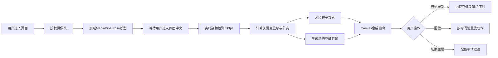

## 1. 产品概述
「霓虹舞影」是一款基于Web的实时舞蹈动作捕捉与视觉艺术化应用，通过摄像头将用户的身体动作实时转化为发光粒子构成的虚拟舞者，配合动态霓虹背景营造沉浸式舞蹈体验。
- 目标用户：街舞爱好者、舞蹈学习者、视觉艺术创作者
- 核心价值：让普通人无需专业设备即可体验动作捕捉技术，将舞蹈转化为极具视觉冲击力的数字艺术作品

## 2. 核心功能

### 2.1 功能模块
1. **主页（唯一页面）**：摄像头预览、粒子舞者Canvas渲染、录制/回放控制、主题切换

### 2.2 页面详情
| 页面名称 | 模块名称 | 功能描述 |
|---------|---------|---------|
| 主页 | 摄像头预览模块 | 实时显示摄像头画面（320x240px），画面中央区域检测提示，丢失追踪5秒显示暂停提示 |
| 主页 | 姿势检测模块 | MediaPipe Pose 30fps实时检测33个关键点，自动追踪站立于画面中央的用户 |
| 主页 | 粒子舞者渲染 | 17个主要关节映射为发光粒子（6-12px动态大小），半透明连线形成骨架，颜色上下半身渐变 |
| 主页 | 节奏光效反馈 | 帧间位移量>300px触发中心扩散闪光（0.15秒），随机霓虹色，动态光斑与流动线条背景 |
| 主页 | 录制与回放 | 内存记录最近30秒关键点序列+时间戳，回放时按时间轴重放动作与光效 |
| 主页 | 主题切换 | 三种预设配色（霓虹城市/熔岩之夜/深海幻境），0.5秒平滑过渡动画 |
| 主页 | 性能自适应 | 帧率监控，低于20fps持续3秒自动降级（4x→2x抗锯齿，17→9关节点） |

## 3. 核心流程
用户进入页面 → 授权摄像头访问 → 系统初始化MediaPipe模型 → 用户站立于画面中央触发追踪 → 实时渲染粒子舞者与背景光效 → 用户可录制舞蹈 → 回放查看录制内容 → 切换不同视觉主题

## 4. 用户界面设计

### 4.1 设计风格
- **主色调**：深色背景 #1A1A2E，霓虹渐变（暖橙 #FF6B35 → 冷青 #00F5FF）
- **配色主题**：
  - 霓虹城市：粉 #FF3366 / 紫 #B388FF / 蓝 #00E5FF 渐变
  - 熔岩之夜：红 #FF3333 / 橙 #FF6B35 / 黄 #FFD700 渐变
  - 深海幻境：青 #00E5FF / 蓝 #54A0FF / 绿 #00FFA3 渐变
- **按钮风格**：胶囊形（圆角20px），半透明深色背景（rgba(255,255,255,0.1)），悬停变亮，点击内缩2px
- **字体**：无衬线字体，标题渐变文字效果，粗体28px
- **布局**：桌面端左右分栏（摄像头320px + Canvas剩余空间），移动端上下堆叠，垂直线性渐变分割线

### 4.2 页面设计概述
| 页面名称 | 模块名称 | UI元素 |
|---------|---------|--------|
| 主页 | 顶部标题区 | 渐变文字标题"霓虹舞影"，录制/回放胶囊按钮 |
| 主页 | 左侧摄像头区 | 320x240px圆角视频，半透明边框，中央检测提示，丢失追踪提示层 |
| 主页 | 右侧Canvas区 | 粒子舞者渲染，最小宽600px，动态背景光效 |
| 主页 | 分割线 | 垂直渐变线（#FF3366→#00E5FF） |
| 主页 | 底部工具栏 | 三个40x40px圆形主题色块，选中时放大1.2倍+360度旋转（0.3s） |

### 4.3 响应式
- **桌面优先**：屏幕≥768px，左右布局
- **移动端适配**：屏幕<768px，上下堆叠布局，所有字号缩小1.2倍，触摸优化（增大点击区域）
- **触摸优化**：主题色块、按钮增加触摸反馈区域
