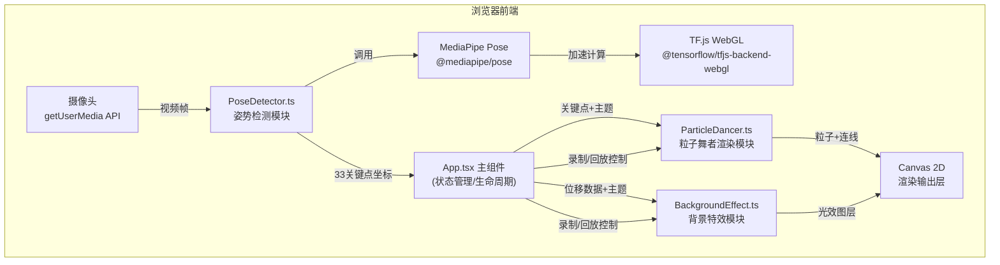

## 1. 架构设计



## 2. 技术描述
- **前端框架**：React 18 + TypeScript 5
- **构建工具**：Vite 5 + @vitejs/plugin-react
- **姿势检测**：@mediapipe/pose（MediaPipe Pose Landmark模型，33个关键点）
- **AI推理加速**：@tensorflow/tfjs-core + @tensorflow/tfjs-backend-webgl
- **渲染引擎**：Canvas 2D API + requestAnimationFrame
- **状态管理**：React useState/useRef（轻量级，无需zustand）
- **初始化工具**：vite-init（react-ts模板）

## 3. 路由定义
| 路由 | 用途 |
|-----|------|
| / | 主页，包含全部功能模块 |

本应用为单页面应用，无路由跳转。

## 4. 数据模型

### 4.1 核心数据结构

```typescript
// 单个关键点坐标
interface Landmark {
  x: number;      // 归一化X坐标 (0-1)
  y: number;      // 归一化Y坐标 (0-1)
  z: number;      // 归一化Z坐标
  visibility: number;  // 可见度置信度 (0-1)
}

// 姿势检测结果
interface PoseResult {
  landmarks: Landmark[];      // 33个关键点
  timestamp: number;          // 检测时间戳(ms)
}

// 录制帧数据
interface RecordedFrame {
  landmarks: Landmark[];      // 当帧关键点
  timestamp: number;          // 相对录制开始的时间偏移(ms)
  displacement: number;       // 当帧总位移量
}

// 主题配色方案
interface ThemePalette {
  id: string;
  name: string;
  upperBodyColor: string;     // 上半身粒子色
  lowerBodyColor: string;     // 下半身粒子色
  warmLineColor: string;      // 暖色连线
  coolLineColor: string;      // 冷色连线
  flashColors: string[];      // 节奏闪光色组
  bgGradient: [string, string];  // 背景渐变色
  themePreview: string;       // 主题预览色
}

// 性能配置
interface PerformanceConfig {
  antiAliasing: 1 | 2 | 4;    // 抗锯齿采样率
  jointCount: 9 | 17;         // 渲染关节数量
  particleQuality: 'low' | 'medium' | 'high';
}
```

### 4.2 MediaPipe 33关键点索引映射
```
0: 鼻尖 / 11-12: 左右肩 / 13-14: 左右肘 / 15-16: 左右腕
23-24: 左右髋 / 25-26: 左右膝 / 27-28: 左右踝 / 7-8: 左右耳
(核心9关节: 0,11,12,13,14,23,24,25,26,27,28精简为9个)
```

### 4.3 数据流向说明
```
摄像头视频帧 (HTMLVideoElement)
    ↓ 每帧输入
PoseDetector.detect() → MediaPipe Pose模型
    ↓ 输出 Landmark[33]
App.tsx 状态更新
    ├→ calculateDisplacement() → 帧间位移量计算
    ├→ 录制缓冲区写入（若录制中）
    ├→ ParticleDancer.update(landmarks, theme)
    │      ↓
    │   17/9关节点映射 → 粒子位置/大小/颜色计算
    │   骨架连线坐标 → 渐变色线条
    │      ↓
    │   ParticleDancer.render(ctx) → Canvas前景层
    │
    └→ BackgroundEffect.update(displacement, theme)
           ↓
        光斑位置/亮度更新，流动线条偏移，节奏闪光触发
           ↓
        BackgroundEffect.render(ctx) → Canvas背景层
```

## 5. 文件结构与职责

```
src/
├── App.tsx              # 主组件：状态管理、生命周期、模块协调、布局UI
├── PoseDetector.ts      # 姿势检测：MediaPipe初始化/帧处理/关键点输出
├── ParticleDancer.ts    # 粒子渲染：关节映射/粒子属性/骨架连线绘制
├── BackgroundEffect.ts  # 背景特效：光效参数/节奏闪光/渐变图层
└── main.tsx             # React入口（Vite模板生成）
```

### 5.1 文件调用关系
- App.tsx 实例化 PoseDetector、ParticleDancer、BackgroundEffect
- PoseDetector → 通过回调向 App.tsx 推送关键点数据
- App.tsx → 向 ParticleDancer 传入关键点、主题、性能配置
- App.tsx → 向 BackgroundEffect 传入位移数据、主题、闪光事件
- 三个模块之间无直接依赖，全部通过 App.tsx 协调

## 6. 性能优化策略

### 6.1 帧率监控
- requestAnimationFrame循环内记录帧间隔时间
- 滑动窗口计算最近60帧平均FPS
- 触发条件：FPS<20 持续≥3秒

### 6.2 自动降级
| 级别 | 抗锯齿 | 关节数 | 粒子光晕 | 背景光斑 |
|-----|--------|--------|---------|---------|
| 高性能 | 4x | 17 | 完整 | 20个 |
| 中性能 | 2x | 17 | 简化 | 12个 |
| 低性能 | 2x | 9 | 关闭 | 6个 |

### 6.3 计算优化
- 粒子更新计算目标：≤2ms/帧（基于简单数学运算，避免对象分配）
- 使用对象池复用粒子数据结构，避免GC
- 位移计算使用增量累加，避免全量遍历重复计算
- Canvas使用离屏缓冲（双缓冲）减少闪烁
