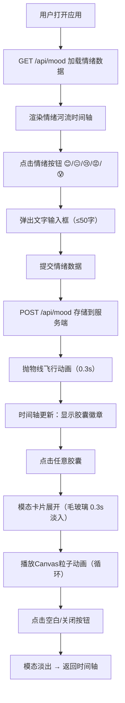

## 1. 产品概述

「时光胶囊·情绪速写」是一款面向日常用户的情绪记录与可视化回溯应用，通过将每日情绪转化为独特的视觉徽章，帮助用户建立情绪感知习惯并实现长期心理状态追踪。

- 核心目标：解决日常情绪记录缺乏视觉化表达与时间线回溯的痛点，将抽象情绪转化为可收藏、可回顾的「胶囊」艺术品
- 目标用户：关注心理健康、喜欢记录生活、追求审美体验的年轻群体（18-35岁）
- 市场价值：填补情绪记录类产品在「视觉美学」与「交互体验」上的空白，打造兼具功能性与情感温度的数字日记本

## 2. 核心特性

### 2.1 用户角色

| 角色 | 注册方式 | 核心权限 |
|------|----------|----------|
| 普通用户 | 无需注册，直接使用 | 录入情绪、查看情绪河流、浏览情绪详情、查看统计数据 |

### 2.2 功能模块

1. **首页导航区**：品牌Logo、快捷入口按钮（我的河流、写情绪）、欢迎标语
2. **情绪录入面板**：五种情绪选择按钮、文字描述输入框、提交确认
3. **情绪河流时间轴**：水平滚动日期卡片槽、胶囊徽章展示、翻页控制、统计圆环
4. **胶囊详情模态**：全屏毛玻璃卡片、情绪信息展示、Canvas粒子动画展示

### 2.3 页面详情

| 页面名称 | 模块名称 | 功能描述 |
|-----------|-------------|---------------------|
| 首页（单页应用） | 导航栏 | 左对齐Logo「时光胶囊」，右对齐「我的河流」和「写情绪」按钮 |
| 首页 | 欢迎标语区 | 居中展示「今天，你想记录什么？」大标题 |
| 首页 | 情绪输入面板 | 5个圆形emoji按钮（😊😐😢😡😰）+ 50字限制输入框，提交后触发生成动画 |
| 首页 | 情绪河流时间轴 | 水平滚动展示最近7天（默认），每天180px×120px卡片槽，左右翻页箭头 |
| 首页 | 今日统计圆环 | 直径60px扇形统计图，悬停显示各情绪次数，近7天数据 |
| 首页 | 胶囊详情模态 | 毛玻璃全屏卡片，展示情绪详情+20帧循环Canvas动画，0.3秒渐变过渡 |

## 3. 核心流程

用户打开应用 → 浏览情绪河流时间轴（加载服务端历史数据）→ 点击情绪按钮选择情绪 → 输入文字描述（≤50字）→ 提交 → 胶囊徽章从按钮位置沿抛物线飞向时间轴（0.3s ease-out）→ 时间轴更新显示当日胶囊 → 点击任意胶囊 → 模态卡片展开（毛玻璃淡入）→ 播放情绪专属Canvas动画 → 点击空白/关闭按钮返回时间轴

## 4. 用户界面设计

### 4.1 设计风格

- **主色调**：深色主题 `#1E1E2E`（背景）、`#2D2D44`（卡片）、`#E0E0F0`（文字）
- **情绪主题色**：
  - 快乐 Happy：`#FFD700`（金色）
  - 平静 Calm：`#7EC8E3`（天蓝色）
  - 忧郁 Melancholy：`#6C5CE7`（紫罗兰）
  - 愤怒 Anger：`#FF6B6B`（珊瑚红）
  - 焦虑 Anxiety：`#A29BFE`（薰衣草紫）
- **按钮风格**：圆形容器（默认48px / hover 52px），半透明背景色，hover微光扩散
- **字体**：主标题使用优雅衬线体（Playfair Display），正文使用现代无衬线体（Noto Sans SC），通过Google Fonts引入
- **布局风格**：卡片式布局，顶部固定导航，主体居中时间轴，两侧留白呼吸感
- **图标/Emoji**：情绪按钮使用原生emoji，导航图标使用lucide-react图标库

### 4.2 页面设计概览

| 页面名称 | 模块名称 | UI元素 |
|-----------|-------------|-------------|
| 首页 | 导航栏 | 固定顶部、深色背景、Logo文字（品牌色渐变）、右侧两个圆角按钮 |
| 首页 | 欢迎标语 | 居中大标题（48px/600字重）+ 副标题引导，字间距微调 |
| 首页 | 情绪输入面板 | 5个圆形按钮水平排列，间距16px，下方居中输入框+提交按钮 |
| 首页 | 情绪河流 | 水平滚动容器，卡片槽圆角16px，虚线框为留白状态，胶囊带微妙阴影层次 |
| 首页 | 统计圆环 | 右侧悬浮定位，悬停tooltip白底黑字圆角8px |
| 首页 | 胶囊详情模态 | 全屏半透明白色15% + backdrop-filter blur(10px)，内容卡片白色2px描边 |
| 首页 | 胶囊徽章 | emoji顶部 + 几何形状（圆/星/钻石）主题色渐变中心 + 底部时间（12px） |

### 4.3 响应式设计

- **宽屏适配（≥1200px）**：时间轴容器max-width 1400px，两侧padding 60px，居中显示
- **平板适配（768px-1199px）**：卡片槽宽度从180px缩小至150px，高度保持120px，统计圆环缩小至50px
- **触控优化**：所有可点击元素最小触控区域44×44px，按钮增加padding确保触控友好
- **断点策略**：Desktop-first，使用CSS media queries实现断点切换

### 4.4 动效系统

- **胶囊生成动画**：CSS transform + transition，从按钮位置（origin）沿贝塞尔曲线路径位移至时间轴目标位置，0.3s cubic-bezier(0.25, 0.46, 0.45, 0.94)
- **模态过渡**：opacity 0→1（0.3s ease-out），scale 0.9→1（同时间轴）
- **情绪按钮hover**：scale 1→1.08（0.2s），box-shadow 0→0 0 10px rgba(255,215,0,0.3)
- **粒子动画（快乐）**：20颗金色粒子，从中心向上飘散，scale 0.5→1.5，opacity 1→0，循环
- **粒子动画（忧郁）**：15颗蓝色水滴，从顶部下落，sin(x)左右摇摆，opacity 1→0.3，循环
- **粒子动画（愤怒）**：25颗红色火焰粒子，从底部向上喷射后四散，快速闪烁消失
- **粒子动画（焦虑）**：18颗紫色抖动粒子，无规则快速颤动+向外扩散，营造不安感
- **粒子动画（平静）**：12颗天蓝色气泡，缓慢上升+轻微左右漂浮，柔和消失
