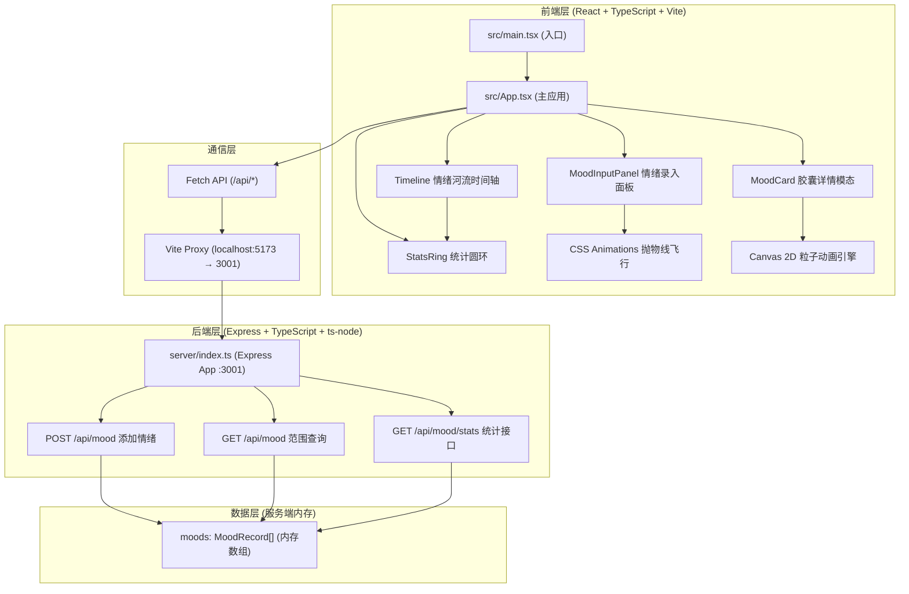
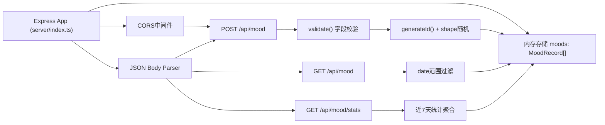
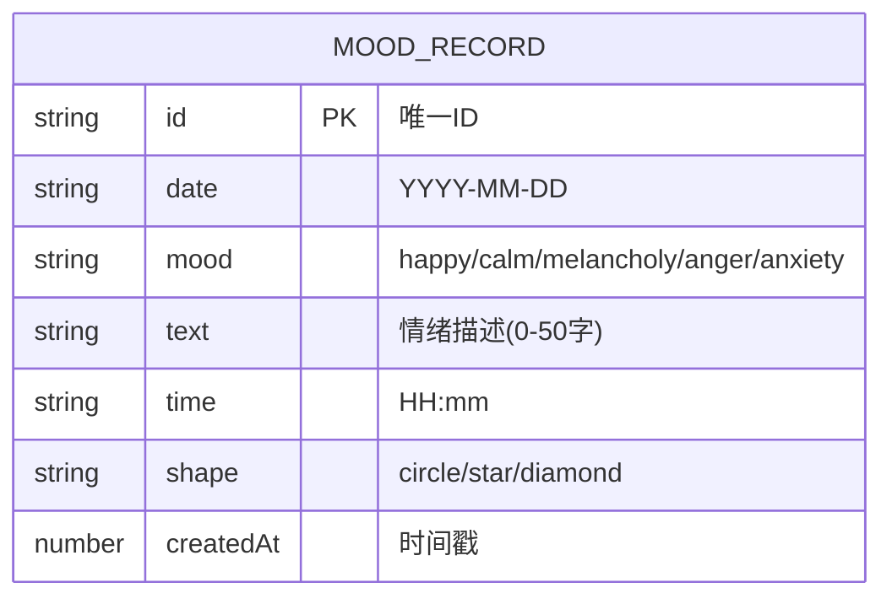

## 1. 架构设计



## 2. 技术选型说明

| 层级 | 技术栈 | 版本要求 | 用途说明 |
|------|--------|----------|----------|
| 前端框架 | React | ^18.2.0 | UI组件化开发，Hooks管理状态与生命周期 |
| 语言 | TypeScript | ^5.3.0 | 类型安全、严格模式（strict: true） |
| 构建工具 | Vite | ^5.0.0 | 极速HMR、代理配置、生产打包 |
| Vite React插件 | @vitejs/plugin-react | ^4.2.0 | JSX编译（react-jsx模式） |
| 类型定义 | @types/react | ^18.2.0 | React API类型 |
| 类型定义 | @types/react-dom | ^18.2.0 | ReactDOM类型 |
| 图标库 | lucide-react | ^0.294.0 | 导航栏与功能按钮图标 |
| 后端框架 | Express | ^4.18.2 | RESTful API服务 |
| 后端类型 | @types/express | ^4.17.21 | Express类型定义 |
| 后端运行时 | ts-node | ^10.9.2 | 直接运行TypeScript后端 |
| Node.js | >=18.0.0 | LTS版本 | 运行时环境 |

## 3. 路由定义（单页应用，无前端路由）

| 组件/区域 | 挂载位置 | 功能描述 |
|-----------|----------|----------|
| 导航栏 Navbar | App.tsx 顶部固定 | Logo + 快捷按钮 |
| 欢迎区 Hero | App.tsx 主体上部 | 欢迎标语展示 |
| 情绪输入区 MoodInputPanel | App.tsx 主体中部 | 情绪选择 + 文字输入 |
| 情绪河流区 Timeline | App.tsx 主体下部 | 横向滚动时间轴 |
| 统计圆环 StatsRing | Timeline 右侧 | 近7天情绪分布 |
| 胶囊详情模态 MoodCard | App.tsx 根Portal | 全屏毛玻璃卡片 |

## 4. API接口定义

### 4.1 类型定义（前后端共享）

```typescript
type MoodType = 'happy' | 'calm' | 'melancholy' | 'anger' | 'anxiety';

type ShapeType = 'circle' | 'star' | 'diamond';

interface MoodRecord {
  id: string;
  date: string; // YYYY-MM-DD
  mood: MoodType;
  text: string;
  time: string; // HH:mm
  shape: ShapeType;
  createdAt: number;
}

interface MoodStats {
  happy: number;
  calm: number;
  melancholy: number;
  anger: number;
  anxiety: number;
  total: number;
}
```

### 4.2 POST /api/mood - 添加情绪记录

**请求体：**
```typescript
interface AddMoodRequest {
  date: string;   // YYYY-MM-DD
  mood: MoodType;
  text: string;   // 0-50 characters
}
```

**响应（200）：**
```typescript
interface AddMoodResponse {
  success: true;
  data: MoodRecord;
}
```

**响应（400）：**
```typescript
interface AddMoodError {
  success: false;
  error: string;
}
```

### 4.3 GET /api/mood - 范围查询情绪记录

**查询参数：**
- `startDate`: string (YYYY-MM-DD) - 起始日期（包含）
- `endDate`: string (YYYY-MM-DD) - 结束日期（包含）

**响应（200）：**
```typescript
interface GetMoodsResponse {
  success: true;
  data: MoodRecord[]; // 按createdAt升序
}
```

### 4.4 GET /api/mood/stats - 获取近7天统计

**响应（200）：**
```typescript
interface GetStatsResponse {
  success: true;
  data: MoodStats;
}
```

## 5. 后端服务架构



## 6. 数据模型（内存存储）

### 6.1 实体关系



### 6.2 校验规则

| 字段 | 校验规则 | 错误提示 |
|------|----------|----------|
| date | 必须为有效YYYY-MM-DD格式 | 日期格式无效 |
| mood | 必须为5种枚举值之一 | 情绪类型无效 |
| text | 长度0-50字符 | 描述文字过长（最多50字） |

### 6.3 初始种子数据（可选）

服务启动时可生成最近7天内5-8条随机情绪记录，用于演示效果。

## 7. 项目文件结构

```
auto55/
├── package.json              # 统一依赖管理 + dev脚本
├── vite.config.js            # Vite配置 + /api代理到:3001
├── tsconfig.json             # TS严格模式 + react-jsx + esModuleInterop
├── index.html                # 入口HTML（加载/src/main.tsx）
├── server/
│   └── index.ts              # Express后端（:3001，三个API）
└── src/
    ├── main.tsx              # React入口（createRoot + render App）
    ├── App.tsx               # 主应用（全局状态 + 四大区块布局）
    ├── components/
    │   ├── MoodInputPanel.tsx  # 情绪输入面板（5按钮 + 输入框）
    │   ├── Timeline.tsx        # 情绪河流时间轴（横向滚动卡片槽）
    │   ├── MoodCard.tsx        # 胶囊详情模态（毛玻璃 + Canvas动画）
    │   └── StatsRing.tsx       # 统计圆环（扇形图 + tooltip）
    ├── types/
    │   └── index.ts            # 共享类型定义
    ├── utils/
    │   ├── moodColors.ts       # 情绪主题色映射
    │   └── dateUtils.ts        # 日期范围计算工具
    └── styles/
        └── index.css           # 全局样式 + CSS变量 + 动画关键帧
```

## 8. 关键技术实现要点

### 8.1 抛物线飞行动画
- 使用CSS `@keyframes` + `transform: translate()`
- 通过JavaScript动态计算起点（按钮DOMRect）和终点（时间轴卡片槽DOMRect）
- 三个关键帧：0%（起点，scale:1）→ 50%（抛物线顶点，scale:1.2）→ 100%（终点，scale:1）
- duration: 0.3s，timing: `cubic-bezier(0.25, 0.46, 0.45, 0.94)`

### 8.2 Canvas 2D 粒子动画引擎
- 封装 `Particle` 基类 + 5种情绪特化子类
- `requestAnimationFrame` 循环，60FPS帧率控制（通过timestamp差值节流）
- 粒子池模式（Object Pool）避免频繁GC，帧率≥55FPS
- 每情绪20帧循环，粒子参数：位置(x,y)、速度(vx,vy)、大小、透明度、生命周期

### 8.3 统计圆环扇形绘制
- 使用纯CSS `conic-gradient` 实现扇形图（无需Canvas）
- `--angle-start` 和 `--angle-end` CSS变量驱动
- SVG `<title>` + CSS tooltip 实现悬停数值显示

### 8.4 性能优化策略
- Timeline懒渲染：仅渲染当前视图7天卡片槽，不虚拟化
- 胶囊徽章CSS硬件加速：`will-change: transform`
- Canvas动画分层：离屏Canvas预渲染静态元素
- 防抖/节流：翻页按钮300ms节流，防止快速连点

## 9. 启动命令与开发流程

| 命令 | 作用 | 端口 |
|------|------|------|
| `npm install` | 安装所有依赖（前端+后端） | - |
| `npm run dev` | 并发启动Vite(:5173) + ts-node后端(:3001) | 5173/3001 |
| `npm run dev:client` | 仅启动前端Vite开发服务器 | 5173 |
| `npm run dev:server` | 仅启动后端ts-node服务器 | 3001 |

**dev脚本实现**：使用`concurrently`同时启动前端与后端。
