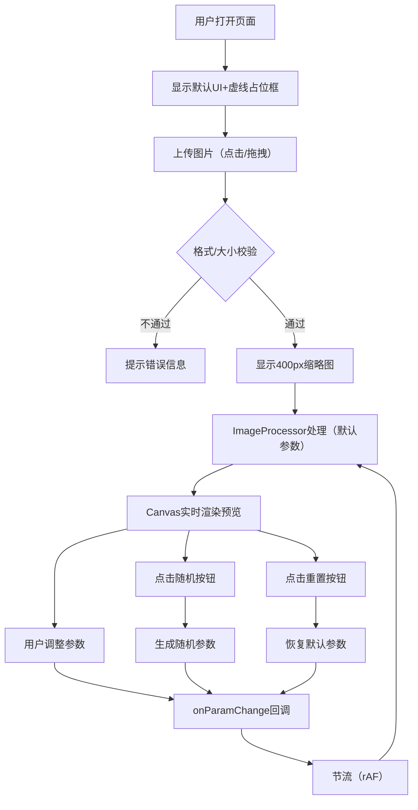

## 1. 产品概述
「旧影匣」是一款面向老照片收藏爱好者的Web端复古胶片滤镜工具，通过Canvas 2D实时渲染技术，将普通照片一键转换为具有年代感的胶片质感图像（颗粒感、偏色光晕、划痕纹理、暗角），为用户提供沉浸式的"时光穿梭"照片处理体验。

- 核心价值：在浏览器中即可获得专业级的复古照片效果，无需安装任何软件
- 目标用户：老照片收藏家、复古风格爱好者、摄影发烧友、设计师

## 2. 核心功能

### 2.1 用户角色
| 角色 | 注册方式 | 核心权限 |
|------|----------|----------|
| 普通用户 | 无需注册，直接访问 | 上传图片、调整滤镜参数、实时预览效果 |

### 2.2 功能模块
1. **图片上传区**：支持点击/拖拽上传（最大8MB），支持jpg/png格式，缩略图展示原始图
2. **滤镜控制面板**：噪点强度滑块、光晕色相选择器、划痕密度下拉菜单、暗角强度滑块、随机化/重置按钮
3. **实时预览区**：Canvas 2D渲染处理结果，参数调整时实时更新
4. **图像处理引擎**：四层叠加算法（噪点→光晕→划痕→暗角），优化性能保证流畅体验

### 2.3 页面详情
| 页面名称 | 模块名称 | 功能描述 |
|----------|----------|----------|
| 主页（单页应用） | 上传交互模块 | 点击或拖拽上传单张图片，8MB大小校验，格式校验 |
| 主页（单页应用） | 缩略图展示模块 | 原始图以400px宽度缩略图显示在左侧，保持纵横比 |
| 主页（单页应用） | 滤镜参数控制模块 | 5个控件：噪点滑块(0-100)、色相选择器(0-360)、划痕下拉(轻/中/重)、暗角滑块(0-100)、操作按钮组 |
| 主页（单页应用） | Canvas渲染预览模块 | 处理后图像在右侧Canvas实时渲染，未上传时显示虚线占位提示框 |
| 主页（单页应用） | 性能优化模块 | requestAnimationFrame节流渲染，20万像素图像处理<150ms，拖动滑块≥30fps |

## 3. 核心流程

用户使用「旧影匣」的完整流程：
1. 用户打开页面，看到带虚线占位框的预览区和控制面板（默认参数）
2. 用户通过点击或拖拽方式上传一张jpg/png图片
3. 系统校验文件格式和大小（≤8MB），校验通过后左侧显示缩略图
4. 系统使用默认参数自动处理图片，右侧Canvas显示处理后的复古效果
5. 用户拖动滑块或选择下拉菜单调整参数，预览区实时更新效果
6. 用户可点击"随机老照片"一键生成随机复古效果
7. 用户可点击"重置"恢复到默认参数和原始状态
8. 整个过程通过requestAnimationFrame确保流畅的UI响应

## 4. 用户界面设计

### 4.1 设计风格
- **整体主题**：复古老照片风格，温暖怀旧的色彩基调
- **主色调**：深棕色 #3E2723（背景起始），米黄色 #D7CCC8（背景结束）
- **辅助色**：奶油白 #FAFAFA（卡片背景），深褐色 #5D4037（文字），暖橙 #FF9800（强调色）
- **按钮风格**：圆角12px，柔和投影，悬停时scale(1.05)，过渡0.2s ease
- **卡片风格**：border-radius: 12px，box-shadow: 0 4px 12px rgba(0,0,0,0.2)
- **字体方案**：标题使用衬线字体（Playfair Display/思源宋体）体现年代感，正文使用无衬线字体（系统默认）保证可读性
- **质感细节**：页面背景使用渐变+微噪点纹理叠加，卡片微磨砂质感

### 4.2 页面设计概述
| 页面名称 | 模块名称 | UI元素 |
|----------|----------|--------|
| 主页 | 整体布局 | 桌面端：左右两栏（左40%上传+缩略图，右60%预览+控件）；移动端：上下堆叠布局 |
| 主页 | 背景容器 | div#root 线性渐变背景：#3E2723 → #D7CCC8，最小高度100vh |
| 主页 | 标题区域 | 应用名称"旧影匣"，衬线大号字体，副标题"—— 时光滤镜工坊"，居中或左对齐 |
| 主页 | 上传区卡片 | 圆角12px卡片，虚线边框拖拽区，点击触发文件选择，hover有微动画 |
| 主页 | 缩略图区域 | 卡片内显示400px宽缩略图，图片下方显示文件名和大小 |
| 主页 | 预览区域 | 大尺寸Canvas容器，未上传时虚线占位+提示文字"点击或拖拽图片开始" |
| 主页 | 控制面板卡片 | 所有滤镜控件统一卡片风格，每个控件组有小标题和说明文字 |
| 主页 | 滑块控件 | 自定义样式滑块（track+thumb），左右显示数值标签，hover时强调 |
| 主页 | 色相选择器 | 圆形色相环或滑块样式，当前选中色有预览小方块 |
| 主页 | 按钮组 | 两个按钮并排："随机老照片"（暖橙主色调）、"重置"（中性灰） |

### 4.3 响应式设计
- **设计策略**：桌面端优先（Desktop-first），768px断点自适应
- **≥768px（桌面/平板横屏）**：左右两栏布局，左栏宽度约42%-45%，右栏占剩余空间，卡片有充足呼吸空间
- **<768px（平板竖屏/手机）**：上下堆叠布局，顺序为：标题→上传区→缩略图→预览区→控制面板；所有控件等比缩放保证可点击区域≥44px
- **触控优化**：移动端滑块和按钮加大触控热区，下拉菜单改为更友好的触控选择器

### 4.4 动效与微交互
- 页面加载：卡片依次淡入（staggered animation）
- 滑块拖动：滑块手柄有微妙的按压反馈，数值标签实时更新
- 按钮悬停：transform: scale(1.05) + 阴影加深，0.2s ease过渡
- 图片上传成功：缩略图带缩放+淡入组合动画
- 参数变化时：Canvas平滑过渡（如有前后两帧插值更佳）
- 随机按钮点击：按钮轻微弹跳动画，增加趣味性
