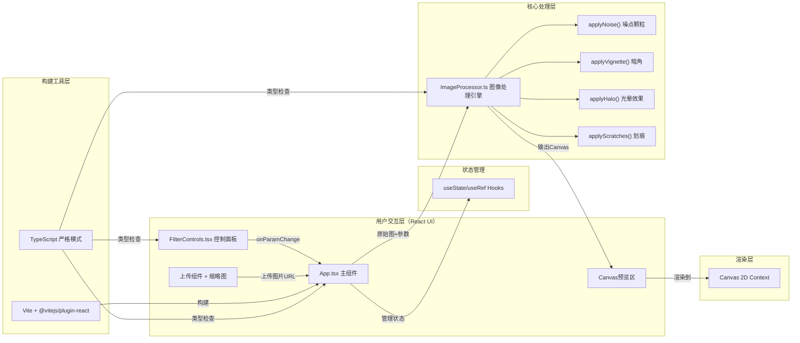

## 1. 架构设计



**数据流向说明**：
1. 上传交互 → App.tsx（存储imageUrl）→ 加载HTMLImageElement
2. FilterControls → onParamChange回调 → App.tsx（更新filterParams状态）
3. App.tsx（参数变更+图片加载完成）→ useMemo/useEffect触发 → ImageProcessor.process(image, params)
4. ImageProcessor：读取原始ImageData → 依次叠加4层效果 → 返回处理后Canvas
5. App.tsx → 将返回Canvas渲染到预览区域

## 2. 技术描述

- **前端框架**：React 18 + TypeScript（严格模式 strict: true）
- **构建工具**：Vite 5 + @vitejs/plugin-react
- **图像处理**：原生 Canvas 2D API（getImageData / putImageData / createLinearRadialGradient）
- **样式方案**：原生CSS（不引入Tailwind，用户需求中明确指定圆角卡片、渐变背景、hover动画等具体CSS属性）
- **状态管理**：React内置 Hooks（useState, useRef, useEffect, useCallback），无需引入zustand/zustand等外部库
- **性能优化**：requestAnimationFrame节流、参数变更合并渲染、离屏Canvas预处理
- **初始化方式**：使用 `npm init vite-init@latest . --template react-ts --force`

**核心依赖**：
```json
{
  "react": "^18.3.0",
  "react-dom": "^18.3.0",
  "typescript": "^5.4.0",
  "vite": "^5.2.0",
  "@vitejs/plugin-react": "^4.3.0"
}
```

## 3. 项目文件结构与职责

```
auto57/
├── index.html                    # Vite入口HTML，包含带渐变背景的#root容器
├── package.json                  # 依赖配置，scripts: dev/build/preview
├── vite.config.js                # Vite配置（React插件，端口配置）
├── tsconfig.json                 # TypeScript配置（strict: true）
├── src/
│   ├── main.tsx                  # React入口：ReactDOM.createRoot渲染<App/>
│   ├── App.tsx                   # 主组件（核心调度）
│   ├── ImageProcessor.ts         # 图像处理引擎（纯函数模块）
│   ├── FilterControls.tsx        # 滤镜参数控制面板组件
│   ├── types.ts                  # 类型定义（FilterParams, ScratchLevel等）
│   └── styles/
│       └── index.css             # 全局样式：渐变背景、卡片风格、响应式布局
```

**各文件间调用关系**：
```
main.tsx → App.tsx → FilterControls.tsx
                  ↘ ImageProcessor.ts（纯函数调用）
                  ↘ styles/index.css（import引入）

types.ts → 被 App.tsx / FilterControls.tsx / ImageProcessor.ts 共同引用
```

## 4. 核心数据类型定义

```typescript
// src/types.ts
export type ScratchLevel = 'light' | 'medium' | 'heavy';

export interface FilterParams {
  noiseLevel: number;       // 0-100，噪点强度
  haloHue: number;          // 0-360，光晕色相
  scratchLevel: ScratchLevel; // 划痕密度
  vignetteStrength: number; // 0-100，暗角强度
}

export interface ScratchConfig {
  countRange: [number, number]; // 对应light/medium/heavy的条数范围
}

export const SCRATCH_CONFIG: Record<ScratchLevel, ScratchConfig> = {
  light:  { countRange: [1, 2] },
  medium: { countRange: [2, 3] },
  heavy:  { countRange: [3, 5] },
};

export const DEFAULT_PARAMS: FilterParams = {
  noiseLevel: 20,
  haloHue: 30,
  scratchLevel: 'light',
  vignetteStrength: 30,
};
```

## 5. 核心算法说明

### 5.1 ImageProcessor 处理管线
输入：`HTMLImageElement` + `FilterParams` → 输出：`HTMLCanvasElement`

处理顺序（性能顺序，从快到慢，减少ImageData复制）：
1. **步骤0**：将原始图片绘制到目标Canvas，获取基础ImageData
2. **applyNoise**（像素级操作，直接操作Uint8ClampedArray）：
   - 密度映射：50→30%像素，100→60%像素（线性插值）
   - 对目标像素RGB分别加 ±(10~40) 的随机扰动，alpha保持不变
   - 噪点大小：每次循环跳过1-2像素模拟1-3px颗粒
3. **applyHalo**（渐变合成，使用Canvas渐变+globalCompositeOperation）：
   - 短边shortSide = min(width, height)
   - 光晕宽度 = shortSide * 30%，渐变过渡15px
   - 在四个角落分别画径向渐变，颜色hsl(haloHue, 70%, 65%, 0.5)
   - 合成模式 'screen'，模拟胶片漏光
4. **applyScratches**（路径绘制，Canvas lineTo）：
   - 根据ScratchLevel在范围内随机取条数N
   - 每条：随机起点/角度/长度(15-60)/宽度(1-2)/透明度(0.2-0.5)
   - 描边颜色白色 rgba(255,255,255,alpha)，轻微模糊
5. **applyVignette**（径向渐变遮罩，'multiply'合成）：
   - 椭圆径向渐变，中心透明，边缘黑色
   - 短轴 = shortSide * 50%，长轴按图片比例
   - 强度映射：100→边缘透明度0.7（乘在渐变最后stop上）

### 5.2 性能优化策略
- **离屏Canvas**：所有效果先在 OffscreenCanvas（或普通隐藏canvas）绘制，一次性贴到展示Canvas
- **参数变更防抖**：滑块拖动时通过 rAF 合并多次状态变更，每帧最多渲染1次
- **跳过无变化参数**：若某个参数为0（如noiseLevel=0），跳过该层处理
- **像素遍历优化**：使用32位整数视图（Uint32Array）操作ImageData，减少循环次数

## 6. 关键交互实现

### 6.1 拖拽上传
- 使用原生 Drag and Drop API：onDragOver / onDrop 事件
- 防止浏览器默认行为（打开图片）
- DataTransfer.files[0] 获取文件，FileReader.readAsDataURL 生成预览URL

### 6.2 实时预览节流
```
用户拖动滑块 → React state频繁更新 → useEffect检测参数变化
  → 检查pendingRafId，取消上一次rAF → requestAnimationFrame安排下一次处理
  → rAF回调内调用 ImageProcessor.process() → 更新Canvas ref
```

### 6.3 一键随机化
```typescript
const randomize = (): FilterParams => ({
  noiseLevel: Math.floor(Math.random() * 101),
  haloHue: Math.floor(Math.random() * 361),
  scratchLevel: (['light','medium','heavy'] as const)[Math.floor(Math.random() * 3)],
  vignetteStrength: Math.floor(Math.random() * 101),
});
```

## 7. 样式架构

全局CSS通过CSS变量管理主题色：
```css
:root {
  --bg-start: #3E2723;
  --bg-end: #D7CCC8;
  --card-bg: rgba(250, 250, 250, 0.92);
  --text-primary: #5D4037;
  --accent: #FF9800;
  --radius: 12px;
  --shadow: 0 4px 12px rgba(0, 0, 0, 0.2);
}
```

响应式断点：
```css
/* 默认桌面端左右布局 */
.app-container { display: flex; gap: 24px; }
.left-panel { flex: 0 0 42%; }
.right-panel { flex: 1; }

/* 768px以下上下堆叠 */
@media (max-width: 768px) {
  .app-container { flex-direction: column; }
  .left-panel, .right-panel { flex: 1 1 auto; }
}
```
