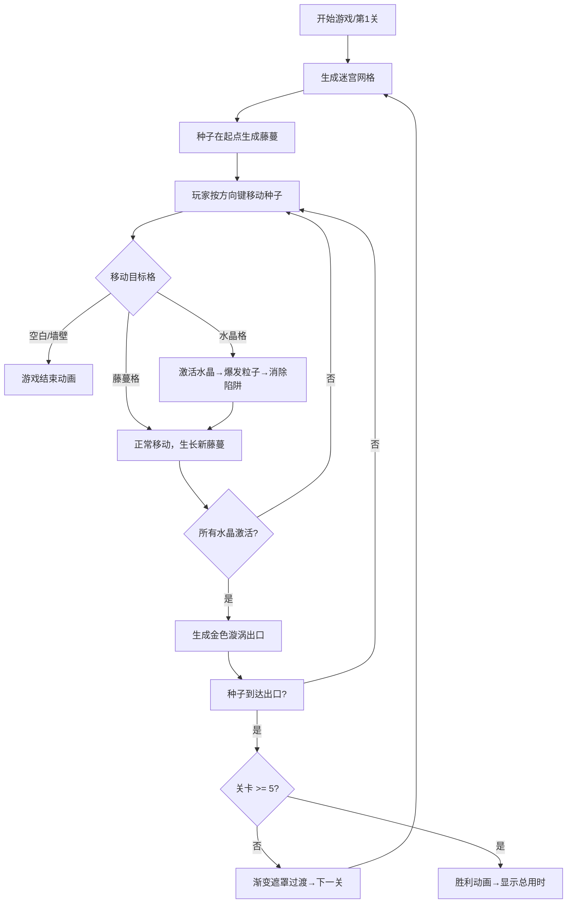

## 1. 产品概述

「藤蔓迷宫」是一款2D浏览器冒险解谜游戏，玩家操控发光的魔法种子，在随机生成的生态迷宫中滚动生长藤蔓、激活水晶机关，最终找到出口通关。

- 目标用户：独立游戏爱好者、休闲解谜玩家
- 产品价值：通过随机生成迷宫与藤蔓生长机制，提供每局不同的策略体验，结合精美的粒子特效营造沉浸式暗黑森林氛围

## 2. 核心功能

### 2.1 用户角色
无角色区分，单机单人游戏

### 2.2 功能模块
1. **游戏主界面**：Canvas游戏画布、关卡信息显示、操作提示
2. **迷宫生成系统**：随机生成15×15可达迷宫，包含墙壁、空格、水晶机关、死亡陷阱
3. **种子控制系统**：方向键控制种子逐格滚动，拖曳发光粒子轨迹
4. **藤蔓生长系统**：种子经过处生长藤蔓形成路径，玩家只能站在藤蔓上
5. **机关触发系统**：水晶激活产生粒子爆发，消除附近死亡陷阱
6. **关卡过渡系统**：全部水晶激活后生成出口，通关进入下一关
7. **胜负判定系统**：掉入空白/墙壁判负，通过第5关获胜

### 2.3 页面详情

| 页面名称 | 模块名称 | 功能描述 |
|-----------|-------------|---------------------|
| 游戏主界面 | Canvas游戏画布 | 渲染迷宫、种子、藤蔓、水晶、出口、粒子特效 |
| 游戏主界面 | HUD信息栏 | 显示当前关卡数、用时、剩余水晶数 |
| 游戏主界面 | 过渡遮罩层 | 关卡切换渐变动画、胜负结算弹窗 |
| 游戏主界面 | 响应式容器 | 桌面居中显示，移动端全屏自适应 |

## 3. 核心流程

## 4. 用户界面设计

### 4.1 设计风格
- **主色调**：深墨绿 #0A1F0A（背景），浅黄绿 #B0E57C（藤蔓底色），金色 #FFD700→#FFA500（出口）
- **种子外观**：圆形发光体，半径8px，发光半径40px，中心向外亮度衰减
- **藤蔓**：绿色半透明条，1.5px深绿描边，生长动画0.8秒
- **墙壁**：苔藓纹理平铺，锯齿图案标记死亡陷阱
- **字体**：使用奇幻风格装饰字体搭配清晰的正文字体
- **动画**：所有交互都有粒子特效+音效反馈

### 4.2 页面设计概览

| 页面名称 | 模块名称 | UI元素 |
|-----------|-------------|-------------|
| 游戏主界面 | Canvas画布 | 暗黑森林背景、苔藓墙壁、发光种子、藤蔓光晕、水晶闪烁、金色漩涡出口 |
| 游戏主界面 | HUD顶栏 | 关卡徽章、计时器、水晶进度图标（半透明磨砂玻璃效果） |
| 游戏主界面 | 过渡层 | 四周向中心收缩的渐变遮罩、关卡文字淡入淡出 |
| 游戏主界面 | 结算弹窗 | 粒子爆炸背景、游戏结束/通关文字、最终数据展示 |

### 4.3 响应式设计
- **桌面端（>768px）**：游戏画布居中显示，带装饰性UI边框，HUD顶栏悬浮于画布上方
- **移动端（≤768px）**：画布全屏铺满，隐藏装饰边框，HUD简化为紧凑图标行
- **触摸优化**：方向键支持虚拟方向按钮（可选），或使用滑动手势

### 4.4 音效设计（Web Audio API）
- 移动：短促"滴"声（高频正弦波，快速衰减）
- 水晶激活：清脆"叮"声（多谐波叠加，长尾韵）
- 机关消除：低沉"砰"声+噪音爆裂
- 通关：上升音阶序列
- 失败：下降音阶+噪音
