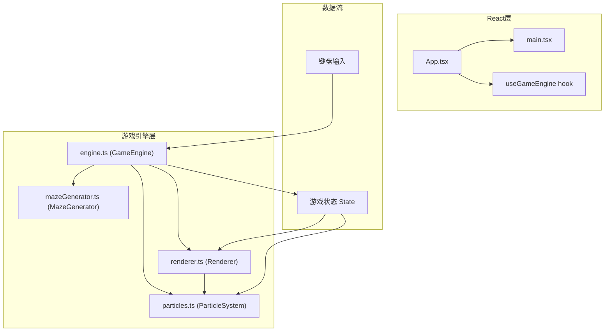

## 1. 架构设计



**各文件调用关系与数据流向：**
1. `main.tsx` → 渲染 `App.tsx`，React 挂载
2. `App.tsx` → 创建 `GameEngine` 实例，将 Canvas ref 传入，监听引擎回调更新 UI
3. `engine.ts` → 核心调度：
   - 接收键盘事件 → 更新种子位置/移动状态
   - 每帧调用 `update()` → 更新游戏状态、粒子、藤蔓生长进度
   - 调用 `renderer.render(state)` → 触发 Canvas 绘制
   - 迷宫生成委托 `mazeGenerator.ts`
   - 粒子管理委托 `particles.ts`
4. `renderer.ts` → 纯渲染：根据 `GameState` 绘制迷宫、种子、藤蔓、水晶、出口，调用粒子系统绘制粒子
5. `particles.ts` → 管理粒子生命周期：接收发射指令，每帧更新位置/透明度/大小

## 2. 技术栈说明
- **前端框架**：React@18 + TypeScript@5（严格模式）
- **构建工具**：Vite@5 + @vitejs/plugin-react
- **渲染引擎**：Canvas 2D API（高性能粒子与形状绘制）
- **音频**：Web Audio API（程序生成音效，无外部资源）
- **状态管理**：GameEngine 内部可变状态 + React useState 管理 UI 层展示状态（关卡数、用时、胜负）
- **项目初始化**：vite-init 使用 react-ts 模板，移除 tailwind/zustand 等非必要依赖，保持轻量

## 3. 路由定义
无路由，单页面游戏应用

## 4. 核心数据结构（TypeScript 类型）

```typescript
// 格子类型
enum CellType {
  EMPTY = 0,      // 空白（不可站立，藤蔓未生长）
  WALL = 1,       // 墙壁
  TRAP = 2,       // 死亡陷阱（锯齿墙壁）
  VINE = 3,       // 已生长藤蔓
  CRYSTAL = 4,    // 水晶机关
  EXIT = 5,       // 出口
  START = 6,      // 起点
}

// 迷宫网格
type MazeGrid = CellType[][];

// 水晶状态
interface Crystal {
  x: number;
  y: number;
  activated: boolean;
  glowPhase: number;
}

// 藤蔓生长动画
interface VineGrowth {
  x: number;
  y: number;
  progress: number;  // 0~1
}

// 种子
interface Seed {
  gridX: number;
  gridY: number;
  renderX: number;   // 平滑插值坐标
  renderY: number;
  moving: boolean;
  moveProgress: number;
  fromX: number;
  fromY: number;
  toX: number;
  toY: number;
}

// 游戏全局状态
interface GameState {
  level: number;
  elapsed: number;        // 总用时（秒）
  grid: MazeGrid;
  gridSize: number;       // 迷宫边长，≤15
  cellSize: number;       // 单格像素尺寸（根据画布动态计算）
  seed: Seed;
  crystals: Crystal[];
  vineGrowths: VineGrowth[];
  exitActive: boolean;
  exitPos: { x: number; y: number } | null;
  phase: 'playing' | 'gameover' | 'victory' | 'transition';
  transitionProgress: number;
}
```

## 5. 性能优化方案

| 约束 | 策略 |
|------|------|
| FPS ≥ 55 | 使用 `requestAnimationFrame` 循环，状态更新与渲染分离，每帧 dt 驱动 |
| 单帧 ≤18ms | Canvas 分层绘制策略：静态层（迷宫墙壁）离屏缓存为 OffscreenCanvas，每关重绘一次；动态层每帧重绘 |
| 粒子 ≤ 200 | ParticleSystem 使用对象池复用，超过上限时回收最旧粒子；使用 typed array 存储位置/速度 |
| 迷宫 ≤15×15 | 生成时限制边长；BFS 检查可达性，保证起点→水晶→出口路径存在 |

## 6. 目录结构

```
src/
├── main.tsx              # React 入口
├── App.tsx               # 主组件，Canvas 容器 + HUD
├── game/
│   ├── engine.ts         # GameEngine 类：主循环、输入处理、状态更新
│   ├── renderer.ts       # Renderer 类：Canvas 绘制
│   ├── particles.ts      # ParticleSystem 类 + Particle 对象池
│   ├── mazeGenerator.ts  # 迷宫生成算法（DFS回溯）+ 可达性校验
│   └── audio.ts          # Web Audio 音效管理器
└── types.ts              # 全局类型定义（CellType 等）
```
