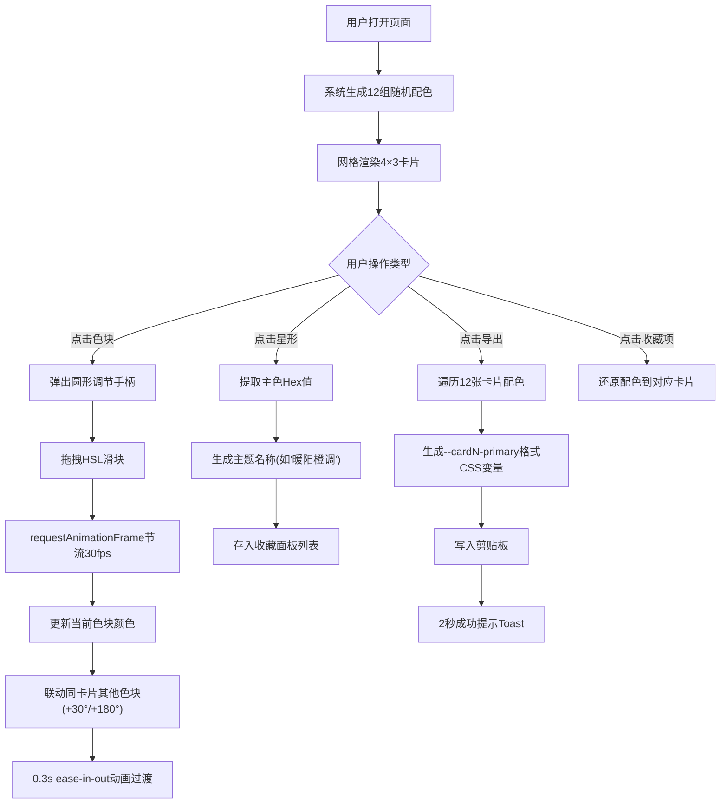

## 1. 产品概述

「色谱调校师」是一款面向视觉设计师的Web端配色方案实时预览与调校工具，帮助设计师在真实界面布局中快速验证多组色彩方案的视觉效果，替代传统设计软件中反复手动调整的繁琐流程。

- 核心目标：让设计师在浏览器中以网格布局同时预览12组配色方案，通过拖拽滑块实时调整HSL参数，收藏优质方案并一键导出为CSS变量
- 目标用户：UI设计师、前端开发者、品牌视觉设计人员
- 产品价值：显著提升配色方案的迭代效率，所见即所得地评估色彩组合

## 2. 核心特性

### 2.1 用户角色

| 角色 | 注册方式 | 核心权限 |
|------|----------|----------|
| 设计师用户 | 无需注册，直接使用 | 预览、调色、收藏、导出全部功能 |

### 2.2 功能模块

1. **主界面**：配色卡片网格预览、实时调色交互
2. **收藏面板**：配色方案收藏与快速还原
3. **导出栏**：CSS变量批量导出与复制

### 2.3 页面详情

| 页面名称 | 模块名称 | 功能描述 |
|----------|----------|----------|
| 主页面 | 卡片网格 | 4×3布局展示12张配色卡片，每张含主色/辅色/强调色三块60×60px色块 |
| 主页面 | 调色交互 | 点击色块弹出圆形半透明调节手柄，H/S/L三滑块实时调整，其余色块按偏移规则联动 |
| 主页面 | 收藏按钮 | 卡片右上角星形图标，一键收藏当前配色，自动生成主题名称 |
| 主页面 | 收藏面板 | 右侧240px宽垂直面板，可折叠，展示收藏列表，点击还原配色 |
| 主页面 | 导出栏 | 底部60px高固定栏，"导出为CSS变量"按钮，生成代码复制到剪贴板，2秒成功提示 |

## 3. 核心流程

用户打开页面 → 系统自动生成12组随机配色方案 → 网格渲染展示 → 用户点击任意色块 → 弹出调节手柄 → 拖拽HSL滑块（requestAnimationFrame节流至30fps）→ 颜色实时更新（0.3s ease-in-out过渡），同卡片其他色块按规则联动微调 → 用户点击星形图标收藏配色 → 自动生成主题名称存入收藏面板 → 用户点击"导出为CSS变量"按钮 → 生成所有卡片的CSS自定义属性代码 → 自动复制到剪贴板并显示2秒成功提示

## 4. 用户界面设计

### 4.1 设计风格

- **主色调**：深色主题，背景 #0f0f1a，卡片背景 #1a1a2e，导出栏背景 #1a1a2e
- **交互反馈**：
  - 卡片悬停：向上浮动4px，box-shadow: 0 8px 24px rgba(0,0,0,0.4)
  - 色块悬停：外发光，亮度提升15%
  - 所有点击/拖拽/切换操作：transform: scale(1.02) 持续0.15秒的震动反馈
- **按钮样式**：圆角按钮，深色基础色，悬停时亮度提升
- **字体**：现代无衬线字体（font-family: system-ui, -apple-system, sans-serif），数字使用等宽字体
- **布局**：卡片式 + 顶部标题 + 右侧可折叠收藏面板 + 底部固定导出栏
- **图标风格**：Lucide图标库，线性风格

### 4.2 页面设计概览

| 页面名称 | 模块名称 | UI元素 |
|----------|----------|--------|
| 主页面 | 顶部标题 | 标题文字"色谱调校师"，副标题描述，背景深色渐变 |
| 主页面 | 卡片网格 | CSS Grid布局，gap 16px，色块60×60px间隙8px，卡片悬停浮动+阴影 |
| 主页面 | 调色手柄 | 透明度0.3圆形，三个滑块H(0-360)/S(0-100%)/L(0-100%)，显示当前HSL值 |
| 主页面 | 收藏面板 | 右侧240px宽，可折叠按钮，收藏项含颜色预览+主题名称 |
| 主页面 | 导出栏 | 底部fixed定位，高度60px，按钮+Toast提示容器 |

### 4.3 响应式设计

- **大屏（≥1024px）**：网格4列，完整显示右侧收藏面板（240px）
- **中屏（768-1023px）**：网格3列，收藏面板可折叠
- **小屏（<768px）**：网格2列，隐藏侧边收藏面板

### 4.4 动画与性能

- 颜色变化过渡：0.3秒 ease-in-out
- 拖拽节流：requestAnimationFrame限制最多30次/秒
- 计算性能：HSL/Hex互转、对比度计算必须在16ms单帧内完成
