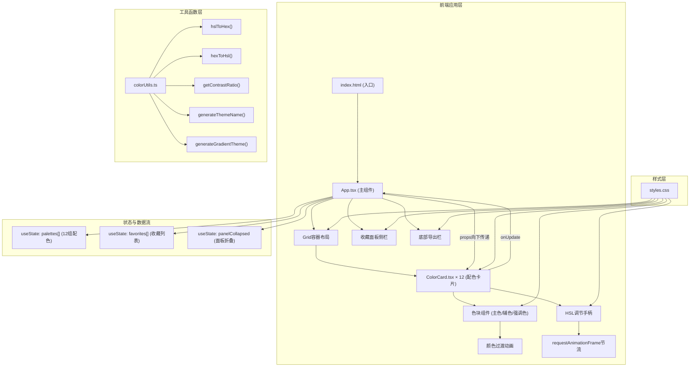

## 1. 架构设计



## 2. 技术描述

- **前端框架**：React@18 + TypeScript@5
- **构建工具**：Vite@5 + @vitejs/plugin-react
- **状态管理**：React useState Hooks（无额外状态库，轻量场景）
- **样式方案**：原生CSS（CSS Grid + Flexbox，CSS变量，CSS Transition动画）
- **图标库**：lucide-react（星形、展开/折叠、导出图标）
- **目标环境**：浏览器纯前端，无后端服务

### 文件结构与调用关系

```
项目根目录/
├── package.json          # 项目依赖与脚本
├── vite.config.js        # Vite构建配置(React+TS支持)
├── tsconfig.json         # TypeScript配置(严格模式, ES2020, bundler解析)
├── index.html            # 入口HTML, 含#root和样式重置
├── src/
│   ├── App.tsx           # 主组件
│   │   ├── 调用: colorUtils.ts(主题名称生成、导出数据处理)
│   │   ├── 传递: palettes数组 → Grid内ColorCard
│   │   └── 接收: ColorCard的onUpdate回调
│   ├── components/
│   │   └── ColorCard.tsx # 单张配色卡片
│   │       ├── 调用: colorUtils.ts(HSL/Hex转换、对比度计算)
│   │       ├── 接收: palette对象 + onUpdate回调(props)
│   │       └── 上报: 新HSL值 → 父组件onUpdate
│   ├── utils/
│   │   └── colorUtils.ts # 颜色工具函数模块
│   └── styles.css        # 全局样式
```

**数据流向**：
1. 用户拖拽滑块 → ColorCard内滑块事件 → requestAnimationFrame节流
2. → 计算新HSL → 同卡片其他色块按规则联动
3. → 调用props.onUpdate(index, newPalette)上报
4. → App.tsx更新palettes数组对应索引
5. → React diff后props下发 → ColorCard重新渲染
6. → CSS transition触发0.3s颜色过渡动画

## 3. 路由定义

纯单页应用，无路由。

| 路径 | 用途 |
|------|------|
| / | 主界面，含卡片网格、收藏面板、导出栏 |

## 4. 类型定义（TypeScript）

```typescript
// 单个颜色的HSL表示
interface HSLColor {
  h: number; // 0-360
  s: number; // 0-100
  l: number; // 0-100
}

// 单个配色方案（3种颜色）
interface Palette {
  id: string;
  primary: HSLColor;    // 主色
  secondary: HSLColor;  // 辅色 (主色偏移20-40°初始化，联动+30°)
  accent: HSLColor;     // 强调色 (主色+160-180°初始化，联动+180°)
}

// 收藏项
interface FavoriteItem {
  id: string;
  palette: Palette;
  themeName: string;     // 自动生成的主题名称如"暖阳橙调"
  savedAt: number;
}

// 色块类型标识
type ColorRole = 'primary' | 'secondary' | 'accent';
```

## 5. 核心算法与性能约束

### 5.1 配色初始化算法
```
for i in 0..11:
  primaryH = random(0, 360)
  primaryS = random(45, 75)
  primaryL = random(40, 60)
  secondaryH = primaryH + random(20, 40)
  secondaryS = primaryS ± random(0, 15)
  secondaryL = primaryL ± random(0, 15)
  accentH = primaryH + random(160, 180)
  accentS = clamp(primaryS + random(-10, 20), 0, 100)
  accentL = clamp(primaryL + random(-10, 10), 15, 85)
```

### 5.2 联动规则
- 调整主色：secondary.h = primary.h + 30; accent.h = primary.h + 180
- 调整辅色：primary.h = secondary.h - 30; accent.h = secondary.h + 150
- 调整强调色：primary.h = accent.h - 180; secondary.h = accent.h - 150
- H值所有计算均对360取模

### 5.3 性能保障
- 滑块事件：requestAnimationFrame + 时间戳节流（最多每33ms触发一次 = ~30fps）
- 颜色计算：纯数学运算，O(1)复杂度，确保<16ms
- 避免重排：颜色变化仅改变background-color，不影响布局

### 5.4 主题名称生成算法
基于主色Hex值的HSL特征匹配语义词汇：
- H区间匹配色相名称（红/橙/黄/绿/青/蓝/紫/粉）
- S/L匹配形容词（暖阳/深海/薄雾/暗夜/活力/沉稳等）
- 组合为"XX+色相+调/韵/境"格式
