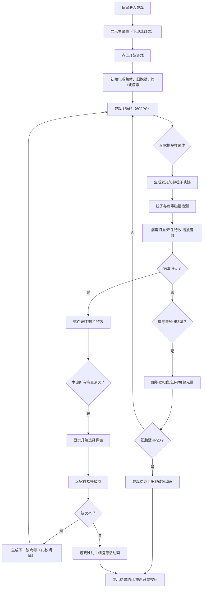

## 1. 产品概述

「噬菌体·细胞防御」是一款基于浏览器的2D即时战略塔防游戏，玩家操控微型噬菌体在动态血流的细胞环境中部署防御粒子，抵御5波入侵病毒。游戏结合生物荧光视觉风格与即时策略玩法，为独立游戏爱好者提供沉浸式微观细胞战斗体验。

- 核心目标：通过灵活操控噬菌体拖尾生成的防御粒子消灭病毒，保护细胞壁不被突破
- 目标用户：独立游戏玩家、生物主题游戏爱好者
- 产品价值：创新的塔防机制（噬菌体拖拽拖尾）+ 生物荧光视觉美学 + 渐进式波次难度

## 2. 核心特性

### 2.1 用户角色

| 角色 | 注册方式 | 核心权限 |
|------|----------|----------|
| 玩家 | 无需注册，直接游玩 | 操控噬菌体、升级属性、查看游戏状态 |

### 2.2 功能模块

1. **游戏主界面**：Canvas游戏画布、状态面板（左：噬菌体生命/粒子数，右：波次/细胞壁血量）、菜单按钮
2. **噬菌体操控系统**：鼠标拖拽移动、发光粒子轨迹生成、粒子碰撞检测与脉冲
3. **病毒波次系统**：5波病毒（共22个）、4种病毒类型（基础/快速/分裂/爆炸）、15秒间隔生成
4. **升级选择系统**：波次完成后三选一升级（伤害+1/持续时间+0.3s/频率+20%）
5. **视觉特效系统**：细胞质碎片、死亡光环、细胞壁红闪、屏幕光晕、裂纹动画
6. **音效系统**：击中音效、病毒死亡音效、波次开始音效、细胞壁破裂音效

### 2.3 页面详情

| 页面名称 | 模块名称 | 功能描述 |
|----------|----------|----------|
| 游戏主界面 | 游戏画布 | 80%宽度100%高度，Canvas渲染所有实体与粒子，WebGL渐变噪声背景 |
| 游戏主界面 | 左侧状态面板 | 噬菌体生命值显示、防御粒子数量/上限（40）显示 |
| 游戏主界面 | 右侧状态面板 | 当前波次（1-5）、细胞壁剩余生命值（渐变色进度条） |
| 游戏主界面 | 顶部菜单 | 毛玻璃效果开始/暂停/重开按钮 |
| 升级选择弹窗 | 三选一卡片 | 三个升级选项，毛玻璃卡片，发光边框，点击确认 |
| 游戏结束弹窗 | 结果展示 | 细胞存活/破裂动画，统计数据，重新开始按钮 |

## 3. 核心流程

## 4. 用户界面设计

### 4.1 设计风格

- **主色调**：深蓝紫细胞质背景（#1a0a2e），生物荧光绿（#00ffaa）、荧光蓝（#00aaff）、荧光紫（#aa00ff）
- **病毒色板**：基础红（#ff3355）、快速黄（#ffcc00）、分裂紫（#aa33ff）、爆炸橙（#ff8833）
- **UI风格**：毛玻璃效果（backdrop-filter: blur(12px)）、半透明面板（rgba(26,10,46,0.6)）、发光边框阴影（box-shadow: 0 0 20px rgba(0,255,170,0.3)）
- **按钮样式**：圆角8px，半透明背景，发光hover效果，0.2s过渡动画
- **字体**：主标题使用 Orbitron（科技感），正文使用 Rajdhani（清晰易读），均通过 Google Fonts 引入
- **动画**：弹窗弹出使用 0.3s ease-out，进度条渐变过渡使用 0.2s linear

### 4.2 页面设计概述

| 页面名称 | 模块名称 | UI元素 |
|----------|----------|--------|
| 游戏主界面 | 背景层 | Canvas：#1a0a2e底色 + WebGL渐变噪声光晕 + 半透明浮动粒子 |
| 游戏主界面 | 游戏画布 | 中心区域，80%宽度，四周细胞壁（渐变绿边框，裂纹渐变） |
| 游戏主界面 | 左侧面板 | 垂直布局：噬菌体图标 + 生命值数字 + 粒子数/上限 |
| 游戏主界面 | 右侧面板 | 垂直布局：波次数字1/5 + 细胞壁进度条（绿→红渐变）+ 血量数字 |
| 游戏主界面 | 顶部菜单 | 水平按钮组：开始/暂停/重开，毛玻璃面板 |
| 升级弹窗 | 卡片容器 | 3列等宽卡片，每卡：图标 + 升级标题 + 描述 + 发光边框 |
| 游戏结束弹窗 | 结果面板 | 大标题（胜利/失败）+ 统计数据 + 重玩按钮 |

### 4.3 响应式

- **桌面优先**：Canvas最小尺寸800x600，最大宽度视口80%
- **移动端适配**：不强制支持触屏，鼠标拖拽为主要操作方式
- **窗口缩放**：Canvas监听resize事件自动调整，保持内容等比缩放

## 5. 性能与约束

- **帧率目标**：全程60FPS（requestAnimationFrame驱动）
- **粒子上限**：防御粒子最多40个（FIFO淘汰），特效粒子最多80个
- **病毒上限**：内存中同时活跃病毒对象不超过20个
- **碰撞优化**：空间哈希网格（cell size = 50px）加速碰撞检测
- **渲染优化**：Canvas每帧仅更新视口内活动实体
