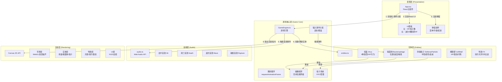

## 1. 架构设计



**文件调用关系与数据流向：**

1. **入口层**：index.html → 加载React应用 → 渲染App.tsx
2. **App.tsx → GameEngine.ts**：
   - 调用方向：`App.tsx` 实例化 `GameEngine`，传入 `canvasRef`
   - 数据流向：App传递鼠标/键盘事件 → Engine接收 → 分发到实体
   - 数据反向：Engine通过回调更新App状态（HP、波次、粒子数等）
3. **GameEngine.ts → entities.ts**：
   - 调用方向：Engine import 所有实体类，在循环中调用 `update()` 和 `render()`
   - 数据流向：Engine传递dt(帧间隔)、碰撞上下文 → 实体更新状态 → 写回Engine的实体数组
4. **GameEngine.ts → audio.ts**：
   - 调用方向：Engine import `AudioManager`，事件触发时调用 `playSound(type)`
   - 数据流向：事件类型（hit/death/wave/rupture）+ 可选参数 → AudioManager创建OscillatorNode播放
5. **GameEngine.ts → Canvas**：
   - 调用方向：Engine在每个RAF帧中调用 `ctx.save()/draw()/restore()`
   - 数据流向：实体的位置/颜色/透明度 → Canvas 2D绘制指令

## 2. 技术栈说明

- **前端框架**：React@18 + TypeScript@5（严格模式，strict: true）
- **构建工具**：Vite@5 + @vitejs/plugin-react@4
- **渲染引擎**：Canvas 2D API（实体、粒子、UI）
- **背景效果**：WebGL（通过原生着色器实现渐变噪声光晕）
- **音频系统**：Web Audio API（OscillatorNode + GainNode 合成音效）
- **状态管理**：React useState/useRef（UI状态），GameEngine内部类字段（游戏状态）
- **UI样式**：原生CSS（style标签，使用CSS变量统一主题）
- **字体**：Google Fonts（Orbitron, Rajdhani）通过link引入

**不引入的依赖**：
- 不使用状态管理库（Zustand/Redux）：游戏状态集中在GameEngine中，UI状态轻量
- 不使用Canvas库（Konva/Pixi）：性能敏感，原生Canvas完全满足需求
- 不使用CSS框架（Tailwind）：UI组件数量少，原生CSS更灵活控制毛玻璃/发光特效

## 3. 目录结构

```
auto63/
├── package.json              # 依赖声明：react, react-dom, typescript, vite, @vitejs/plugin-react, @types/react, @types/react-dom
├── vite.config.js            # Vite构建配置：@vitejs/plugin-react + server.port=5173
├── tsconfig.json             # TS配置：strict:true, target:ES2020, jsx:react-jsx, moduleResolution:bundler
├── index.html                # 入口：<div id="root"> + Google Fonts link
├── src/
│   ├── main.tsx              # React入口：ReactDOM.createRoot(<App/>, root)
│   ├── App.tsx               # 主组件：初始化GameEngine，管理UI状态，渲染HUD和弹窗
│   ├── App.css               # 全局样式：主题变量、毛玻璃效果、弹窗动画
│   ├── GameEngine.ts         # 游戏引擎：类封装，管理循环/碰撞/粒子/输入/渲染
│   ├── entities.ts           # 实体类：Bacteriophage, Virus, DefenseParticle, CellWall, FX
│   ├── audio.ts              # 音频管理器：AudioManager类，合成4种音效
│   ├── background.ts         # WebGL背景：渐变噪声光晕着色器
│   └── types.ts              # 类型定义：Vector2, Entity接口, SoundType, UpgradeType等
└── .trae/documents/
    ├── PRD-噬菌体细胞防御.md
    └── 技术架构-噬菌体细胞防御.md
```

## 4. 类型定义

```typescript
// 坐标向量
interface Vector2 { x: number; y: number; }

// 基础实体接口
interface IEntity {
  id: string;
  pos: Vector2;
  velocity: Vector2;
  radius: number;
  active: boolean;
  update(dt: number, ctx: UpdateContext): void;
  render(ctx: CanvasRenderingContext2D): void;
}

// 病毒类型枚举
type VirusType = 'basic' | 'fast' | 'split' | 'explode';

// 波次配置
interface WaveConfig {
  waveNumber: number;
  viruses: { type: VirusType; count: number }[];
  spawnDelay: number; // 15s
}

// 升级类型
type UpgradeType = 'damage' | 'duration' | 'frequency';

// 音效类型
type SoundType = 'hit' | 'death' | 'wave' | 'rupture';

// 游戏状态枚举
type GameState = 'menu' | 'playing' | 'paused' | 'upgrade' | 'victory' | 'defeat';

// Engine回调接口（供App更新UI）
interface GameEngineCallbacks {
  onStateChange: (state: GameState) => void;
  onStatsUpdate: (stats: GameStats) => void;
}

// 游戏统计数据
interface GameStats {
  phageHP: number;
  particleCount: number;
  particleMax: number;
  currentWave: number;
  totalWaves: number;
  cellWallHP: number;
  cellWallMaxHP: number;
  virusesRemaining: number;
}

// 更新上下文（传递给各实体update方法）
interface UpdateContext {
  canvasWidth: number;
  canvasHeight: number;
  deltaTime: number;
  spatialHash: SpatialHash;
  audio: AudioManager;
  spawnFX: (type: FXType, pos: Vector2, params?: any) => void;
}
```

## 5. 核心算法

### 5.1 空间哈希网格（碰撞优化）

```
CellSize = 50px（约等于最大实体半径×2）
GridCols = Math.ceil(canvasWidth / cellSize)
GridRows = Math.ceil(canvasHeight / cellSize)

插入：
  key = Math.floor(pos.x / cellSize) + Math.floor(pos.y / cellSize) * GridCols
  hash[key].push(entity)

查询邻域：
  遍历实体周围9个cell（含自身），收集实体列表，进行精确圆形碰撞检测
```

### 5.2 粒子FIFO淘汰

```typescript
class ParticleQueue<T> {
  private queue: T[] = [];
  constructor(private maxSize: number) {}
  enqueue(item: T): T | null {
    this.queue.push(item);
    if (this.queue.length > this.maxSize) {
      const evicted = this.queue.shift()!;
      (evicted as any).active = false;
      return evicted;
    }
    return null;
  }
  remove(item: T): void { /* 碰撞消耗时移除 */ }
}
```

### 5.3 病毒寻路算法

病毒朝向中心点（细胞壁中心，即噬菌体初始位置附近）做简单向量追踪，叠加微小随机扰动模拟血流扰动：

```
target = centerOfCell
dir = normalize(target - virus.pos) + random(-0.2, 0.2)
virus.velocity = normalize(dir) * virus.speed
```

## 6. 性能优化策略

1. **对象池模式**：FX特效对象使用对象池复用，避免频繁GC
2. **脏矩形渲染**：每帧仅重绘活动实体所在区域（简化：全屏重绘+离屏Canvas缓存静态背景）
3. **空间哈希**：50px cell size，O(1)邻域查询，碰撞复杂度 O(n) → O(n × avg_neighbors)
4. **节流输入**：mousemove事件throttle到16ms一次，避免过度生成粒子
5. **FPS监控**：Engine内置fps计数器，低于45FPS时自动降低FX粒子数量

## 7. 构建与运行

```bash
npm install
npm run dev       # 开发模式，Vite启动 http://localhost:5173
npm run build     # 生产构建，输出到 dist/
npm run preview   # 预览生产构建
```
