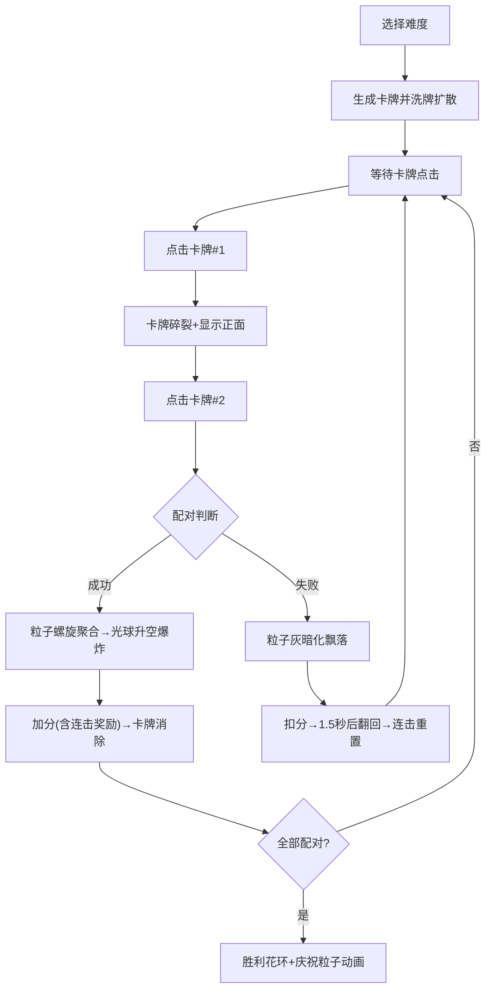

## 1. 产品概述

「记忆花火」是一款基于粒子系统的交互式卡牌记忆游戏，通过绚丽的粒子动效为传统记忆翻牌游戏增添沉浸式视觉体验。目标用户为休闲游戏爱好者，核心价值在于将枯燥的记忆训练转化为充满惊喜的烟花绽放体验。

## 2. 核心功能

### 2.1 用户角色
| 角色 | 注册方式 | 核心权限 |
|------|----------|----------|
| 玩家 | 无需注册，直接进入 | 游戏、选择难度、重新洗牌 |

### 2.2 功能模块
1. **游戏主画布**：卡牌渲染、粒子系统、物理场模拟
2. **计分计时系统**：实时计时、分数计算、连击奖励
3. **难度选择器**：初级(6×4)、中级(6×6)、高级(8×6)
4. **控制面板**：重新洗牌按钮、重力调节滑块、物理场指示器

### 2.3 页面详情
| 页面名称 | 模块名称 | 功能描述 |
|-----------|-------------|---------------------|
| 游戏主页 | 卡牌网格区 | 渲染卡牌背面/正面，支持点击翻转，洗牌扩散动画 |
| 游戏主页 | 粒子系统层 | 卡牌翻开碎裂、配对成功花火爆炸、配对失败尘埃飘散、胜利花环 |
| 游戏主页 | 计分板 | 磨砂玻璃效果，显示分数、连击数、计时器，分数弹跳动画 |
| 游戏主页 | 控制面板 | 难度下拉选择、重新洗牌按钮、重力强度滑块 |
| 游戏主页 | 物理场指示器 | 左下角显示重力方向/强度、涡旋场状态 |

## 3. 核心流程

玩家选择难度 → 系统生成对应数量的卡牌对并执行洗牌扩散动画 → 玩家点击第一张卡牌 → 卡牌碎裂为粒子飞出显示正面 → 玩家点击第二张卡牌 → 判断配对：
- 成功：两堆粒子螺旋聚合 → 光球升空爆炸 → 加分(含连击奖励) → 卡牌消除
- 失败：粒子灰暗化 → 缓慢飘落到底部 → 扣分 → 1.5秒后自动翻回
→ 全部配对完成 → 胜利花环动画 + 庆祝粒子

## 4. 用户界面设计

### 4.1 设计风格
- **主色**：深蓝紫渐变背景 `#1a1a2e → #16213e`
- **强调色**：按钮蓝绿色 `#00d2ff`，悬停亮青色 `#7fffd4`
- **卡牌调色板**：`#E74C3C, #3498DB, #2ECC71, #F1C40F, #9B59B6, #E67E22`（共12种，重复使用）
- **卡牌背面**：深灰色 + 星点纹理(2-4px圆斑，透明度0.2-0.5，2秒明暗周期闪烁)
- **字体**：标题使用具有未来感的等宽字体，正文使用简洁无衬线字体
- **计分板**：磨砂玻璃效果 `rgba(255,255,255,0.1)` 背景 + 0.5px 白色边框 + 8px 圆角
- **按钮**：圆角柔和过渡，悬停上浮3px + 内阴影

### 4.2 页面设计概述
| 页面名称 | 模块名称 | UI 元素 |
|-----------|-------------|-------------|
| 游戏主页 | 卡牌网格 | 居中布局，4:3画布自适应，卡牌圆角，翻转动效 |
| 游戏主页 | 粒子层 | Canvas全屏叠加，z-index高于卡牌背景低于UI面板 |
| 游戏主页 | 右上角计分板 | 垂直堆叠：计时器(大字号)、分数(弹跳动画)、连击数 |
| 游戏主页 | 顶部控制栏 | 左：难度下拉；中：标题「记忆花火」；右：重新洗牌按钮 |
| 游戏主页 | 左下角指示器 | 重力方向箭头 + 数值、涡旋场状态指示 |
| 游戏主页 | 右下滑块 | 重力调节滑块(-3到3)，数值实时显示 |

### 4.3 响应式
- 桌面优先设计，Canvas 保持 4:3 比例，最小宽度 600px
- 宽度自适应窗口，高度按比例缩放
- 触控设备优化点击区域（卡牌点击区域不小于60×60px）

### 4.4 动画规范
| 动画名称 | 持续时间 | 缓动函数 | 触发条件 |
|----------|----------|----------|----------|
| 洗牌扩散 | 0.8s | ease-out | 初始化/重新洗牌 |
| 卡牌点击反馈 | 0.1s | 缩放0.95→1.0 | 点击卡牌瞬间 |
| 翻开粒子飞散 | 1.5s | 线性淡出 | 卡牌翻开 |
| 成功螺旋聚合 | 0.6s | ease-in | 配对成功 |
| 光球升空爆炸 | 2.0s | ease-out | 聚合完成后 |
| 失败尘埃飘落 | 2.0s | ease-in | 配对失败 |
| 分数弹跳 | 0.3s | scale 1.2→1.0 | 分数变化 |
| 按钮悬停 | 0.2s | ease | 鼠标悬停按钮 |
| 花环旋转 | 4.0s | linear loop | 胜利动画 |
| 星点闪烁 | 2.0s | sin loop | 背景常驻 |
