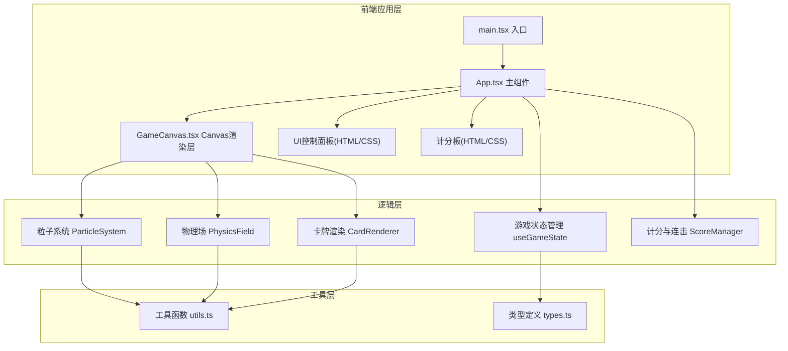

## 1. 架构设计



## 2. 技术描述

- **前端框架**：React 18 + TypeScript（严格模式，target ES2020）
- **构建工具**：Vite 5 + @vitejs/plugin-react
- **渲染引擎**：Canvas 2D（requestAnimationFrame 动画循环）
- **状态管理**：React useState/useRef（无需第三方状态库，状态集中在 App.tsx）
- **样式方案**：原生 CSS + CSS Variables（避免引入 Tailwind，保持轻量）
- **不使用**：任何第三方动画库、状态库、UI组件库

## 3. 路由定义

| 路由 | 用途 |
|-------|---------|
| / | 游戏主页面（单页应用，无其他路由） |

## 4. 文件结构

```
auto64/
├── package.json
├── vite.config.js
├── tsconfig.json
├── index.html
├── src/
│   ├── main.tsx              # React入口，渲染<App />
│   ├── App.tsx               # 主组件：状态管理、UI面板、难度/洗牌控制
│   ├── GameCanvas.tsx        # Canvas组件：卡牌+粒子+物理场
│   ├── types.ts              # 全局类型定义(Card, Particle, Difficulty等)
│   └── styles.css            # 全局样式、CSS Variables、动画关键帧
└── public/
    └── (空，无静态资源)
```

## 5. 核心数据模型

### 5.1 类型定义（types.ts）
```typescript
// 难度等级
export type DifficultyLevel = 'easy' | 'medium' | 'hard';

// 难度配置
export interface DifficultyConfig {
  cols: number;
  rows: number;
  label: string;
}

// 单张卡牌
export interface Card {
  id: number;
  pairId: number;          // 配对ID，两张相同pairId为一对
  isFlipped: boolean;      // 是否翻开显示正面
  isMatched: boolean;      // 是否已配对成功并消除
  pattern: number[][];     // 8x8像素矩阵(0-11索引对应调色板)
  colorIndex: number;      // 主色索引
  gridX: number;           // 网格坐标(列)
  gridY: number;           // 网格坐标(行)
  targetX: number;         // 目标画布坐标
  targetY: number;
  currentX: number;        // 当前画布坐标(用于洗牌动画)
  currentY: number;
  shuffleAnimStart: number; // 洗牌动画开始时间戳
  flipAnimProgress: number; // 翻转动画进度0-1
  clickScale: number;      // 点击缩放动画
}

// 粒子状态
export type ParticleState = 
  | 'scatter'       // 翻开飞散
  | 'spiral'        // 成功螺旋聚合
  | 'explode'       // 光球爆炸
  | 'dust'          // 失败尘埃飘落
  | 'wreath'        // 胜利花环
  | 'celebrate';    // 胜利庆祝

// 单个粒子
export interface Particle {
  id: number;
  x: number;
  y: number;
  vx: number;
  vy: number;
  size: number;
  color: string;
  alpha: number;
  life: number;        // 剩余寿命(秒)
  maxLife: number;
  state: ParticleState;
  // 螺旋/花环专用
  angle?: number;
  radius?: number;
  centerX?: number;
  centerY?: number;
  spiralProgress?: number;
  // 光球专用
  isLightOrb?: boolean;
}

// 涡旋场
export interface Vortex {
  x: number;
  y: number;
  radius: number;
  force: number;       // 0.2-0.5
  life: number;        // 剩余寿命
  born: number;        // 生成时间戳
}

// 游戏状态
export type GamePhase = 'idle' | 'shuffling' | 'playing' | 'won';
```

### 5.2 调色板
```typescript
export const COLOR_PALETTE = [
  '#E74C3C', '#3498DB', '#2ECC71', '#F1C40F',
  '#9B59B6', '#E67E22', '#FF6B9D', '#00CED1',
  '#FFD700', '#FF4500', '#32CD32', '#9370DB'
];
```

## 6. 性能优化策略

1. **粒子池**：预分配粒子数组，最大长度500，超出时淘汰最旧粒子
2. **帧率控制**：使用 requestAnimationFrame，根据 deltaTime 更新物理
3. **离屏绘制**：卡牌图案生成后缓存到 OffscreenCanvas，避免每帧重绘像素
4. **脏区裁剪**：粒子仅在可见区域绘制
5. **类型稳定**：所有类/接口属性顺序固定，帮助 V8 JIT 优化
6. **避免 GC**：动画循环中不创建新对象，复用粒子对象（重置属性而非新建）

## 7. 关键算法

### 7.1 洗牌算法（Fisher-Yates）
```typescript
function shuffle<T>(arr: T[]): T[] {
  for (let i = arr.length - 1; i > 0; i--) {
    const j = Math.floor(Math.random() * (i + 1));
    [arr[i], arr[j]] = [arr[j], arr[i]];
  }
  return arr;
}
```

### 7.2 8x8像素图案生成
- 中心对称生成：生成左半4列，镜像到右半
- 每个图案随机选择主色，像素填充率30-50%
- 生成后缓存，相同 pairId 复用相同图案

### 7.3 物理更新循环
```
每帧:
  1. dt = (当前时间 - 上一帧时间) / 1000 秒
  2. 更新涡旋场(生命周期/生成新涡旋)
  3. 更新卡牌洗牌动画
  4. 遍历每个粒子:
     - 根据 state 应用对应运动公式
     - 叠加重力场: vy += gravity * dt
     - 叠加涡旋场: 计算切向力
     - 更新位置: x += vx*dt; y += vy*dt
     - 更新 alpha/life
     - life <= 0 则回收
  5. 渲染: 背景→卡牌→粒子
```
