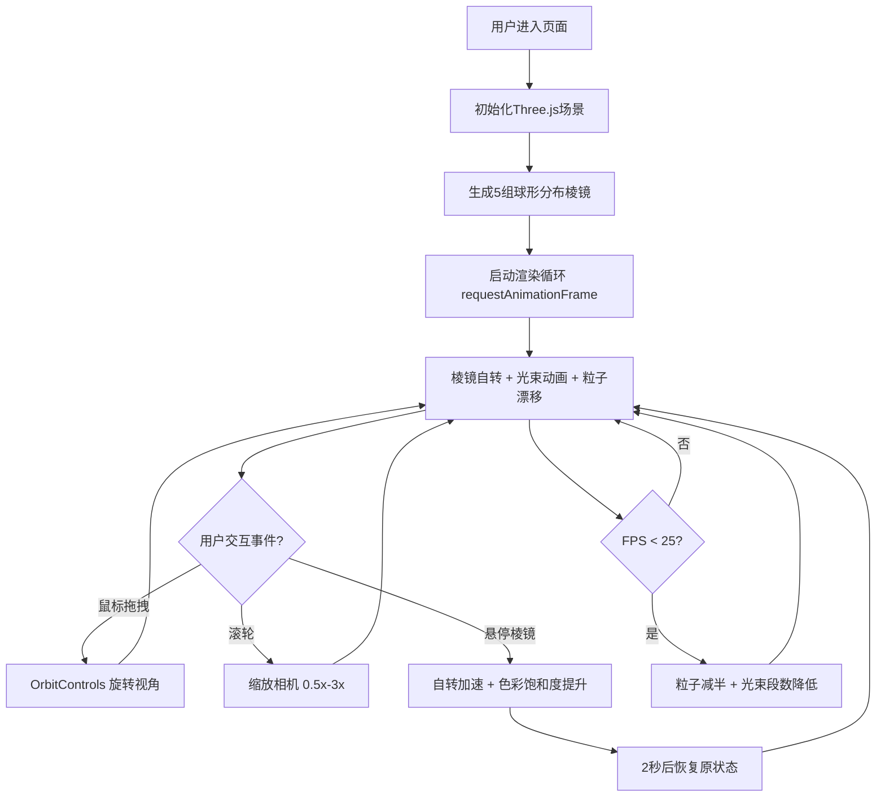

## 1. 产品概述

「光织·浮空棱镜」是一个基于WebGL的3D交互式视觉艺术装置，让用户在浏览器中操控一组由彩色光线编织而成的悬浮棱镜结构，体验动态光影交织的沉浸式视觉效果。

- 面向数字艺术家、视觉设计师、艺术爱好者，提供可交互的光影艺术创作体验
- 利用Three.js实现高性能3D渲染，将抽象的光学折射原理转化为可感知的视觉美学

## 2. 核心功能

### 2.1 功能模块

1. **主场景页面**: 棱镜组渲染、光束折射系统、动态粒子背景、用户交互控制、性能监控面板

### 2.2 页面详情

| 页面名称 | 模块名称 | 功能描述 |
|-----------|-------------|---------------------|
| 主场景页面 | 棱镜生成与布局 | 球形分布5组棱镜结构，每组18-24条光线，随机初始角度与自转速度 |
| 主场景页面 | 光束折射与交叉 | 每条棱镜发射贝塞尔曲线光束，色相循环渐变，交叉点微光闪烁 |
| 主场景页面 | 用户交互与反馈 | 鼠标拖拽旋转视角、滚轮缩放、悬停加速棱镜自转与色彩增强 |
| 主场景页面 | 动态背景粒子场 | 800-1000颗半透明粒子缓慢漂移，颜色随视角变化 |
| 主场景页面 | 性能监控与自适应 | 实时FPS显示，低于25fps自动降级粒子数与光束段数，移动端适配 |

## 3. 核心流程

用户进入页面后自动加载3D场景，棱镜结构持续自转并发射动态光束，背景粒子缓慢漂移形成星空效果。用户可通过鼠标拖拽旋转视角、滚轮缩放观察细节，悬停棱镜触发交互反馈。系统实时监控帧率，自动进行性能降级以保证流畅体验。

## 4. 用户界面设计

### 4.1 设计风格

- **主色调**: 深空黑色背景 `#0A0A14`，冷色系高饱和色循环：青 `#00FFFF`、紫 `#AA00FF`、洋红 `#FF00AA`
- **强调色**: 光束交叉点白色 `#FFFFFF` 闪烁，FPS计数器绿 `#00FFA0`
- **导航栏**: 半透明毛玻璃效果 `rgba(10,10,20,0.6)`，高度60px，`backdrop-filter: blur`
- **字体**: 标题使用系统无衬线字体 `font-family: -apple-system, system-ui, sans-serif`，FPS使用等宽字体 `monospace`
- **布局**: 全屏沉浸式3D画布，顶部悬浮导航栏，左上角标题、右上角FPS
- **质感**: 光线叠加使用加法混合(Additive Blending)，粒子半透明，整体营造深邃宇宙空间感

### 4.2 页面设计概述

| 页面名称 | 模块名称 | UI 元素 |
|-----------|-------------|-------------|
| 主场景页面 | 顶部导航栏 | 毛玻璃背景，左侧标题「光织·浮空棱镜」浅灰#C0C0D0 22px，右侧FPS绿色#00FFA0 14px等宽 |
| 主场景页面 | 3D场景区域 | 全屏WebGL画布，深空背景，棱镜彩色光线网络，动态粒子星空 |
| 主场景页面 | 棱镜结构 | LineSegments彩色光线编织，青/紫/洋红色相渐变，绕Y轴自转 |
| 主场景页面 | 光束系统 | 贝塞尔曲线渐变光束，切线发射，交叉点白光闪烁 |
| 主场景页面 | 粒子场 | 半透明Points，大小2-4px随机，色相随视角偏移 |

### 4.3 响应式设计

- **桌面优先**: 默认全屏布局，粒子数800-1000，棱镜半径5-12单位
- **窄屏适配** (<768px): 粒子数自动降至400颗，棱镜半径缩小至60%
- **移动端**: viewport缩放1.0，交互区域最小尺寸44px，触摸手势支持
- **分辨率自适应**: `window resize` 事件实时更新相机投影矩阵与渲染尺寸

### 4.4 3D场景指导

- **环境与氛围**: 纯黑深空背景 `#0A0A14`，无HDRI，依赖自发光材质创造光源感
- **光照设置**: 无场景光源，所有可视元素使用自发光材质 `MeshBasicMaterial` / `LineBasicMaterial` 配合 vertexColors
- **相机设置**: PerspectiveCamera fov=60，初始位置(0,0,20)，近裁剪0.1，远裁剪1000
- **相机运动**: OrbitControls，enableDamping=true，dampingFactor=0.05，minDistance=10，maxDistance=60
- **构图与焦点**: 5组棱镜球形分布于原点周围，视线默认聚焦原点，轨道控制器目标为(0,0,0)
- **交互与动画**:
  - 棱镜绕Y轴自转 (每帧0.002-0.008弧度)
  - 光束控制点沿贝塞尔曲线偏移产生流动感
  - 粒子沿随机方向0.001单位/帧漂移
  - 悬停棱镜自转速度×2，颜色饱和度0.6→1.0，持续2秒恢复
- **后期效果**: 加法混合实现光线叠加发光感，无额外后期处理以保证性能
- **资源与性能预算**: 纯程序化生成无外部资源，桌面端目标60fps，自动降级保证≥25fps
