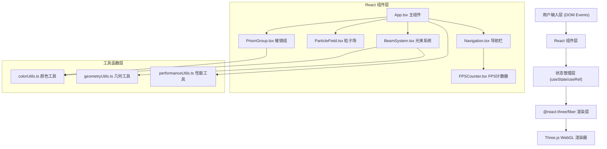

## 1. 架构设计



## 2. 技术描述

- **前端框架**: React 18 + TypeScript 5
- **构建工具**: Vite 5 + @vitejs/plugin-react
- **3D 渲染**: Three.js 0.160 + @react-three/fiber 8 + @react-three/drei 9
- **类型声明**: @types/three
- **初始化方式**: `npm create vite@latest -- --template react-ts`
- **后端服务**: 无（纯前端应用）
- **数据库**: 无（所有数据程序化生成）

### 关键技术选型说明：

1. **@react-three/fiber**: React 的 Three.js 渲染器，以声明式方式构建 3D 场景
2. **@react-three/drei**: 提供 OrbitControls 等常用组件，避免重复造轮子
3. **useFrame Hook**: R3F 内置的帧循环钩子，替代直接使用 requestAnimationFrame
4. **Ref + BufferGeometry**: 直接操作 Three.js 底层对象，确保动画性能
5. **加法混合 (Additive Blending)**: `THREE.AdditiveBlending` 实现光线叠加发光效果

## 3. 路由定义

| 路由 | 用途 |
|-------|---------|
| / | 主场景页面，包含完整 3D 交互装置 |

## 4. 数据模型

### 4.1 核心数据结构

```typescript
// 棱镜组配置
interface PrismConfig {
  id: number;
  position: THREE.Vector3;      // 球形分布位置
  rotationSpeed: number;         // Y轴自转速度 rad/frame (0.002-0.008)
  initialRotation: THREE.Euler;  // 初始旋转角度
  rayCount: number;              // 光线数量 (18-24)
  radius: number;                // 棱镜尺寸半径
  hueBase: number;               // 基础色相 (0-360)
  hueCyclePeriod: number;        // 色相循环周期秒数 (8-12)
  isHovered: boolean;            // 是否被鼠标悬停
  hoverEndTime: number;          // 悬停效果结束时间戳
}

// 单条光束
interface BeamData {
  id: string;
  prismId: number;
  controlPoints: THREE.Vector3[];  // 贝塞尔曲线控制点
  emissionDirection: THREE.Vector3; // 发射切线方向
  hueOffset: number;                // 色相偏移
  alpha: number;                    // 透明度
}

// 交叉点闪烁
interface IntersectionFlash {
  position: THREE.Vector3;
  startTime: number;    // 开始时间戳
  duration: number;     // 持续时长 (500ms)
  intensity: number;    // 闪烁强度 (0.3-0.9)
}

// 粒子数据
interface ParticleData {
  position: THREE.Vector3;
  velocity: THREE.Vector3;  // 漂移方向与速度
  baseHue: number;          // 基础色相
  size: number;             // 渲染大小 (2-4px)
}

// 性能状态
interface PerformanceState {
  fps: number;
  frameTimes: number[];    // 最近N帧耗时
  isDegraded: boolean;     // 是否已降级
  currentParticleCount: number;
  currentBeamSegments: number;  // 贝塞尔曲线段数 (10/5)
}
```

## 5. 模块调用关系与数据流向

### 5.1 文件结构

```
src/
├── App.tsx                    # 主组件：场景初始化、状态管理、交互协调
├── main.tsx                   # React 入口
├── components/
│   ├── PrismGroup.tsx         # 棱镜组：LineSegments光线编织、自转、悬停交互
│   ├── BeamSystem.tsx         # 光束系统：贝塞尔曲线光束、交叉点检测与闪烁
│   ├── ParticleField.tsx      # 粒子场：星空背景、漂移动画、视角色相随动
│   ├── Navigation.tsx         # UI导航栏：毛玻璃样式、标题、FPS容器
│   └── FPSCounter.tsx         # FPS计数器：实时帧率计算与显示
└── utils/
    ├── colorUtils.ts          # 颜色工具：HSL→RGB、色相环渐变、时间驱动颜色
    ├── geometryUtils.ts       # 几何工具：球形分布采样、贝塞尔曲线生成
    └── performanceUtils.ts    # 性能工具：FPS计算、自动降级策略
```

### 5.2 数据流向详细说明

```
用户输入事件流:
  DOM(mousedown/wheel/pointermove)
    → @react-three/drei OrbitControls 处理相机
    → R3F Raycaster 检测棱镜悬停
    → App.tsx setState(hoveredPrismId)
    → PrismGroup 接收 props → 更新自转速度与颜色饱和度

渲染循环数据流 (useFrame @60fps):
  App.tsx useFrame(state, delta)
    ├→ 更新全局时间戳 state.clock.elapsedTime
    ├→ 更新性能状态 performanceUtils.updateFPS()
    │   └→ FPS<25 ? 触发降级：粒子数/2, 光束段数:10→5
    ├→ 传递给子组件:
    │   ├→ PrismGroup: rotation += rotationSpeed * (hovered?2:1)
    │   │   └→ colorUtils.getPrismColors(time, index, saturation)
    │   │       └→ HSL循环 (hue=base+time/period*360, sat=hovered?1:0.6, lig=0.5)
    │   │       └→ 顶点色数组更新 BufferGeometry.attributes.color
    │   ├→ BeamSystem:
    │   │   ├→ 每条棱镜计算表面切线发射方向
    │   │   ├→ 贝塞尔曲线控制点沿时间偏移
    │   │   ├→ geometryUtils.bezierPoints(controls, segments)
    │   │   ├→ 交叉点检测：线段空间距离阈值<0.2
    │   │   │   └→ 生成 IntersectionFlash, 透明度0.3→0.9→0.3
    │   │   └→ colorUtils.getBeamColor(time, hueOffset)
    │   └→ ParticleField:
    │       ├→ 每个粒子 position += velocity
    │       ├→ 视角角度 camera.theta → 色相偏移 angle/360
    │       └→ BufferGeometry.attributes.position.array 批量更新
    └→ FPSCounter: 展示性能状态（DOM overlay）
```

## 6. 性能优化策略

### 6.1 渲染优化

- **BufferGeometry 复用**: 所有棱镜、光束、粒子共享几何结构，仅更新 attribute 数组
- **批量绘制**: 5组棱镜使用 InstancedMesh 或合并 LineSegments 减少 Draw Call
- **加法混合**: `THREE.AdditiveBlending` + `depthWrite: false`，透明排序开销降低
- **粒子使用 Points**: 单个 Draw Call 渲染所有粒子，而非独立 Sprite

### 6.2 自动降级

- **FPS监控**: 滑动窗口记录最近30帧耗时，平均FPS<25触发降级
- **降级策略1 - 粒子数**: 800→400→200，每次减半
- **降级策略2 - 光束段数**: 贝塞尔曲线采样 10→5段，顶点数减半
- **降级策略3 - 交叉检测**: 关闭交叉点闪烁，节省 O(n²) 线段求交

### 6.3 加载优化

- **Vite 代码分割**: Three.js 作为独立 chunk，首屏后懒加载 drei 重组件
- **无外部资源**: 所有几何/颜色程序化生成，无网络请求
- **渐进式渲染**: 先加载低精度版本，资源空闲后升级

## 7. 文件间调用关系表

| 调用方 | 被调用方 | 调用内容 | 数据传递方向 |
|--------|---------|---------|------------|
| App.tsx | PrismGroup.tsx | 渲染棱镜组组件 | props: config[], time, hoveredId |
| App.tsx | BeamSystem.tsx | 渲染光束系统 | props: prismConfigs[], time, degraded, segments |
| App.tsx | ParticleField.tsx | 渲染粒子场 | props: count, cameraAngle, time |
| App.tsx | Navigation.tsx | 渲染导航栏 | props: fps, isDegraded |
| Navigation.tsx | FPSCounter.tsx | 渲染FPS计数 | props: fps |
| PrismGroup.tsx | colorUtils.ts | 生成渐变色 | 入参: time, index, saturation → 返回: RGB数组 |
| BeamSystem.tsx | colorUtils.ts | 光束颜色计算 | 入参: time, hueOffset → 返回: RGB颜色 |
| BeamSystem.tsx | geometryUtils.ts | 贝塞尔曲线生成 | 入参: controls[], segments → 返回: 采样点数组 |
| App.tsx | performanceUtils.ts | FPS监控与降级 | 入参: frameTime → 返回: {fps, degraded, particleCount, segments} |
