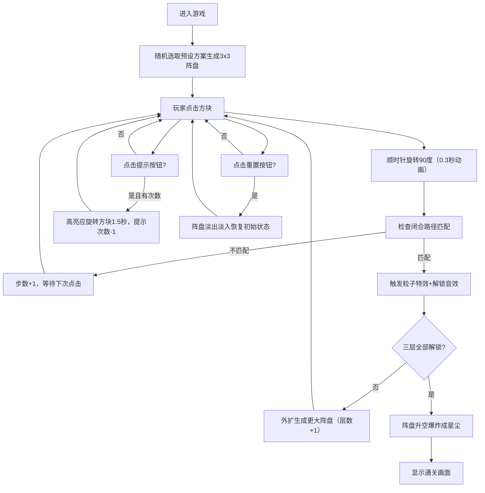

## 1. 产品概述

「秘语魔方·符文阵解谜」是一款面向独立游戏爱好者的浏览器端2D解谜游戏，玩家通过旋转符文方块构建闭合的魔法阵路径，逐层解锁阵盘获得视觉与听觉的双重反馈体验。

- 核心玩法：点击旋转六边形符文方块，使箭头路径从阵眼出发遍历所有方块形成闭合回路
- 目标用户：喜欢解谜游戏、追求视觉美感的独立游戏玩家
- 产品价值：提供富有沉浸感的解谜体验，结合粒子特效与合成音效营造神秘魔法氛围

## 2. 核心功能

### 2.1 用户角色
| 角色 | 注册方式 | 核心权限 |
|------|----------|----------|
| 玩家 | 无需注册，直接进入 | 进行游戏解谜、使用提示与重置功能 |

### 2.2 功能模块
1. **游戏主界面**：符文阵盘显示、顶部信息栏、底部控制按钮、环绕光环装饰
2. **阵盘生成系统**：3层递进式阵盘（3x3→5x5→7x7），预设可解方案随机选取
3. **旋转交互系统**：点击顺时针旋转90度，0.3秒动画过渡，缩放点击反馈
4. **路径判定系统**：实时检测从阵眼出发的闭合遍历路径，匹配即解锁
5. **粒子特效系统**：阵眼爆发粒子、颜色渐变、升空爆炸星尘效果
6. **音效系统**：Web Audio API合成音效，解锁递增频率音、最终爆炸音
7. **提示与重置系统**：3次高亮提示机会，重置恢复初始可解状态

### 2.3 页面详情
| 页面名称 | 模块名称 | 功能描述 |
|----------|----------|----------|
| 游戏主界面 | 顶部信息栏 | 展示当前层数、步数统计、剩余提示次数、游戏Logo |
| 游戏主界面 | 符文阵盘区 | Canvas渲染3x3/5x5/7x7六边形方块、箭头图案、旋转动画、粒子特效 |
| 游戏主界面 | 环绕光环 | 15个圆点组成的符文光环，绕中心0.02rad/s缓慢旋转 |
| 游戏主界面 | 底部控制区 | 重置按钮（渐变背景）、提示按钮（带3秒倒计时进度条） |
| 游戏主界面 | 胜利界面 | 全部解锁后阵盘升空爆炸成星尘，展示通关信息 |

## 3. 核心流程

玩家进入游戏后，首先看到3x3初始阵盘，通过点击方块旋转箭头方向，系统在每次旋转后自动检查路径是否闭合。若路径匹配则触发解锁特效（粒子爆发+音效），阵盘外扩一圈进入下一层（3x3→5x5→7x7）。三层全部解锁后触发最终爆炸特效通关。玩家可随时使用3次提示机会或重置当前阵盘。

## 4. 用户界面设计

### 4.1 设计风格
- **主色调**：深空蓝 `#0B0C10` 背景，营造神秘宇宙氛围
- **辅助色**：深靛蓝 `#1F2833`（方块底色）、水青色 `#45A29E`（解锁高亮）、金属金 `#C5C6C7`（箭头图案）
- **渐变色**：按钮使用 `#45A29E → #66FCF1` 渐变，粒子色相 `#FF6B6B → #4ECDC4` 渐变
- **装饰色**：半透明水青 `rgba(69, 162, 158, 0.3)`（网格线）、金色提示光晕
- **按钮样式**：圆角按钮，渐变背景，悬停微亮效果
- **字体**：等宽字族（monospace），文字色 `#E0E0E0`
- **整体风格**：深色科技与神秘魔法融合，发光与粒子效果营造魔法阵氛围

### 4.2 页面设计概述
| 页面名称 | 模块名称 | UI元素 |
|----------|----------|--------|
| 游戏主界面 | 顶部信息栏 | 左右对称布局：左侧「层数 / 步数」，右侧「提示剩余」，中间游戏Logo |
| 游戏主界面 | 符文阵盘区 | 居中Canvas，网格线半透明水青，六边形方块深靛蓝底色，金属金箭头，发光青色已解锁方块 |
| 游戏主界面 | 环绕光环 | 15个圆点围绕阵盘外沿，缓慢匀速旋转，水青色半透明 |
| 游戏主界面 | 底部控制区 | 两个圆角渐变按钮，水平居中排列；<500px宽度时垂直排列 |
| 游戏主界面 | 提示倒计时 | 提示按钮上叠加圆形进度条，3秒从满到空 |
| 游戏主界面 | 重置过渡 | 阵盘0.5秒淡出淡入过渡动画 |
| 胜利界面 | 星尘爆炸 | 整个阵盘升空后爆炸成漫天星尘粒子，渐隐消散 |

### 4.3 响应式设计
- **桌面优先（Desktop-First）**：默认桌面端布局
- **阵盘自适应**：根据视口尺寸自动调整，最小400px，最大700px
- **断点 <500px**：底部按钮改为垂直排列，顶部信息改为上下两行显示
- **触摸优化**：点击区域足够大，旋转交互响应迅速，无延迟

### 4.4 动画与微交互
- **方块旋转**：0.3秒顺时针旋转90度，线性过渡
- **点击反馈**：0.1秒缩放动画（1 → 1.1 → 1）
- **提示高亮**：方块边缘金色光晕，透明度0.5↔1.0来回变动，持续1.5秒
- **粒子系统**：解锁时30颗彩色粒子从阵眼爆发，1.5秒内消散
- **解锁状态**：方块变为发光青色并保持高亮
- **重置过渡**：0.5秒淡出→淡入恢复初始阵盘
- **最终爆炸**：三层解锁后阵盘升空→爆炸成漫天星尘
- **环绕光环**：15个圆点角速度0.02rad/s持续旋转
