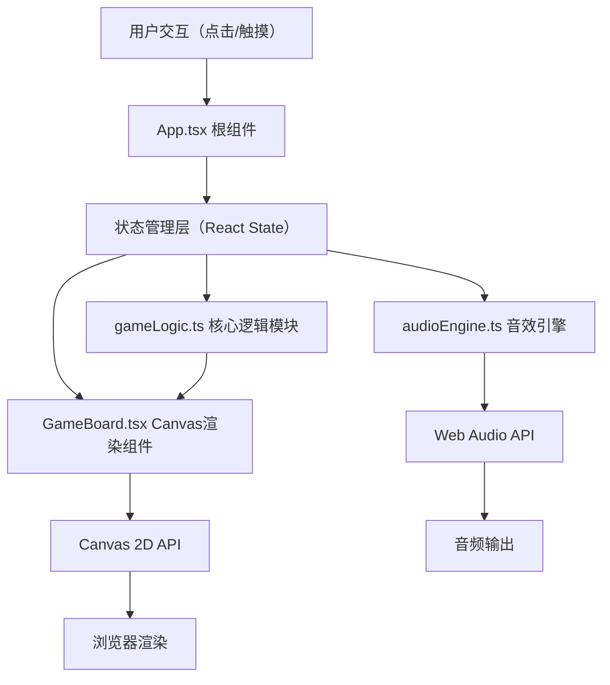

## 1. 架构设计

本项目为纯前端浏览器端解谜游戏，采用分层架构设计，通过React组件树管理UI与游戏状态，Canvas 2D负责高性能图形渲染，独立模块封装游戏逻辑与音频合成。



## 2. 技术选型

| 层级 | 技术栈 | 版本说明 |
|------|--------|----------|
| 构建工具 | Vite 5.x | 极速HMR与构建，配置@vitejs/plugin-react |
| UI框架 | React 18.x | 函数组件 + Hooks（useState, useEffect, useRef, useCallback） |
| 语言 | TypeScript 5.x | strict严格模式，路径别名@/指向src |
| 图形渲染 | Canvas 2D | requestAnimationFrame驱动，每帧≤1次重绘 |
| 音频合成 | Web Audio API | OscillatorNode合成，ADSR包络，无需音频文件 |
| 状态管理 | React本地状态 | useState/useReducer管理游戏状态，无额外状态库 |
| 样式方案 | CSS Module + 内联样式 | 响应式布局，CSS变量管理设计令牌 |

## 3. 模块结构与数据流向

```mermaid
graph LR
    subgraph "src/"
        App["App.tsx<br/>根组件<br/>事件绑定/状态调度"]
        GL["gameLogic.ts<br/>核心解谜逻辑<br/>纯函数模块"]
        GB["GameBoard.tsx<br/>Canvas组件<br/>渲染/动画/交互"]
        AE["audioEngine.ts<br/>音效引擎<br/>Web Audio封装"]
    end
    
    App -->|boardData| GB
    App -->|坐标(x,y)| GL
    GL -->|新阵盘/匹配结果| App
    App -->|解锁事件| AE
    GB -->|用户点击坐标| App
```

### 3.1 文件职责
| 文件 | 职责 | 核心接口 |
|------|------|----------|
| `App.tsx` | 游戏状态容器、事件中枢、UI布局 | 管理level/moves/hints/board状态，调度各模块 |
| `gameLogic.ts` | 阵盘生成、旋转处理、路径判定 | `generateBoard()`, `rotateCell()`, `checkPath()`, `expandBoard()`, `getHintCell()` |
| `GameBoard.tsx` | Canvas渲染、动画循环、交互监听 | 绘制方块/箭头/粒子/光环，监听点击事件，requestAnimationFrame循环 |
| `audioEngine.ts` | Web Audio封装、合成音效 | `playUnlockSound()`, `playFinalExplosion()`, `playClickSound()` |

### 3.2 数据流向（单向数据流）
1. **用户点击方块** → GameBoard捕捉坐标 → 上报App
2. **App调用gameLogic.rotateCell(x,y)** → 返回新的board（含旋转动画标记）
3. **App更新board状态** → GameBoard接收新board → 渲染旋转动画
4. **动画完成后App调用gameLogic.checkPath(board)** → 返回是否匹配
5. **匹配成功** → App触发:
   - 更新unlocked标记 → GameBoard渲染发光状态
   - 调用audioEngine.playUnlockSound() → 播放音效
   - 生成粒子数据 → GameBoard渲染粒子爆发
   - 若未满3层，调用gameLogic.expandBoard() → 生成下一层阵盘
6. **提示按钮** → App调用gameLogic.getHintCell() → 获取高亮坐标 → GameBoard渲染金色光晕

## 4. 数据模型定义

### 4.1 核心类型
```typescript
// 箭头方向（顺时针90度递增序列）
type Direction = 0 | 1 | 2 | 3 | 4 | 5 | 6 | 7;
// 0=上, 1=右上, 2=右, 3=右下, 4=下, 5=左下, 6=左, 7=左上

// 单个方块数据
interface Cell {
  x: number;              // 网格X坐标
  y: number;              // 网格Y坐标
  direction: Direction;   // 当前箭头方向
  targetDirection: Direction; // 目标正确方向
  isCenter: boolean;      // 是否为阵眼（中央方块）
  unlocked: boolean;      // 是否已解锁高亮
  rotating: boolean;      // 是否正在旋转
  rotationProgress: number; // 旋转动画进度 0~1
  highlighted: boolean;   // 是否被提示高亮
  scale: number;          // 点击缩放值
}

// 阵盘数据
interface Board {
  size: number;           // 阵盘尺寸 3|5|7
  cells: Cell[][];        // 二维网格数组
  level: number;          // 当前层数 1~3
  presolved: boolean;     // 是否已被成功解锁
}

// 粒子数据
interface Particle {
  id: number;
  x: number;              // 初始位置X（画布坐标）
  y: number;              // 初始位置Y
  vx: number;             // 水平速度
  vy: number;             // 垂直速度
  life: number;           // 剩余生命周期 0~1
  maxLife: number;        // 最大生命周期（秒）
  hueStart: string;       // 起始色 #FF6B6B
  hueEnd: string;         // 结束色 #4ECDC4
  size: number;           // 粒子大小
}

// 游戏状态
interface GameState {
  board: Board;
  currentLevel: number;   // 1~3
  moves: number;          // 总步数
  hintsRemaining: number; // 剩余提示次数
  particles: Particle[];  // 活跃粒子列表
  hintCell: {x:number,y:number}|null; // 当前提示坐标
  hintTimer: number;      // 提示剩余高亮时间
  victory: boolean;       // 是否全部通关
  fading: boolean;        // 重置过渡状态
  fadeAlpha: number;      // 淡出透明度
}
```

### 4.2 预设解谜方案（3套）
```typescript
// 每套方案包含3x3阵盘的targetDirection（正确方向值）
// 通过BFS/DFS预先验证可解性，保证从阵眼出发存在哈密顿闭合路径
const PUZZLE_PRESETS: Array<Array<Array<Direction>>> = [
  // 预设方案1：螺旋路径
  // 预设方案2：蛇形路径
  // 预设方案3：对角回环路径
];
```

## 5. 核心算法说明

### 5.1 路径判定算法（checkPath）
1. **起点**：阵眼方块（中心cell）
2. **方向映射**：根据direction计算下一格坐标偏移量（dx, dy）
3. **遍历**：沿箭头方向移动到下一格，检查是否越界或已访问
4. **终止条件**：
   - 访问过N个不同格子（N=size×size）且下一步回到起点 → 匹配成功
   - 越界/重复访问/死胡同 → 匹配失败
5. **复杂度**：O(N)，N≤49，每帧计算无性能压力

### 5.2 外扩阵盘算法（expandBoard）
1. **旧尺寸size → 新尺寸size+2**
2. **复制**：旧阵盘cells映射到新阵盘的中心区域（偏移+1）
3. **关联生成**：对新增外圈16/24个格子：
   - 50%概率 = 相邻内圈格子相反方向（direction + 4）% 8
   - 50%概率 = 随机非相反方向
4. **修正**：保证外圈整体存在可连通路径

### 5.3 粒子系统更新（每帧）
1. **上限**：最多100个活跃粒子
2. **更新**：
   - `x += vx * dt, y += vy * dt`
   - `life -= dt / maxLife`
   - `vy += gravity * dt`（轻微重力）
3. **渲染**：
   - 透明度 = life
   - 颜色 = lerp(hueStart, hueEnd, 1 - life)
4. **清理**：life ≤ 0 的粒子从数组移除

## 6. 性能约束实现方案

| 约束项 | 实现方案 |
|--------|----------|
| FPS ≥ 50 | requestAnimationFrame驱动，dt时间步长，避免阻塞主线程 |
| 阵盘每帧重绘 ≤ 1次 | React useEffect依赖数组精确控制，仅board/particles/hint状态变化才重绘 |
| 粒子 ≤ 100个 | 粒子数组length检查，超出时丢弃最早的粒子（FIFO） |
| 旋转动画流畅 | Canvas内部插值rotationProgress，而非逐帧更新React state |
| GC压力可控 | 对象池复用Particle对象，避免频繁创建/销毁 |
| 响应式布局 | useResizeObserver监听容器尺寸，动态计算cell大小 |

## 7. 音效合成方案（Web Audio API）
| 音效 | 参数配置 |
|------|----------|
| 点击音 | 方波 800Hz，ADSR 0.01/0.05/0.1/0.05，音量-20dB |
| 单层解锁音 | 锯齿波，频率线性 523Hz → 1047Hz，0.5秒时长，ADSR包络 |
| 全部通关音 | 3个正弦波叠加（C5/E5/G5大和弦），2秒持续，混响效果 |

## 8. 文件输出结构
```
auto66/
├── .trae/documents/
│   ├── PRD.md
│   └── TECHNICAL.md
├── index.html
├── package.json
├── tsconfig.json
├── vite.config.js
└── src/
    ├── App.tsx
    ├── main.tsx
    ├── index.css
    ├── gameLogic.ts
    ├── audioEngine.ts
    └── GameBoard.tsx
```
