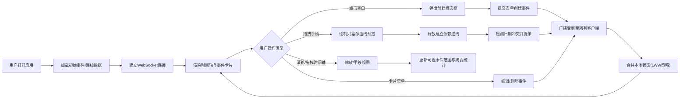

## 1. 产品概述

协作年谱是一款面向远程团队的沉浸式协作式时间轴应用，解决传统甘特图/看板工具在项目里程碑规划时缺乏流畅时间浏览和实时互动的痛点。团队成员可在可缩放拖拽的横向时间轴上创建、编辑和关联事件卡片，并通过WebSocket实现多人实时同步协作。

- **核心问题**：传统项目管理工具在远程协作中时间线浏览体验割裂，缺乏沉浸式交互和实时反馈
- **目标用户**：远程工作团队、项目管理者、产品研发团队
- **产品价值**：提供视觉化、沉浸式的时间轴协作体验，让项目规划和里程碑追溯更直观高效

## 2. 核心特性

### 2.1 用户角色

| 角色 | 注册方式 | 核心权限 |
|------|----------|----------|
| 团队成员 | 无需注册，直接访问 | 创建/编辑/删除事件卡片、建立依赖连线、实时同步协作 |

### 2.2 功能模块

1. **时间轴主界面**：可缩放拖拽的横向无限滚动时间轴，5级缩放层级（天/周/月/季/年），半透明网格背景
2. **事件卡片管理**：点击空白创建事件，模态表单编辑标题/日期/描述/优先级，彩色条块呈现
3. **依赖连线系统**：拖拽手柄建立贝塞尔曲线依赖关系，箭头指示方向，日期冲突检测与红色闪烁提示
4. **实时协作同步**：WebSocket多标签页实时广播，最后写入者获胜合并策略
5. **控制面板**：左下角垂直缩放滑块，右侧可折叠事件摘要面板（总数/已完成/冲突数统计）

### 2.3 页面详情

| 页面名称 | 模块名称 | 功能描述 |
|----------|----------|----------|
| 主界面 | 时间轴容器 | 水平无限滚动、5级缩放、平滑动画、网格背景、虚拟滚动优化 |
| 主界面 | 事件卡片 | 彩色条块、优先级色块、菜单按钮、拖拽手柄、悬停发光效果 |
| 主界面 | 依赖连线层 | Canvas绘制贝塞尔曲线、箭头指示、悬停高亮、冲突检测 |
| 主界面 | 模态表单 | 标题(必填50字)/日期选择器/Markdown描述/三档优先级选择 |
| 主界面 | 控制面板 | 垂直缩放滑块+标签、右侧浮动摘要面板、移动端折叠为圆形按钮 |
| 主界面 | 事件摘要面板 | 统计可视范围内事件总数、已完成数(含"已完成"文本)、冲突数 |

## 3. 核心流程

## 4. 用户界面设计

### 4.1 设计风格
- **主背景色**：#1a1a2e（深紫蓝），次要背景：#16213e，卡片背景：#0f3460
- **文字颜色**：#e0e0e0（浅灰白），优先级色：低-灰、中-蓝、高-红
- **字体方案**：标题使用 "Space Grotesk" 几何无衬线字体，正文使用 "JetBrains Mono" 等宽字体，营造科技工程感
- **布局风格**：沉浸式全屏时间轴为主体，左右浮动控制面板，卡片悬浮+发光边框微交互
- **视觉基调**：深空蓝紫赛博朋克风，半透明网格线营造数据可视化沉浸感
- **装饰细节**：卡片8px圆角+0.3阴影，悬停1.02缩放+青蓝发光边框，连线Canvas渲染

### 4.2 页面设计概览

| 页面名称 | 模块名称 | UI元素 |
|----------|----------|--------|
| 主界面 | 时间轴 | 全屏横向布局、50px网格(#ffffff10)、顶部时间刻度、渐变色块层次 |
| 主界面 | 事件卡片 | 8px圆角、box-shadow 0 4px 12px rgba(0,0,0,0.3)、左上6x6色块、右上...菜单、右侧8px半透明圆形手柄 |
| 主界面 | 连线层 | 2px rgba(255,255,255,0.6)贝塞尔曲线+箭头、悬停变3px #88ccff高亮 |
| 主界面 | 模态表单 | 深色背景弹出、居中布局、日期选择器、优先级三色选项卡 |
| 主界面 | 控制面板 | 左下角垂直range滑块、左右文字标签、右侧浮动折叠面板 |
| 主界面 | 冲突提示 | 红色边框闪烁动画（2秒，透明度0.3↔1循环3次） |

### 4.3 响应式设计
- **桌面优先**：完整时间轴+控制面板布局
- **移动端(<768px)**：
  - 时间轴保持水平触摸滚动
  - 事件摘要面板自动收起为48px直径圆形浮动按钮
  - 点击按钮弹出侧边抽屉展示统计

### 4.4 动效规范
- **缩放动画**：transition 0.3s 平滑过渡
- **悬停效果**：transform 0.2s ease-out（缩放1.02+发光）
- **冲突闪烁**：animation 2s infinite alternate（3次循环）
- **所有交互**：transform & opacity 0.2s ease-out 过渡
