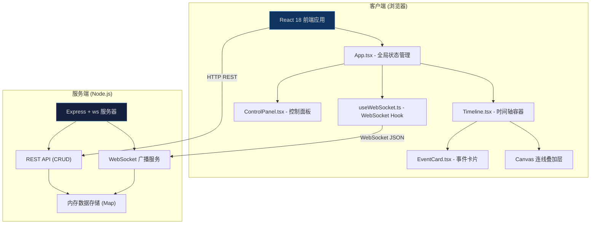
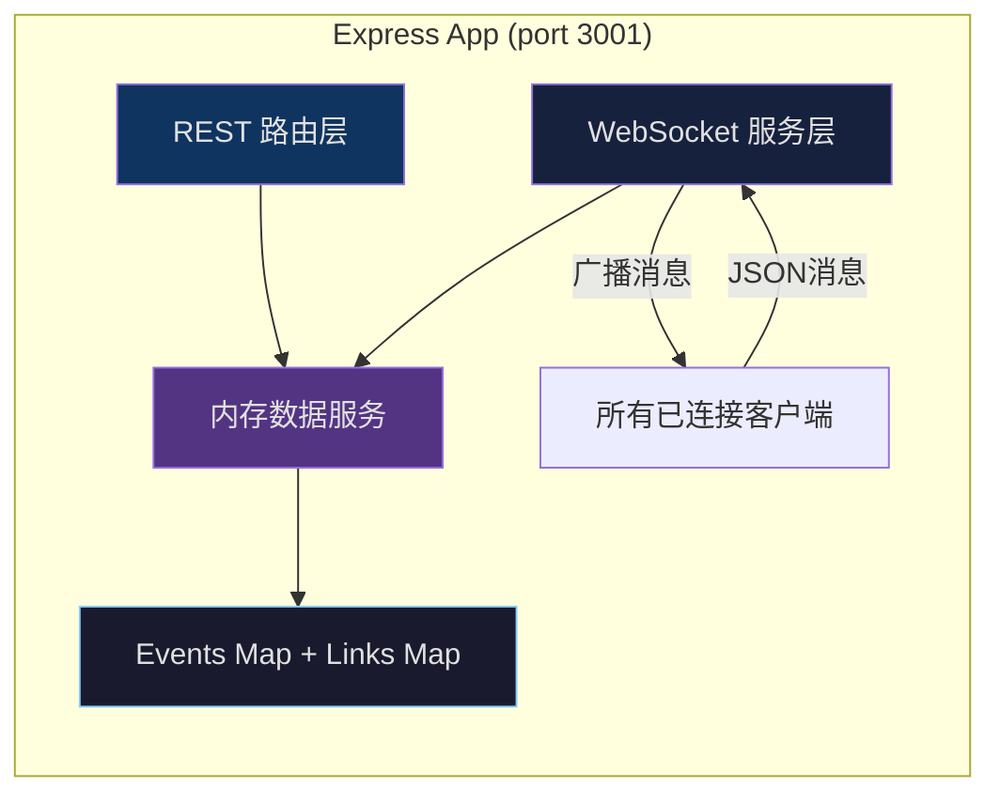
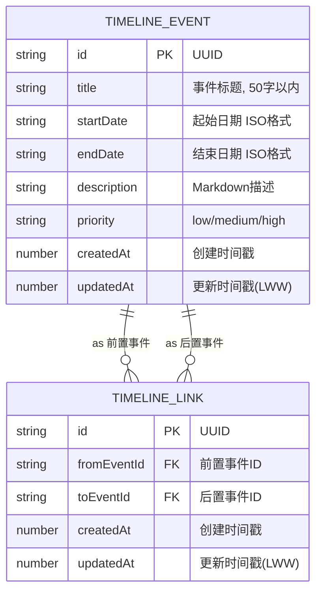

## 1. 架构设计



## 2. 技术说明

- **前端框架**：React 18 + TypeScript 5 + 函数组件 + useReducer
- **构建工具**：Vite 5 + @vitejs/plugin-react，ES模块输出
- **后端框架**：Express 4 + TypeScript，ts-node 执行
- **实时通信**：原生 `ws` 模块 + 浏览器 WebSocket API（不使用 Socket.io）
- **数据存储**：内存 Map（events + links），无需数据库
- **代理配置**：Vite dev server 代理 API/WebSocket 至 Express 3001端口
- **性能优化**：虚拟滚动（只渲染可视区卡片）、Canvas渲染连线（减少DOM节点）

## 3. 路由定义

| 路由 | 用途 |
|------|------|
| GET / | Vite 提供 React 应用入口 |
| GET /api/timeline | 获取全部事件和连线数据 |
| POST /api/events | 创建新事件 |
| PUT /api/events/:id | 更新指定事件 |
| DELETE /api/events/:id | 删除指定事件及关联连线 |
| POST /api/links | 创建新依赖连线 |
| DELETE /api/links/:id | 删除指定依赖连线 |

## 4. API 定义

### 类型定义

```typescript
// 优先级枚举
type Priority = 'low' | 'medium' | 'high'

// 事件接口
interface TimelineEvent {
  id: string
  title: string
  startDate: string  // ISO 8601 格式 YYYY-MM-DD
  endDate: string
  description: string  // Markdown格式文本，仅渲染纯文本和换行
  priority: Priority
  createdAt: number    // Unix 时间戳 (ms)
  updatedAt: number    // 用于最后写入者获胜 (LWW)
}

// 依赖连线接口
interface TimelineLink {
  id: string
  fromEventId: string  // 前置事件ID（被依赖）
  toEventId: string    // 后置事件ID（依赖方）
  createdAt: number
  updatedAt: number
}

// 时间轴完整数据
interface TimelineData {
  events: TimelineEvent[]
  links: TimelineLink[]
}

// WebSocket 消息类型
type WSMessage =
  | { type: 'event:created'; data: TimelineEvent }
  | { type: 'event:updated'; data: TimelineEvent }
  | { type: 'event:deleted'; data: { id: string } }
  | { type: 'link:created'; data: TimelineLink }
  | { type: 'link:deleted'; data: { id: string } }
  | { type: 'users:count'; data: { count: number } }
```

### 请求/响应示例

**GET /api/timeline** → 200 OK
```json
{
  "events": [{ "id": "evt_xxx", "title": "...", "startDate": "2026-01-01", "...": "..." }],
  "links": [{ "id": "lnk_xxx", "fromEventId": "evt_a", "toEventId": "evt_b" }]
}
```

**POST /api/events** (Body: Omit<TimelineEvent,'id'|'createdAt'|'updatedAt'>) → 201 Created

**PUT /api/events/:id** (Body: Partial<TimelineEvent>，但title/startDate/endDate必填) → 200 OK

**DELETE /api/events/:id** → 204 No Content（同时删除关联连线）

## 5. 服务端架构图



**关键实现要点**：
- 每个CRUD操作成功后，通过WebSocket向所有客户端广播对应事件
- 删除事件时级联删除 fromEventId 或 toEventId 匹配的连线，并广播 link:deleted
- 在线用户数变化时广播 users:count 消息

## 6. 数据模型

### 6.1 数据模型定义



### 6.2 数据实现（内存存储）

```typescript
// server 内存存储
const events = new Map<string, TimelineEvent>()
const links = new Map<string, TimelineLink>()

// 生成ID工具函数
function generateId(prefix: 'evt' | 'lnk'): string {
  return `${prefix}_${Date.now().toString(36)}_${Math.random().toString(36).slice(2, 8)}`
}
```

### 前端状态合并策略（LWW）

```typescript
// 收到WebSocket消息后合并本地状态
function mergeEvent(local: TimelineEvent | undefined, incoming: TimelineEvent): TimelineEvent {
  if (!local || incoming.updatedAt >= local.updatedAt) {
    return incoming  // 最后写入者获胜
  }
  return local
}
```
