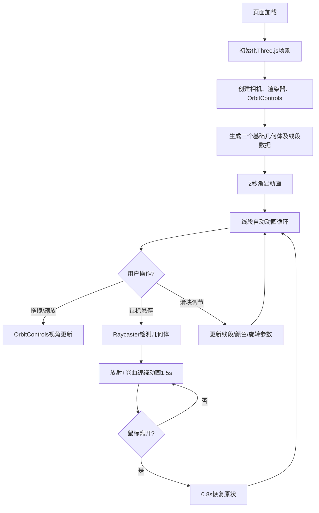

## 1. 产品概述

光锥缠绕三维交互可视化应用，在浏览器中呈现由发光线条构成的抽象几何体（立方体、球体、环面），通过动态光效与鼠标交互反馈，解决静态3D模型缺乏生动视觉体验的问题。

- 主要目的：创建沉浸式3D视觉体验，展示光纤维缠绕的动态美学效果
- 目标用户：设计师、艺术家、3D可视化爱好者、教育演示场景

## 2. 核心特性

### 2.1 功能模块

1. **主场景页**：3D场景渲染、基础几何体展示、发光线段动画、鼠标悬停交互、视角控制、参数控制面板

### 2.2 页面详情

| 页面名称 | 模块名称 | 功能描述 |
|-----------|-------------|---------------------|
| 主场景页 | 基础几何体生成 | 生成立方体、球体、环面三个抽象几何体，各由50-80条发光线段构成 |
| 主场景页 | 线段动态效果 | 线段颜色从暖色(#FF6B35)渐变到冷色(#2B2D42)，沿路径做2秒周期的正弦波动，色相偏移30度 |
| 主场景页 | 鼠标悬停交互 | Raycaster检测悬停，线段沿法线向外放射1.5倍距离，CatmullRom曲线生成2-3圈卷曲缠绕，动画1.5秒，离开后0.8秒恢复 |
| 主场景页 | 参数控制面板 | 三个滑块控制：线段粗细(1-8px)、颜色速度(0.5-3x)、旋转速度(0-1 rad/s)，数值实时显示 |
| 主场景页 | 视角控制 | OrbitControls拖拽旋转，滚轮缩放(0.5-5x) |
| 主场景页 | 辅助坐标轴 | 半透明RGB三轴辅助线(长度2单位)，微弱发光效果 |
| 主场景页 | 光晕效果 | Points配合透明度渐变实现柔和光晕，几何体分布在半径5的球面上 |
| 主场景页 | 性能优化 | BufferGeometry批量渲染，帧率50FPS+，无卡顿闪烁，UI响应延迟≤50ms |
| 主场景页 | 页面加载动画 | 几何体2秒透明渐显动画 |

## 3. 核心流程

用户进入页面 → 场景初始化（深空渐变背景、坐标轴、光晕加载）→ 几何体2秒渐显 → 发光线段自动动画 → 用户交互（拖拽旋转/滚轮缩放/悬停几何体）→ 卷曲缠绕动画触发 → 滑块参数调节 → 实时视觉反馈

## 4. 用户界面设计

### 4.1 设计风格
- **主色调**：深空渐变背景 #0B0C10 → #1F2833
- **强调色**：暖色 #FF6B35，冷色 #2B2D42，HSL色环平滑过渡
- **坐标轴色**：红R(255,0,0)、绿G(0,255,0)、蓝B(0,0,255)
- **UI面板**：磨砂玻璃风格，rgba(255,255,255,0.1)背景，1px rgba(255,255,255,0.2)边框
- **动画缓动**：所有过渡采用ease-in-out

### 4.2 字体
- 引入Google Fonts现代无衬线字体
- 标题：醒目的几何风格字体
- 正文：清晰易读的无衬线字体

### 4.3 页面设计概览

| 页面名称 | 模块名称 | UI元素 |
|-----------|-------------|-------------|
| 主场景页 | 3D画布 | 全屏渲染，深空渐变，Three.js WebGLRenderer |
| 主场景页 | 坐标轴辅助 | 场景中心，RGB三色轴，半透明发光 |
| 主场景页 | 三个几何体 | 球面上均匀分布，发光线段+Points光晕 |
| 主场景页 | 控制面板 | 右下角定位，磨砂玻璃，三个滑块组+实时数值 |
| 主场景页 | 加载动画 | 透明度0→1，2秒ease-in-out过渡 |

### 4.4 响应式设计
- **桌面端(>1200px)**：控制面板宽度300px，标准字体大小
- **平板端**：控制面板宽度200px，字体缩小80%
- **移动端**：控制面板缩小适配，滑块触控优化
- 保持3D场景全屏自适应

### 4.5 3D场景指导
- **环境**：深空渐变背景，无HDRI，营造深邃宇宙感
- **光照**：线段自发光材质(LineBasicMaterial + AdditiveBlending)，无传统光源依赖
- **相机**：PerspectiveCamera，OrbitControls限制缩放0.5-5倍
- **构图**：三几何体分布在半径5的球面上，正三角形布局，场景中心为视觉焦点
- **后处理**：发光效果通过AdditiveBlending实现，Points模拟光晕
- **性能**：BufferGeometry批量渲染，动画基于requestAnimationFrame，GPU友好
