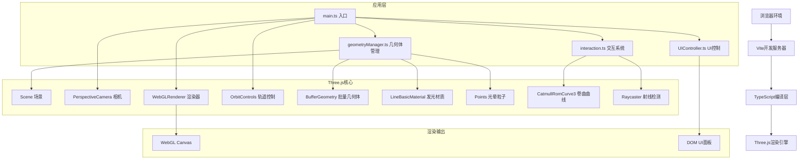

## 1. 架构设计



## 2. 技术描述

- **前端框架**：无框架（原生TypeScript），轻量高效，专注Three.js渲染
- **构建工具**：Vite@5，极速热更新，原生ES模块支持
- **3D引擎**：Three.js@0.160，成熟稳定的WebGL抽象层
- **类型系统**：TypeScript@5，严格模式(strict: true)，ESNext模块
- **材质系统**：LineBasicMaterial + AdditiveBlending，实现发光线段效果
- **动画系统**：requestAnimationFrame循环 + ease-in-out缓动函数
- **交互系统**：Raycaster射线拾取 + CatmullRomCurve3曲线缠绕
- **性能优化**：BufferGeometry批量渲染，共享材质实例，避免draw call爆炸

## 3. 模块与文件结构

| 文件路径 | 职责 | 核心导出 |
|----------|------|----------|
| `src/main.ts` | 应用入口，场景/相机/渲染器初始化，主循环 | `init()` 初始化函数 |
| `src/geometryManager.ts` | 几何体生成、线段数据管理、参数更新接口 | `GeometryManager` 类 |
| `src/interaction.ts` | 鼠标悬停检测、卷曲缠绕动画、放射恢复逻辑 | `InteractionManager` 类 |
| `src/UIController.ts` | 右侧UI面板DOM创建、滑块事件绑定、数值显示 | `UIController` 类 |
| `index.html` | 页面结构，Canvas容器，CSS样式，Google Fonts | - |

## 4. 关键类与接口定义

### 4.1 GeometryManager
```typescript
interface GeometryConfig {
  lineCount: number;        // 每几何体线段数 50-80
  warmColor: string;        // 暖色 #FF6B35
  coolColor: string;        // 冷色 #2B2D42
  wavePeriod: number;       // 正弦波动周期 2秒
  hueShiftRange: number;    // 色相偏移 30度
  distributionRadius: number; // 分布球面半径 5
}

interface GeometryData {
  id: string;               // 'cube' | 'sphere' | 'torus'
  group: THREE.Group;       // 几何体容器组
  lineMeshes: THREE.Line[]; // 线段数组
  haloPoints: THREE.Points; // 光晕粒子
  originalEndpoints: THREE.Vector3[]; // 原始端点缓存
  normals: THREE.Vector3[]; // 法线方向缓存
  hoverProgress: number;    // 悬停进度 0-1
  rotationSpeed: number;    // 旋转速度
}

class GeometryManager {
  constructor(scene: THREE.Scene, config?: Partial<GeometryConfig>);
  init(): void;                                   // 初始化三个几何体
  update(delta: number, colorSpeed: number): void; // 每帧动画更新
  getGeometries(): GeometryData[];                // 获取几何体数据
  setLineThickness(px: number): void;             // 设置线段粗细
  setRotationSpeed(radPerSec: number): void;      // 设置旋转速度
  setFadeInProgress(t: number): void;             // 设置渐显进度
  getBoundingMeshes(): THREE.Mesh[];              // 获取用于Raycaster的碰撞体
}
```

### 4.2 InteractionManager
```typescript
interface InteractionConfig {
  radiateScale: number;       // 放射倍数 1.5
  wrapDuration: number;       // 缠绕动画时长 1.5秒
  recoverDuration: number;    // 恢复时长 0.8秒
  wrapTurns: [number, number]; // 缠绕圈数范围 [2, 3]
  curveSegments: number;      // 曲线分段数
}

class InteractionManager {
  constructor(
    scene: THREE.Scene,
    camera: THREE.Camera,
    geometryManager: GeometryManager,
    renderer: THREE.WebGLRenderer,
    config?: Partial<InteractionConfig>
  );
  update(delta: number): void;                   // 每帧检测+动画
  getActiveHoverId(): string | null;             // 当前悬停几何体ID
}
```

### 4.3 UIController
```typescript
interface UICallbacks {
  onThicknessChange: (px: number) => void;
  onColorSpeedChange: (multiplier: number) => void;
  onRotationSpeedChange: (radPerSec: number) => void;
}

interface SliderConfig {
  min: number;
  max: number;
  step: number;
  default: number;
  label: string;
  unit: string;
}

class UIController {
  constructor(container: HTMLElement, callbacks: UICallbacks);
  mount(): void;                                   // 创建并挂载DOM
  unmount(): void;                                 // 清理DOM和事件
  updateThicknessDisplay(value: number): void;     // 外部更新显示
  updateColorSpeedDisplay(value: number): void;
  updateRotationSpeedDisplay(value: number): void;
}
```

## 5. 动画与性能设计

### 5.1 动画循环架构
```
requestAnimationFrame 
  ├─ 计算 deltaTime (秒)
  ├─ OrbitControls.update()
  ├─ InteractionManager.update(delta)
  │    ├─ Raycaster检测悬停
  │    ├─ 缠绕/恢复ease-in-out插值
  │    └─ 更新GeometryData.hoverProgress
  ├─ GeometryManager.update(delta, colorSpeed)
  │    ├─ 每个线段：HSL色相正弦波动
  │    ├─ 粗细沿路径Lerp
  │    ├─ 放射端点基于hoverProgress插值
  │    └─ Group旋转基于rotationSpeed
  ├─ UIController响应式检查(节流)
  └─ renderer.render(scene, camera)
```

### 5.2 性能优化策略
- **BufferGeometry批量**：同一几何体的线段尽量合并为单个BufferGeometry
- **共享材质**：相同视觉属性的线段共享LineBasicMaterial实例
- **曲线缓存**：CatmullRom曲线点计算仅在动画进度整数倍变化时重算
- **事件节流**：mousemove事件RAF节流，避免每像素触发
- **渐显动画**：opacity统一通过Group.material.transparent控制，非逐线段

### 5.3 缓动函数
```typescript
function easeInOutCubic(t: number): number {
  return t < 0.5 ? 4*t*t*t : 1 - Math.pow(-2*t+2, 3)/2;
}
```
用于：悬停缠绕(0→1,1.5s)、恢复(1→0,0.8s)、渐显(0→1,2s)、滑块过渡(可选)

## 6. 响应式断点

| 断点 | 面板宽度 | 字体缩放 | 说明 |
|------|----------|----------|------|
| > 1200px | 300px | 100% | 桌面端默认 |
| 768-1200px | 200px | 80% | 平板适配 |
| < 768px | 160px | 70% | 移动端触控优化 |

通过CSS Media Queries在index.html中内联定义。

## 7. 浏览器兼容性

| 浏览器 | 最低版本 | 技术依赖 |
|--------|----------|----------|
| Chrome | 90+ | WebGL 2.0, ES2020 |
| Firefox | 90+ | WebGL 2.0, ES2020 |
| Edge | 90+ | WebGL 2.0, ES2020 |
| Safari | 14+ | WebGL 2.0 fallback |

所有特性基于WebGL 1.0基础功能（无高级扩展），无需特殊polyfill。
