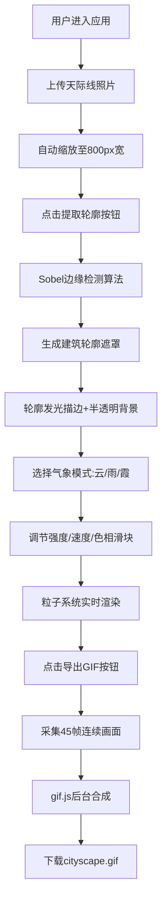

## 1. 产品概述

「天际·微光」是一款面向城市探险摄影师的Web前端应用，将用户拍摄的城市天际线照片转化为带有动态气象效果的交互式光影明信片。应用自动提取照片中的建筑轮廓并赋予呼吸光效，叠加流云、细雨、晚霞等气象粒子系统，支持实时调节与GIF动图导出。

- **核心价值**：零门槛的创意影像工具，让静态照片拥有电影级的动态光影氛围
- **目标用户**：城市摄影爱好者、社交媒体创作者、设计从业者

## 2. 核心功能

### 2.1 用户角色

| 角色 | 注册方式 | 核心权限 |
|------|----------|----------|
| 访客用户 | 无需注册，浏览器直接访问 | 上传图片、处理轮廓、选择气象模式、调节参数、导出GIF |

### 2.2 功能模块

1. **主编辑页面**：图片上传区、Canvas主显示区、垂直工具栏、缩略图列表、导出按钮
2. **图像处理模块**：图片缩放、Sobel边缘检测、轮廓遮罩生成、发光描边
3. **粒子系统模块**：流云/细雨/晚霞三种气象模式、实时参数调节、碰撞限制
4. **导出模块**：GIF帧采集、gif.js合成、进度显示、自动下载

### 2.3 页面详情

| 页面名称 | 模块名称 | 功能描述 |
|----------|----------|----------|
| 主编辑页 | 图片上传区 | 点击/拖拽上传（jpg/png ≤10MB）、拖拽高亮反馈、虚线边框 |
| 主编辑页 | 缩略图列表 | 最多3张缩略图、切换选中状态、删除未使用图片 |
| 主编辑页 | Canvas主显示区 | 800px固定宽度原图显示、轮廓叠加、粒子渲染、进度条覆盖 |
| 主编辑页 | 垂直工具栏 | 三种气象模式图标按钮、强度/速度/色相滑块组、提取轮廓按钮 |
| 主编辑页 | 导出按钮 | 亮橙色导出按钮、点击闪烁动画、导出进度条、自动下载 |

## 3. 核心流程

**主工作流程**：用户进入应用 → 上传天际线照片（自动缩放预览）→ 点击"提取轮廓" → Sobel边缘检测生成遮罩 → 建筑轮廓发光显示，非轮廓区域半透明 → 选择气象模式（云/雨/霞）→ 滑块实时调节强度/速度/色相 → 满意后点击"导出GIF" → 采集45帧（3秒×15fps）→ gif.js异步合成 → 自动下载cityscape.gif

## 4. 用户界面设计

### 4.1 设计风格

- **主色调**：深空蓝 `#1a1a2e`（背景）、微光金 `#FFD700`（轮廓发光）、电青蓝 `#00d2ff`（交互高亮）
- **气象主题色**：云 `#E0E0E0`、雨 `#00BFFF`、霞 `#FF6347`
- **导出按钮**：亮橙 `#FF8C00`
- **字体方案**：展示字使用 "Noto Serif SC"（思源宋体，优雅衬线），正文/控件使用 "PingFang SC"（苹方，现代清晰）
- **按钮风格**：圆形气象按钮（直径48px，Unicode符号居中），所有控件悬停时 `scale(1.1)` + `box-shadow` 增强，过渡 `0.3s ease`
- **布局风格**：左右式布局（左垂直工具栏 + 中央Canvas区 + 右下悬浮导出按钮），桌面端居中显示，移动端垂直堆叠

### 4.2 页面设计概述

| 页面名称 | 模块名称 | UI元素 |
|----------|----------|--------|
| 主编辑页 | 图片上传区 | 虚线2px边框 `#4a4a6a` → 拖拽时实线 `#00d2ff`，居中云图标+提示文字，圆角8px |
| 主编辑页 | 垂直工具栏 | 固定宽度80px，垂直排列三个圆形气象按钮，下方三个滑块，滑块背景渐变显示当前色相 |
| 主编辑页 | Canvas显示区 | 宽800px容器，黑边圆角，处理进度条覆盖在Canvas底部（0-100%，青色渐变填充） |
| 主编辑页 | 缩略图区 | 水平排列，120×80px缩略图，选中项金色2px边框，未选中半透明 |
| 主编辑页 | 导出按钮 | 右下角绝对定位，圆角全杯 `#FF8C00` 白色文字，点击时 `opacity` 闪烁动画，点击后上方出现进度百分比 |

### 4.3 响应式

- **桌面优先设计**，断点 768px
- **<768px移动端**：垂直工具栏转为水平顶部工具栏，Canvas宽度 100%（max-width 800px居中），导出按钮固定底部全屏宽度，缩略图区横向滚动
- **触控优化**：按钮最小触控区 44×44px，滑块增大手柄

### 4.4 视觉动效

- **轮廓发光**：`#FFD700` 2px描边，透明度 0.4-0.6 正弦波动（呼吸光效，周期3秒）
- **粒子入场**：切换气象模式时，粒子从对应方向渐入（云从左、雨从上、霞从下）
- **进度条**：Canvas绘制的线性进度，从左至右填充 `#00d2ff → #00ffa2` 渐变
- **导出闪烁**：按钮点击时触发一次 `@keyframes flash`（opacity 1→0.3→1，0.4s）
