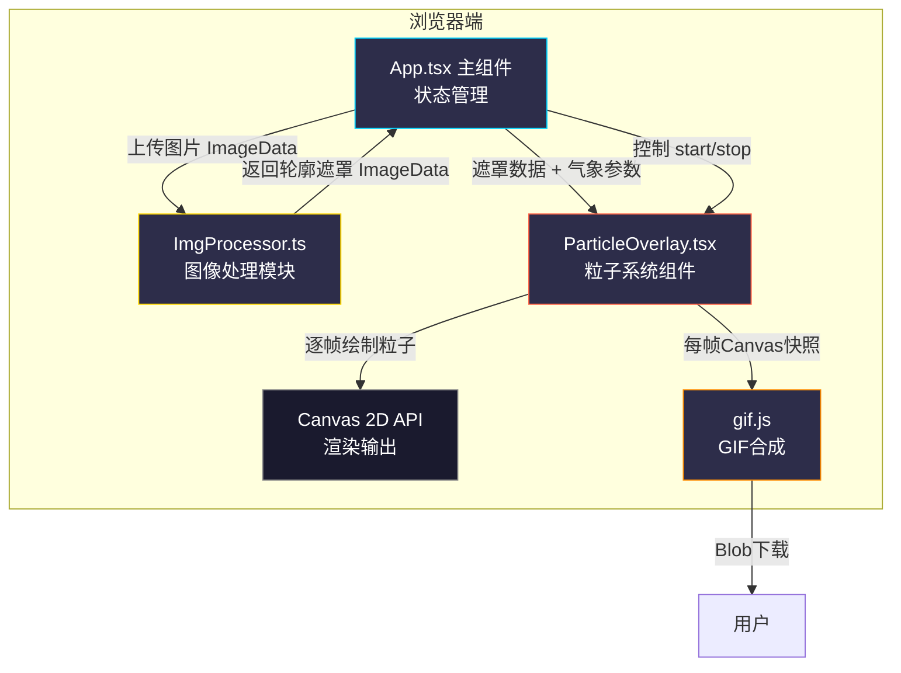

## 1. 架构设计



## 2. 技术描述

- **前端框架**：React 18 + TypeScript（严格模式 strict: true）
- **构建工具**：Vite 5 + @vitejs/plugin-react
- **图像处理**：Canvas 2D API + 手写 Sobel 边缘检测算法
- **粒子渲染**：Canvas 2D requestAnimationFrame 循环，对象池复用粒子
- **GIF导出**：gif.js（Web Worker 模式，不阻塞主线程）
- **样式方案**：原生 CSS + CSS 变量（深色主题），无Tailwind依赖（用户未指定）
- **初始化工具**：vite-init react-ts 模板

## 3. 文件结构与职责

```
auto69/
├── index.html                              # 入口HTML，含根容器、全局样式、字体CDN
├── package.json                            # 依赖：react/react-dom/typescript/vite/@vitejs/plugin-react/gif.js
├── vite.config.js                          # Vite React配置，端口、别名
├── tsconfig.json                           # strict:true, target:ES2020, module:ES2020
└── src/
    ├── main.tsx                            # React入口，渲染App
    ├── App.tsx                             # 【主组件】管理上传、状态、工具栏、导出、布局
    │                                       #   调用关系：→ ImgProcessor → ParticleOverlay
    ├── ImgProcessor.ts                     # 【图像处理模块】Sobel边缘检测 + 遮罩生成
    │                                       #   数据流：接收ImageData → 返回mask ImageData + 进度回调
    ├── ParticleOverlay.tsx                 # 【粒子系统组件】Canvas粒子渲染器
    │                                       #   接收：mask + weatherType + 强度/速度/色相
    │                                       #   内部：createParticles() / updateParticles() / renderParticles()
    └── types.ts                            # 共享类型定义（WeatherType, Particle, ImageItem等）
```

**数据流调用链**：
1. `App.tsx` 接收用户上传图片 → FileReader → HTMLImageElement → drawImage到隐藏Canvas → getImageData
2. `App.tsx` 调用 `ImgProcessor.extractContour(imageData, onProgress)` → 异步Sobel → 返回mask（建筑区域=不透明，非建筑=透明0.2）
3. `App.tsx` 将 `mask` + `weatherMode` + `intensity/speed/hueShift` 作为 props 传给 `ParticleOverlay`
4. `ParticleOverlay` 使用 mask 判定粒子允许出现的区域（仅在非建筑区域=透明处生成/运动），逐帧渲染
5. 导出时，`App.tsx` 逐帧抓取（原图 + 轮廓发光 + 粒子叠加）的合成Canvas，传给 gif.js 45帧（3s × 15fps）

## 4. 核心算法与性能设计

### 4.1 Sobel边缘检测（ImgProcessor.ts）

```
输入：RGBA ImageData (width × height)
步骤：
  1. 灰度化：Gray = 0.299R + 0.587G + 0.114B
  2. 高斯模糊（3×3核）降噪
  3. Sobel卷积：Gx=[-1,0,1;-2,0,2;-1,0,1]，Gy=[-1,-2,-1;0,0,0;1,2,1]
  4. 梯度幅值：G = sqrt(Gx² + Gy²)
  5. 双阈值二值化（high=80, low=30）+ 非极大值抑制简化版
  6. 输出mask：建筑像素 α=255（或发光描边），背景像素 α=51（0.2）
  7. 进度回调：每处理10%行数触发一次
```

### 4.2 粒子系统设计（ParticleOverlay.tsx）

| 气象模式 | 粒子结构 | 数量 | 运动规则 | 遮罩约束 |
|----------|----------|------|----------|----------|
| 流云 Cloud | `{x,y,r,opacity,vx,vy,phase}` | 200×强度 | x += vx×speed, y+=vy×speed；opacity按phase正弦波动 | 进入mask建筑区域时 opacity→0，或x坐标重置于左侧 |
| 细雨 Rain | `{x,y,len,angle,vy}` | 500×强度 | y += vy×speed, x偏移=tan(angle)×len；超出底部重置于顶部 | 触碰mask建筑区域时立即重置（雨滴被屋檐阻挡） |
| 晚霞 Sunset | `{x,y,rx,ry,hue,opacity,vy,life}` | 150×强度 | y -= vy×speed（上升），opacity=0.6×(1-life/totalLife)，life++ | 触碰mask时vy=0，横向飘移避免穿过建筑 |

**性能优化**：
- 粒子使用TypedArray（Float32Array）存储，避免GC
- requestAnimationFrame + deltaTime时间步长控制
- 离屏Canvas预渲染粒子sprite，drawImage代替arc/line
- 遮罩检测采用"降采样"：将mask缩到1/4分辨率，检查粒子位置时用整数坐标查表

### 4.3 GIF导出（不阻塞主线程）

- gif.js 自动使用 Blob URL + Worker（`workers: 2`）
- 每帧渲染：暂停粒子系统 → 渲染当前帧 → addFrame → 推进一个固定dt → 循环45次
- UI使用独立的进度条（非Canvas绘制），通过onProgress回调更新
- 最终 `renderAsync()` 返回 Blob，创建 `<a download>` 触发下载

## 5. 类型定义（types.ts）

```typescript
export type WeatherType = 'cloud' | 'rain' | 'sunset';

export interface ImageItem {
  id: string;
  file: File;
  url: string;           // ObjectURL
  width: number;
  height: number;
  scaledWidth: number;   // =800
  scaledHeight: number;  // =800 * aspect
  maskImageData?: ImageData;
  processed?: boolean;
}

export interface ParticleSettings {
  weather: WeatherType;
  intensity: number;     // 0 - 200 (%)
  speed: number;         // 0.5 - 3 (x)
  hueShift: number;      // -30 - +30 (度)
}

export interface ContourProgress {
  percent: number;       // 0-100
}
```
