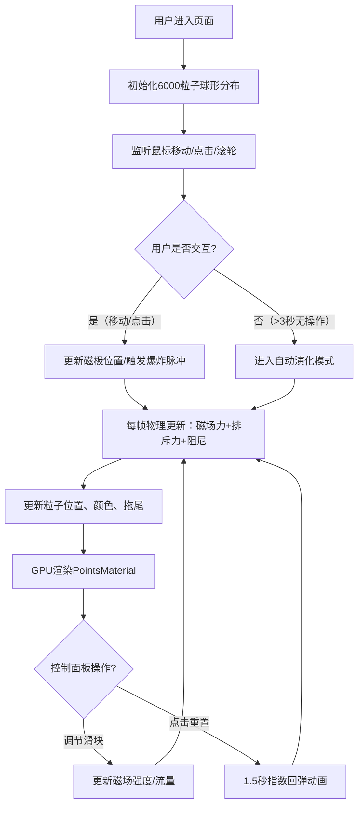

## 1. 产品概述

一个基于WebGL的三维交互式磁流体雕塑可视化应用，通过数千个磁性粒子的实时物理模拟，为用户提供沉浸式的艺术创作体验。用户可通过鼠标操控虚拟磁场，即兴创作流动的星云、花瓣和波纹形态。

- 核心目标：解决传统3D艺术缺乏实时物理触感和用户即兴创作反馈的问题
- 目标用户：数字艺术爱好者、创意设计师、互动艺术体验者
- 市场价值：探索人机交互艺术的边界，提供可触控的数字雕塑创作工具

## 2. 核心功能

### 2.1 用户角色

| 角色 | 注册方式 | 核心权限 |
|------|----------|----------|
| 访客用户 | 无需注册，直接访问 | 完整体验所有交互功能 |

### 2.2 功能模块

1. **主场景页面**：6000粒子3D磁流体雕塑、鼠标拖拽旋转、滚轮缩放、点击爆炸脉冲
2. **控制面板**：磁场强度滑块、粒子流量旋钮、重置按钮、自动演化状态指示

### 2.3 页面详情

| 页面名称 | 模块名称 | 功能描述 |
|----------|----------|----------|
| 主场景页面 | 粒子系统 | 6000个球形粒子在半径5单位的球体内分布，受磁场和邻居排斥力作用，60FPS实时更新，0.98阻尼系数 |
| 主场景页面 | 磁场模拟 | 鼠标位置作为磁极，平方反比吸引力（距离<0.1时消失），邻居短程排斥力（力程1.2单位线性衰减） |
| 主场景页面 | 拖尾效果 | 10个半透明副本构成拖尾，透明度0.6→0递减，长度随速度动态（>2单位/帧最长，<0.2时消失） |
| 主场景页面 | 点击爆炸 | 点击产生斥力脉冲（0.3秒，半径0→3，2倍磁场强度），粒子变金色#FFD700持续0.2秒；双击<0.5秒时4倍半径 |
| 主场景页面 | 自动演化 | 3秒无交互后启动，15个随机磁极交替切换（每个2-4秒），10-15秒周期变形，色相60-120度平滑过渡 |
| 控制面板 | 磁场强度滑块 | 范围0.5-5.0，默认2.0，步长0.1，实时显示数值 |
| 控制面板 | 粒子流量旋钮 | 聚集速度控制，范围0.1-2.0，默认1.0 |
| 控制面板 | 重置按钮 | 恢复初始球形分布，1.5秒指数回弹动画 |

## 3. 核心流程

## 4. 用户界面设计

### 4.1 设计风格
- **设计基调**：深空幽玄 · 星云流彩 · 极简未来主义
- **主色调**：纯黑背景 `#000000`，粒子从炽白 `#FFFFFF` 到幽蓝 `#000033`，暖色轮 `#FF3366`→`#FF9933`，冷色轮 `#9933FF`→`#3366FF`
- **控制面板**：半透明深紫蓝 `rgba(10,10,30,0.7)`，圆角8px，内边距12px
- **滑块样式**：轨道深灰 `#333`，手柄渐变蓝紫 `#3366FF`→`#9900FF`，悬停放大20%+浅蓝光晕
- **微交互**：控制面板悬停上浮10px+阴影加深（`rgba(0,0,0,0.3)`→`rgba(0,0,0,0.6)`），按钮点击110%放大+0.1秒回弹
- **字体**：Google Fonts - Space Grotesk（标题/数字） + Noto Sans SC（中文说明）
- **微光边缘**：所有UI元素 `box-shadow: 0 0 4px rgba(100,150,255,0.2)`

### 4.2 页面设计概述

| 页面名称 | 模块名称 | UI元素 |
|----------|----------|--------|
| 主场景页面 | 3D画布 | 全屏黑色背景，Three.js Canvas，OrbitControls拖拽旋转（Y轴-180°~180°，X轴-30°~30°），滚轮缩放0.5~10倍指数平滑（0.3秒过渡） |
| 主场景页面 | 粒子渲染 | PointsMaterial + sizeAttenuation，基于磁极距离的冷暖色渐变，<2单位高亮（+50%亮度），拖尾10层历史位置缓存 |
| 控制面板 | 容器 | 右下角浮动，响应式宽度（桌面240px / 移动180px），响应式字体（14px→12px），响应式滑块（160px→120px） |
| 控制面板 | 磁场强度 | 滑块+标签+实时数值显示，渐变手柄+悬停光晕 |
| 控制面板 | 粒子流量 | 旋钮+标签+当前值显示，圆形渐变旋钮 |
| 控制面板 | 重置按钮 | 圆角胶囊按钮，深蓝渐变，点击微缩放反馈 |
| 控制面板 | 演化指示 | 自动演化时显示脉冲小圆点 |

### 4.3 响应式设计
- **策略**：桌面优先，移动端自适应
- **断点**：768px
- **移动端适配**：控制面板宽度240→180px，字号14→12px，滑块160→120px
- **触控优化**：支持触摸拖拽旋转、双指缩放、点击爆炸

### 4.4 3D场景指引
- **环境/氛围**：纯黑虚空背景，无HDRI，粒子自发光营造星云氛围
- **光照设置**：无额外灯光，粒子使用顶点颜色自发光（PointsMaterial vertexColors）
- **相机设置**：PerspectiveCamera，fov 60，初始距离8单位，OrbitControls启用阻尼（enableDamping: true）
- **构图与焦点**：粒子球形雕塑居中，鼠标为视觉焦点，控制面板右下角不遮挡主体
- **交互与动画**：拖拽以点击点为中心旋转，缩放指数平滑0.3秒，重置指数回弹1.5秒，自动演化色相插值过渡
- **后处理**：无需额外后处理，依靠粒子透明度和拖尾叠加强度营造辉光感
- **性能预算**：每帧物理计算<16ms，6000粒子GPU渲染，单页Vite构建生产包<300KB（gzip）
