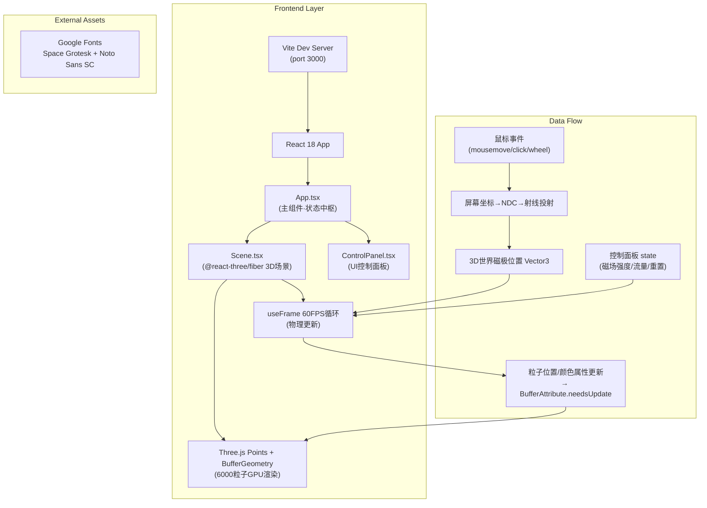
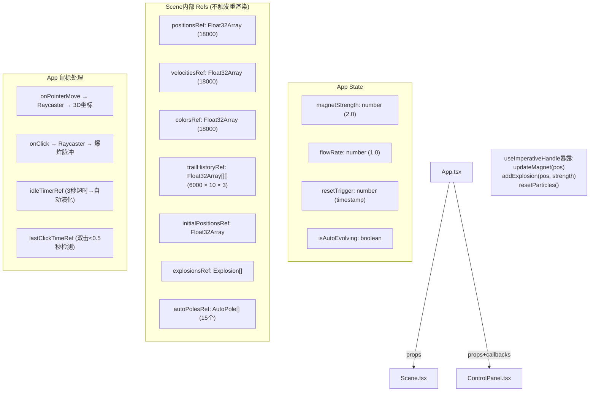

## 1. 架构设计



## 2. 技术描述

- **前端框架**：React 18 + TypeScript（strict模式）
- **构建工具**：Vite 5（ESNext模块，base: "./"，server port 3000 strictPort）
- **3D渲染引擎**：Three.js r160 + @react-three/fiber v8 + @react-three/drei v9（OrbitControls）
- **粒子渲染**：Three.js Points + BufferGeometry（position/color Float32Array）+ PointsMaterial（sizeAttenuation, vertexColors, transparent）
- **拖尾实现**：多实例化渲染策略，每个粒子10层历史位置数组，循环队列管理（pop最旧/push最新）
- **物理模拟**：CPU侧每帧向量运算（Vector3操作），6000粒子×磁场力+邻居排斥力+阻尼，目标<16ms/帧
- **类型系统**：TypeScript strict: true，target ES2020，module ESNext，jsx react-jsx
- **样式方案**：内联React style + CSS变量（响应式适配768px断点）

## 3. 路由定义

| 路由 | 用途 |
|------|------|
| `/` | 单页应用主入口，直接渲染磁流体雕塑3D场景+控制面板 |

## 4. 组件层级与Props数据流



## 5. 核心算法规范

### 5.1 粒子受力计算

```typescript
// 伪代码
for each particle i:
    force = Vector3(0,0,0)
    
    // 1. 用户磁极吸引力（平方反比）
    delta = magnetPos - positions[i]
    distSq = delta.lengthSq()
    if distSq > 0.01:  // 距离>0.1时才生效
        dist = sqrt(distSq)
        force += delta.normalize() * (magnetStrength / distSq) * flowRate
    
    // 2. 自动演化磁极吸引力
    for each autoPole:
        delta = autoPole.pos - positions[i]
        distSq = delta.lengthSq()
        if distSq > 0.01:
            force += delta.normalize() * (autoPole.strength / distSq) * flowRate
    
    // 3. 邻居排斥力（简化：网格空间哈希避免O(n²)）
    neighbors = spatialGrid.queryNearby(positions[i], radius=1.2)
    for each neighbor j:
        delta = positions[i] - positions[j]
        dist = delta.length()
        if dist < 1.2 && dist > 0.001:
            force += delta.normalize() * (1.2 - dist) / 1.2 * repulsionStrength
    
    // 4. 爆炸脉冲斥力
    for each explosion:
        delta = positions[i] - explosion.pos
        dist = delta.length()
        if dist < explosion.currentRadius:
            force += delta.normalize() * explosion.strength * (1 - dist/explosion.currentRadius)
    
    // 5. 积分更新
    velocities[i] = (velocities[i] + force * dt) * 0.98  // 阻尼
    positions[i] += velocities[i] * dt
```

### 5.2 颜色计算

```typescript
// 基于距最近磁极距离的冷暖渐变
distance = (position - nearestMagnet).length()
t = clamp(distance / maxDistance, 0, 1)  // 0=近, 1=远

// 暖色轮→冷色轮插值 (红#FF3366→橙#FF9933→紫#9933FF→蓝#3366FF)
if t < 0.33:
    color = lerp(#FF3366, #FF9933, t/0.33)
elif t < 0.66:
    color = lerp(#FF9933, #9933FF, (t-0.33)/0.33)
else:
    color = lerp(#9933FF, #3366FF, (t-0.66)/0.34)

// 距离<2单位高亮+50%亮度
if distance < 2:
    color = color * 1.5  // clamp到1.0

// 爆炸期间金色叠加 (0.2秒)
if explosionFlashTimer[i] > 0:
    color = lerp(color, #FFD700, explosionFlashTimer[i]/0.2)

// 自动演化色相偏移
if autoEvolving:
    color = shiftHue(color, currentHueOffset)
```

## 6. 文件组织

```
auto7/
├── .trae/documents/
│   ├── PRD-磁流体雕塑.md
│   └── TECH-架构设计.md
├── src/
│   ├── App.tsx              # 主组件：状态管理、鼠标事件、Canvas组装
│   ├── Scene.tsx            # 3D场景：粒子系统、物理模拟、拖尾、爆炸、自动演化
│   ├── ControlPanel.tsx     # 控制面板：滑块、旋钮、重置按钮、演化指示
│   └── main.tsx             # React入口
├── package.json             # 依赖+脚本
├── tsconfig.json            # TS配置 strict模式
├── vite.config.js           # Vite配置 base="./" port 3000
└── index.html               # 入口HTML 标题+字体+viewport
```

## 7. 性能优化策略

1. **物理计算优化**：使用 TypedArray（Float32Array）直接操作粒子数据，避免Vector3对象频繁GC
2. **邻居查询**：空间网格哈希（Spatial Grid）将邻居查找从O(n²)降为O(n)，网格尺寸=1.2单位
3. **GPU渲染**：单一Points draw call，BufferAttribute直接更新，避免逐对象渲染
4. **Ref而非State**：所有粒子数据存于useRef，useFrame内直接修改，不触发React重渲染
5. **拖尾优化**：历史位置循环队列，单次memcpy更新，避免数组shift/push开销
6. **60FPS节流**：useFrame内部dt时间步长，确保物理更新与帧率解耦
