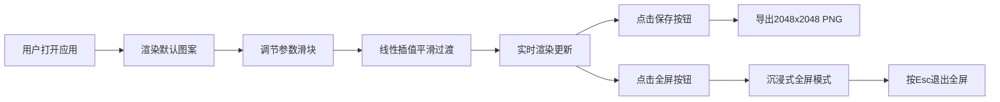

## 1. 产品概述
万花筒编织交互式图案生成器，是一款在浏览器中运行的创意图形生成Web应用。用户通过实时调节参数旋钮与滑块，动态生成幻彩万花筒图案，支持高分辨率图片导出，解决静态图形缺乏随机美学与动态演变的问题。
- 核心目标：为设计师、艺术爱好者提供即时视觉创作工具
- 市场价值：低门槛、即时满足创意图形创作需求

## 2. 核心功能

### 2.1 功能模块
1. **主画布区域**：万花筒图案实时渲染、粒子系统动态效果、光晕扩散
2. **参数控制面板**：6组滑块调节、基础图形选择、面板折叠
3. **导出与全屏**：高分辨率PNG导出、沉浸式全屏模式

### 2.2 页面详情
| 页面名称 | 模块名称 | 功能描述 |
|-----------|-------------|---------------------|
| 主页面 | 万花筒画布 | 实时渲染对称轴映射图案、渐变填充、纹理叠加、粒子闪烁漂移 |
| 主页面 | 参数调节面板 | 对称轴(2-12)、镜像层(1-5)、旋转速度(0.1-5°/帧)、色相偏移(0-360)、饱和度(±50%)、亮度(±50%)、基础图形选择 |
| 主页面 | 操作工具栏 | 保存PNG(2048x2048)、全屏切换、面板折叠 |

## 3. 核心流程
用户打开应用 → 默认渲染初始万花筒图案 → 调节任意参数 → 图案实时平滑过渡 → 点击保存导出高分辨率图片 → 可切换全屏沉浸式观赏

## 4. 用户界面设计
### 4.1 设计风格
- 主色：背景#0B0C10、面板#1F2833、文字#C5C6C7、强调色#45A29E
- 按钮样式：圆角8px、点击缩放至95%再恢复、绿色边框/背景
- 字体：现代无衬线字体、标题16px/正文13px
- 布局风格：左侧固定面板(280px可折叠)+右侧自适应画布
- 图标风格：Lucide图标库、线性风格、16px尺寸

### 4.2 页面设计概览
| 页面名称 | 模块名称 | UI元素 |
|-----------|-------------|-------------|
| 主页面 | 画布区域 | 黑色底色、万花筒圆形图案、粒子闪烁、光晕效果 |
| 主页面 | 参数面板 | 卡片分组、圆角8px、微弱阴影边框、滑块平滑过渡动画 |
| 主页面 | 全屏按钮 | 右上角半透明玻璃效果、悬浮高亮 |

### 4.3 响应式
- 桌面端：左面板280px + 右侧画布自适应
- 移动端(最小360px)：面板可折叠隐藏、画布全屏
- 触屏优化：滑块触控区域增大、按钮最小尺寸44px
