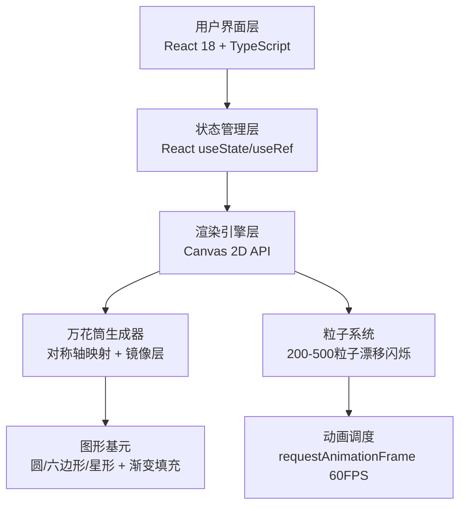

## 1. 架构设计


## 2. 技术描述
- 前端框架：React 18 + TypeScript 5
- 构建工具：Vite 5 + @vitejs/plugin-react
- 渲染引擎：原生 Canvas 2D API（保证性能12ms/帧内）
- 状态管理：React Hooks (useState / useRef / useEffect)
- 图标库：lucide-react
- 无后端、无数据库、纯前端应用

## 3. 路由定义
| 路由 | 用途 |
|-------|---------|
| / | 主应用页面，包含参数面板与画布 |

## 4. 核心类型定义
```typescript
interface KaleidoscopeParams {
  symmetry: number;        // 对称轴数量 2-12
  mirrorLayers: number;    // 镜像层数 1-5
  rotationSpeed: number;   // 旋转速度 0.1-5 °/帧
  hueOffset: number;       // 色相偏移 0-360
  saturationDelta: number; // 饱和度变化 -50 ~ +50 %
  lightnessDelta: number;  // 亮度变化 -50 ~ +50 %
  baseShape: 'circle' | 'hexagon' | 'star' | 'triangle' | 'square';
}

interface Particle {
  x: number; y: number;
  vx: number; vy: number;
  size: number;            // 2-6px
  alpha: number;           // 0.3-1.0
  alphaSpeed: number;
  alphaDir: number;
  hue: number;
}
```

## 5. 文件结构
```
.
├── package.json
├── vite.config.js
├── tsconfig.json
├── index.html
└── src/
    ├── App.tsx              # 主组件：状态管理 + 布局协调
    ├── main.tsx             # 入口文件
    ├── index.css            # 全局样式（深色主题）
    └── components/
        ├── Panel.tsx        # 参数面板组件
        └── Kaleidoscope.tsx # 画布组件 + 渲染引擎 + 粒子系统
```

## 6. 性能优化要点
- 使用 requestAnimationFrame 统一驱动动画循环
- 画布尺寸采用设备像素比适配，避免模糊
- 粒子系统使用对象池避免频繁GC
- 参数变更使用线性插值(lerp) 0.3-0.8s平滑过渡
- Canvas状态（save/restore）最小化，缓存重复计算
