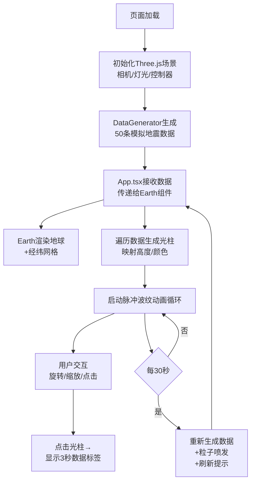

## 1. 产品概述

「地脉涟漪」是一款面向数据艺术家与科普爱好者的3D实时地震数据可视化沙盘，通过WebGL技术在浏览器中以沉浸式方式呈现全球地震活动分布。将抽象的地震震级、深度与地理位置映射为色彩斑斓的脉冲光柱与地形涟漪，让冰冷的数据转化为富有艺术感的动态视觉叙事。

- **核心价值**：以直观震撼的3D交互形式让用户感知地球的"脉动"，兼具科学可视化价值与艺术表现力
- **目标用户**：数据艺术家、地理/地震科普教育者、科技可视化爱好者

## 2. 核心功能

### 2.1 功能模块

1. **3D地球场景**：半透明蓝色地球 + 经纬网格，缓慢自转
2. **地震光柱映射**：按经纬度在球面生成光柱，高度/颜色映射震级
3. **脉冲波纹动画**：光柱底部持续扩散环形波纹
4. **粒子喷发特效**：数据更新时光柱顶部喷发射粒子簇
5. **视角交互系统**：拖拽旋转、滚轮缩放、点击光柱显示详情
6. **数据刷新提示**：每30秒数据更新时的淡入淡出通知

### 2.2 页面详情

| 页面名称 | 模块名称 | 功能描述 |
|---------|---------|---------|
| 主场景页 | 3D地球模型 | 半径5的半透明蓝色球体，白色经纬网格叠加，60秒自转一圈 |
| 主场景页 | 地震光柱系统 | 50个光柱，高度=震级*0.8，HSL颜色从绿→黄→红渐变 |
| 主场景页 | 脉冲波纹动画 | 光柱底部环形扩散，半径0.5→2.0，2秒周期循环 |
| 主场景页 | 粒子喷发系统 | 数据更新时每光柱发射震级*5个粒子，向上扩散1秒消失 |
| 主场景页 | 视角交互 | OrbitControls拖拽旋转，缩放范围5-30，tween过渡0.5秒 |
| 主场景页 | 数据标签 | 点击光柱显示震级/深度/时间信息，3秒后自动消失 |
| 主场景页 | 刷新提示 | 左上角"新数据已更新"淡入淡出提示，持续2秒 |

## 3. 核心流程

## 4. 用户界面设计

### 4.1 设计风格

- **主色调**：深空蓝黑渐变背景 #0a0a2a → #1a1a3a，营造宇宙深空氛围
- **地球色**：半透明蓝色（带发光效果），科技感全息投影风格
- **光柱色阶**：
  - 震级 0-3：HSL绿色区间 (120°, 80%, 50%)
  - 震级 3-6：HSL黄色区间 (60°, 90%, 55%)
  - 震级 6-10：HSL红色区间 (0°, 90%, 55%)
- **波纹色**：半透明白色 rgba(255,255,255,0.6)
- **提示文字**：青白色发光文字

### 4.2 视觉风格定位

**科技感暗色数据可视化主题**：
- 整体氛围：深空宇宙中的全息地球仪
- 地球质感：半透明 + 轻微发光描边，类似科幻全息投影
- 光柱质感：自发光材质 + 顶部高光
- 粒子质感：星点状快速消散光点
- 字体：等宽数字 + 无衬线标题字体，增强数据感

### 4.3 页面设计概览

| 页面名称 | 模块名称 | UI元素 |
|---------|---------|--------|
| 主场景页 | 背景层 | 径向渐变深蓝→深紫，轻微星点粒子点缀 |
| 主场景页 | 中央地球 | 居中显示，占视觉焦点60%，半透明发光 |
| 主场景页 | 光柱层 | 球面径向分布，高度错落，色彩分级 |
| 主场景页 | 波纹层 | 紧贴球面，环形扩散，低透明白色 |
| 主场景页 | 粒子层 | 数据刷新瞬间爆发，快速消散 |
| 主场景页 | 左上角提示 | 固定定位，CSS淡入淡出动画 |
| 主场景页 | 数据标签 | 跟随点击光柱位置，浮层样式，3秒淡出 |

### 4.4 响应式设计

- **桌面优先**：主场景100vw×100vh全屏
- **平板适配**：保持全屏，缩放范围自适应
- **移动端**：触控支持，禁用不必要的动画，降低粒子数以保证性能
- **窗口resize**：动态调整相机aspect和渲染器size

### 4.5 3D场景指引

- **环境光**：AmbientLight 强度0.3，提供基础照明
- **主光源**：DirectionalLight 从(10,10,5)方向，强度1.2，模拟太阳
- **点光源**：PointLight 在相机位置，增强光柱发光感
- **相机**：PerspectiveCamera fov=60，初始距离15
- **OrbitControls**：enableDamping=true，dampingFactor=0.08，smooth过渡
- **后处理**：轻微Bloom发光效果（可选，视性能而定）
- **性能预算**：实时对象 ≤ 200个，FPS目标60
