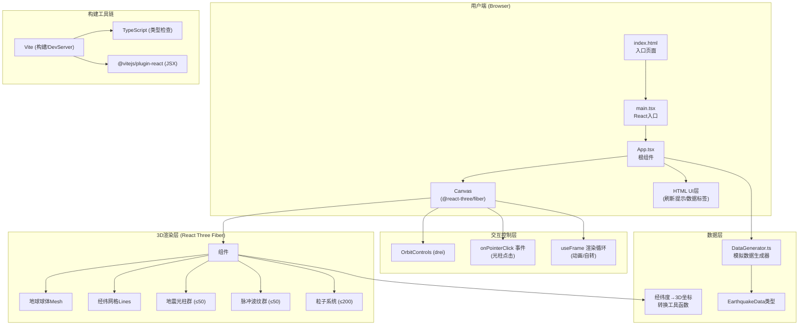
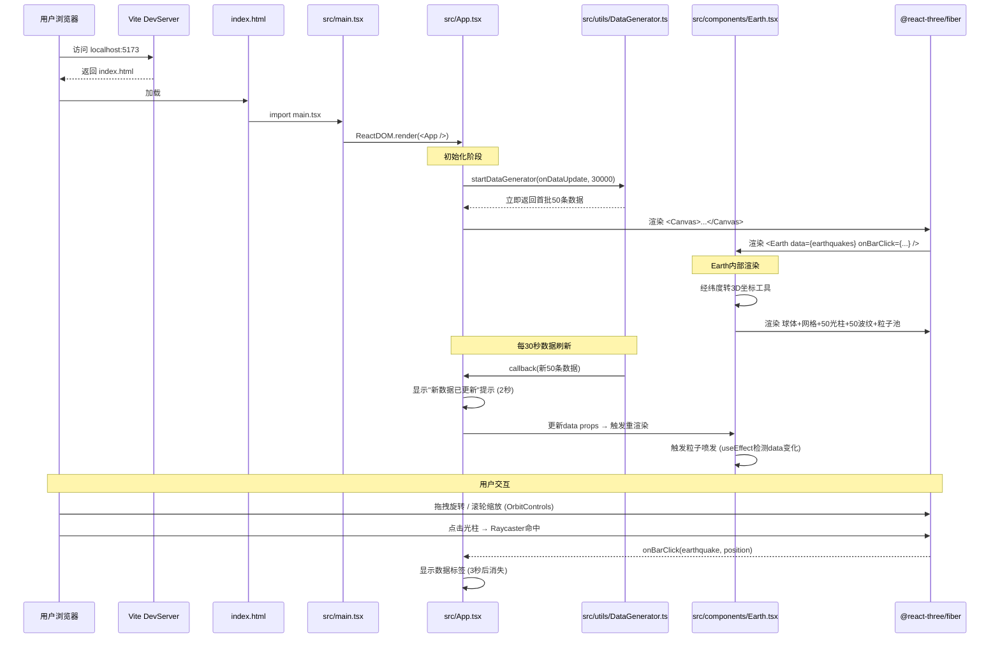

## 1. 架构设计



## 2. 技术栈说明

| 技术模块 | 选型 | 版本建议 | 用途说明 |
|---------|------|---------|---------|
| 前端框架 | React | ^18.2.0 | 组件化UI，Hooks管理状态/生命周期 |
| 3D渲染引擎 | Three.js | ^0.160.0 | WebGL底层渲染，几何体/材质/动画 |
| React 3D桥接 | @react-three/fiber | ^8.15.0 | React 声明式 Three.js 渲染器 |
| 3D辅助组件库 | @react-three/drei | ^9.92.0 | OrbitControls、Text、Html等预置组件 |
| 3D类型定义 | @types/three | ^0.160.0 | Three.js TypeScript类型支持 |
| 构建工具 | Vite | ^5.0.0 | 极速冷启动，ES Module原生支持，HMR |
| React构建插件 | @vitejs/plugin-react | ^4.2.0 | Vite下React JSX/TSX编译 |
| 类型系统 | TypeScript | ^5.3.0 | 严格类型检查，增强代码可维护性 |
| 语言编译目标 | ES2020 | - | 现代浏览器原生支持，兼顾性能与兼容性 |

## 3. 项目目录结构与调用关系

```
auto71/
├── package.json                 # 依赖声明 & npm scripts
├── vite.config.js               # Vite构建配置 (React + TS)
├── tsconfig.json                # TS严格模式配置 target:ES2020
├── index.html                   # 入口HTML，挂载点#root + 全局样式
└── src/
    ├── main.tsx                 # React入口，渲染<App />到#root
    ├── App.tsx                  # ★ 根组件
    │   ├── 数据流向：调用DataGenerator→获取地震数据→props传给<Earth />
    │   ├── 管理：Canvas画布、OrbitControls、灯光、相机
    │   ├── UI层：刷新提示、数据标签浮层、点击事件回调
    │   └── 生命周期：30s定时器→触发数据刷新→粒子喷发+提示动画
    │
    ├── components/
    │   └── Earth.tsx            # ★ 地球&地震可视化核心组件
    │       ├── 数据流向：接收App传入的earthquakes数组
    │       ├── 子元素1：球体Mesh (半透明蓝) + 经纬网格Lines
    │       ├── 子元素2：光柱群 (每个地震点一个CylinderMesh)
    │       ├── 子元素3：脉冲波纹群 (每个光柱底部一个TorusMesh，useFrame动画)
    │       ├── 子元素4：粒子群 (数据刷新时发射，1秒生命周期，useFrame更新位置)
    │       └── 工具：经纬度(lng,lat)→球面3D坐标(x,y,z)转换函数
    │
    └── utils/
        └── DataGenerator.ts     # ★ 模拟数据生成模块
            ├── 接口：generateEarthquakes(count=50) → EarthquakeData[]
            ├── 接口：startDataGenerator(callback, interval=30000) → stop函数
            └── 类型：export interface EarthquakeData { id, lng, lat, magnitude, depth, timestamp }
```

### 文件调用关系图



## 4. 核心数据模型

### 4.1 TypeScript 类型定义

```typescript
// src/utils/DataGenerator.ts
export interface EarthquakeData {
  id: string;              // 唯一标识，用于React key
  lng: number;             // 经度: -180 ~ 180
  lat: number;             // 纬度: -90 ~ 90
  magnitude: number;       // 震级: 0 ~ 10 (精确到小数点后1位)
  depth: number;           // 深度(km): 0 ~ 700
  timestamp: number;       // 发生时间戳 (ms)
}

// 映射配置常量
export const CONFIG = {
  EARTH_RADIUS: 5,         // 地球半径 (单位: 3D空间单位)
  BAR_HEIGHT_MULTIPLIER: 0.8, // 光柱高度系数: magnitude * 0.8
  GRID_LINE_WIDTH: 0.05,   // 经纬网格线宽
  ROTATION_PERIOD: 60000,  // 地球自转周期 (ms) = 60秒
  PULSE_DURATION: 2000,    // 波纹周期 (ms)
  PULSE_RADIUS_START: 0.5, // 波纹起始半径
  PULSE_RADIUS_END: 2.0,   // 波纹结束半径
  PARTICLE_LIFETIME: 1000, // 粒子存活时间 (ms)
  PARTICLE_PER_MAG: 5,     // 每震级发射粒子数
  DATA_REFRESH_INTERVAL: 30000, // 数据刷新间隔 (ms)
  LABEL_DURATION: 3000,    // 数据标签持续时间 (ms)
  REFRESH_NOTICE_DURATION: 2000, // 刷新提示持续时间 (ms)
  MAX_REALTIME_OBJECTS: 200, // 实时对象上限
} as const;
```

### 4.2 经纬度转3D球面坐标算法

```
公式（球坐标系→笛卡尔坐标系）：
  给定地球半径R，经度θ(lng)，纬度φ(lat)

  x = R * cos(φ_rad) * cos(θ_rad)
  y = R * sin(φ_rad)
  z = R * cos(φ_rad) * sin(θ_rad)

  其中：
    θ_rad = lng * π / 180
    φ_rad = lat * π / 180

  光柱方向向量 = normalize([x, y, z])  （从地心指向该点）
  光柱底端位置 = [x, y, z]
  光柱顶端位置 = [x, y, z] + 方向向量 * 高度
```

### 4.3 震级→颜色HSL插值算法

```
magnitude ∈ [0, 10]

分段线性插值:
  0 ≤ m ≤ 3:  HSL(120, 80%, 50%)  →  HSL(60, 90%, 55%)
              ratio = m / 3
              按 ratio 在两点间逐通道插值

  3 < m ≤ 6:  HSL(60, 90%, 55%)   →  HSL(0, 90%, 55%)
              ratio = (m - 3) / 3
              按 ratio 在两点间逐通道插值

  6 < m ≤ 10: HSL(0, 90%, 55%)    →  HSL(-10, 100%, 45%) (深红)
              ratio = (m - 6) / 4
              按 ratio 在两点间逐通道插值
```

## 5. 性能优化策略

| 优化点 | 策略 | 预期效果 |
|-------|------|---------|
| 实时对象数量限制 | 光柱≤50个，波纹≤50个，粒子总数≤100个，使用对象池重用Mesh | 总实时对象≤200 |
| 几何体复用 | 所有光柱共用同一个CylinderGeometry实例，仅材质实例化 | 减少GPU顶点缓冲内存 |
| 动画管理 | useFrame中按delta时间更新，避免setInterval和重复re-render | 稳定60FPS |
| 材质优化 | 光柱使用MeshBasicMaterial（自发光，无需复杂光照计算） | 减少Fragment Shader开销 |
| 粒子回收 | 粒子超出生命周期后visible=false，放回对象池而非销毁重建 | 降低GC压力 |
| 渲染限制 | R3F Canvas frameloop="always"，按需更新而非每帧reconcile | 减少React Diff开销 |
| 窗口Resize | useThree + resize事件相机aspect/renderer.size | 不触发整个树重渲染 |

## 6. 组件间数据流向总结

```
DataGenerator (每30s)
      ↓ onDataUpdate(earthquakes[])
App.tsx
      ├─→ setEarthquakes(earthquakes)
      ├─→ setShowRefreshNotice(true) → 2秒后false
      └─→ 通过props传递给Earth组件
           ↓
Earth.tsx (useEffect 依赖 earthquakes)
      ├─→ 计算所有光柱的3D位置、高度、颜色
      ├─→ 触发粒子喷发（生成一批新粒子状态）
      └─→ useFrame 每帧更新：
           ├─ 地球自转角度 += delta
           ├─ 波纹半径/透明度插值
           └─ 粒子位置 += velocity*delta，寿命递减
```

**关键单向数据流原则**：
- DataGenerator 纯产出，无副作用（除定时器）
- App 为状态中心，单向向下传递数据
- Earth 纯渲染组件，所有动画计算在useFrame内完成
- 无跨组件直接引用，无双向绑定
