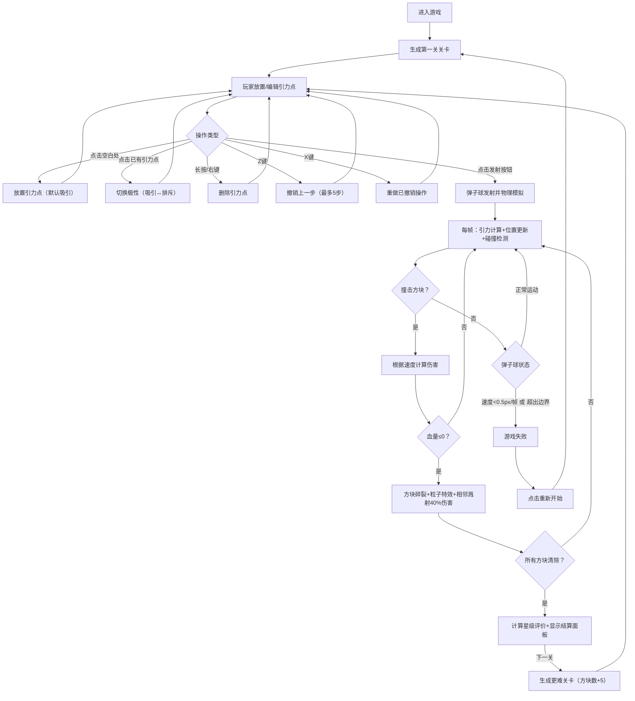

## 1. 产品概述

「引力弹子球」是一款基于物理模拟的2D弹球解谜游戏，玩家通过放置正/负引力点来操控弹子球轨迹，利用万有引力使弹子球撞击并消除所有目标方块。

- 核心目标：解决传统弹球游戏物理深度不足、缺乏战略规划的痛点，提供高可玩性的策略解谜体验
- 目标用户：休闲游戏玩家、物理模拟爱好者、喜欢策略规划的解谜游戏群体
- 产品价值：将真实的万有引力物理模拟与弹球消除玩法结合，创造独特的"放置-发射-观察"策略循环

---

## 2. 核心功能

### 2.1 用户角色

| 角色 | 注册方式 | 核心权限 |
|------|----------|----------|
| 普通玩家 | 无需注册，直接进入 | 体验所有关卡、放置引力点、发射弹子球、撤销/重做操作 |

### 2.2 功能模块

1. **游戏主界面**：深空背景棋盘、Canvas渲染区域、实时状态信息
2. **引力点系统**：放置、切换极性、删除引力点，支持撤销/重做（最多5步）
3. **物理引擎**：万有引力模拟、弹性碰撞、轨迹追踪、速度阈值判定
4. **方块消除系统**：硬度机制、伤害计算、血量显示、粒子特效、连锁溅射伤害
5. **关卡系统**：难度递增的随机关卡生成、星级评价系统
6. **控制面板**：发射、撤销、重做、重新开始按钮，键盘快捷键支持

### 2.3 页面详情

| 页面名称 | 模块名称 | 功能描述 |
|----------|----------|----------|
| 游戏主界面 | 棋盘渲染区 | 600x600px半透明网格棋盘，Canvas 2D渲染所有实体 |
| 游戏主界面 | 状态信息栏 | 右上角显示：当前关卡、剩余方块数、撞击次数、已用时间 |
| 游戏主界面 | 控制面板 | 底部四个功能按钮：发射、撤销、重做、重新开始 |
| 游戏主界面 | 引力点交互 | 点击放置/切换极性、长按/右键删除、Z/X快捷键撤销重做 |
| 游戏主界面 | 结算面板 | 关卡完成后显示统计：击破率、撞击次数、用时、星级评价 |

---

## 3. 核心流程

### 3.1 主用户流程描述

玩家进入游戏后，系统自动生成第一关。玩家在棋盘空白处点击放置引力点（蓝色吸引/红色排斥），可反复点击切换极性，长按或右键删除。规划完成后点击"发射"按钮，弹子球从发射点以初速度射出，在引力场中沿复杂轨迹运动，与边界和方块弹性碰撞。根据撞击速度对方块造成伤害，方块血量归零后碎裂并触发相邻方块溅射伤害。清除所有方块则过关，显示星级评价；若弹子球速度过低或飞出边界则失败，可重新开始。

### 3.2 Mermaid 流程图

---

## 4. 用户界面设计

### 4.1 设计风格

- **主色调**：深空背景 #0B0C10（深色科技感）
- **辅助色**：
  - 吸引引力点：#00BFFF（深水蓝）
  - 排斥引力点：#FF4500（橙红色）
  - 弹子球：#66FCF1（青绿色发光）
  - 轨迹渐变：#45A29E → #66FCF1
  - 网格线：#1F2833（透明度0.3）
  - 按钮hover：#45A29E
  - 文字：#FFFFFF（白色，monospace数字字体）
- **按钮样式**：圆角矩形 border-radius: 8px，hover背景色变化，点击时 transform: scale(0.95) 缩放反馈
- **字体**：统一使用 'Segoe UI', sans-serif，数字使用 monospace
- **布局风格**：居中卡片式布局，元素之间保持8px间距，棋盘居中显示
- **动效**：引力点脉动光晕（2秒周期，透明度0.5-1.0），弹子球轨迹渐隐，粒子扩散，按钮hover/点击过渡

### 4.2 页面设计概览

| 页面名称 | 模块名称 | UI元素 |
|----------|----------|--------|
| 游戏主界面 | 深空背景 | #0B0C10纯色背景，可添加微弱星点粒子装饰 |
| 游戏主界面 | 棋盘区域 | 600x600px半透明网格，1F2833线条@0.3透明度，居中卡片阴影 |
| 游戏主界面 | 状态信息栏 | 右上角四行monospace白色文字：关卡、方块数、撞击次数、时间 |
| 游戏主界面 | 引力点 | 半透明发光圆环，半径代表强度，脉动动画，蓝/红区分极性 |
| 游戏主界面 | 弹子球 | 直径8px发光圆球 #66FCF1，带辉光效果 |
| 游戏主界面 | 轨迹线 | 最多200路径点，#45A29E→#66FCF1渐变，透明度线性衰减1.0→0.0 |
| 游戏主界面 | 方块 | 四色方块（红/绿/蓝/黄），底部血量进度条，碎裂粒子特效 |
| 游戏主界面 | 控制面板 | 底部四按钮水平排列：发射（主色调）、撤销、重做、重新开始 |
| 游戏主界面 | 结算面板 | 居中模态框，统计数据+1-3星评价+下一关按钮 |

### 4.3 响应式设计

- **桌面端**：棋盘 600x600px，固定尺寸居中显示
- **平板端**：棋盘宽度自适应为 80% 视口宽度，保持1:1正方形比例
- **移动端**：棋盘最小尺寸 300x300px，触控操作优化（点击区域放大）
- **触控支持**：所有交互原生支持触控（点击放置、长按删除、触控按钮）
- **断点策略**：基于 CSS 媒体查询，max-width: 768px 启用移动端适配

### 4.4 视觉性能要求

- **帧率**：requestAnimationFrame 驱动，稳定 60fps
- **粒子上限**：同时存在粒子数 ≤ 500个
- **内存**：占用 ≤ 100MB
- **加载时间**：页面首次加载 ≤ 2秒
