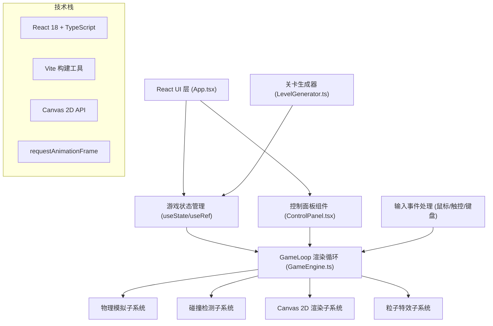

## 1. 架构设计

### 1.1 分层架构图



### 1.2 架构说明

采用 **单向数据流 + 集中式引擎** 架构：
- **React UI 层**：负责非Canvas的DOM元素渲染（按钮、状态栏、结算面板），通过props和回调与引擎交互
- **GameEngine核心**：单一GameLoop类管理整个游戏世界，包含物理、碰撞、渲染、粒子等子系统，通过EngineState接口对外暴露只读状态
- **状态同步**：引擎内部使用ref管理高频更新状态（位置、速度），低频状态（关卡数、方块数）通过回调通知React层更新
- **关卡生成**：独立的LevelGenerator工具类，根据难度参数生成纯数据结构LevelData，无副作用便于测试

---

## 2. 技术描述

### 2.1 前端技术栈

| 技术 | 版本 | 用途 |
|------|------|------|
| React | ^18.2.0 | UI组件框架，管理DOM元素和生命周期 |
| React DOM | ^18.2.0 | React渲染到DOM的绑定 |
| TypeScript | ^5.3.0 | 静态类型检查，接口定义 |
| Vite | ^5.0.0 | 构建工具，开发服务器，HMR |
| @vitejs/plugin-react | ^4.2.0 | Vite的React/JSX支持插件 |
| Canvas 2D API | - | 浏览器原生API，高性能游戏实体渲染 |
| requestAnimationFrame | - | 浏览器原生API，60fps稳定动画循环 |

### 2.2 构建与运行

- **初始化方式**：npm init vite-init@latest -- --template react-ts
- **开发命令**：npm run dev
- **构建命令**：npm run build
- **类型检查**：npx tsc --noEmit

---

## 3. 路由定义

| 路由 | 页面/组件 | 用途 |
|------|-----------|------|
| / | App.tsx | 单页面应用，游戏主界面，包含全部游戏功能 |

> 说明：本游戏为纯前端单页面应用，无多路由需求。

---

## 4. 核心数据结构定义（TypeScript接口）

### 4.1 游戏核心类型

```typescript
// 引力点极性
export type GravityPolarity = 'attract' | 'repel';

// 引力点
export interface GravityPoint {
  id: string;
  x: number;
  y: number;
  polarity: GravityPolarity;
  strength: number;      // 引力强度（同时决定视觉半径）
  radius: number;        // 视觉半径
  createdAt: number;     // 时间戳，用于淡入动画
}

// 方块颜色类型
export type BlockColor = 'red' | 'green' | 'blue' | 'yellow';

// 方块
export interface Block {
  id: string;
  x: number;             // 左上角x
  y: number;             // 左上角y
  width: number;
  height: number;
  color: BlockColor;
  hardness: number;      // 硬度系数（影响初始血量）
  maxHp: number;
  currentHp: number;
}

// 弹子球
export interface Ball {
  x: number;
  y: number;
  vx: number;            // x方向速度 px/帧
  vy: number;            // y方向速度 px/帧
  radius: number;
}

// 轨迹点
export interface TrailPoint {
  x: number;
  y: number;
  timestamp: number;
}

// 粒子
export interface Particle {
  id: string;
  x: number;
  y: number;
  vx: number;
  vy: number;
  color: string;
  life: number;          // 剩余生命（秒）
  maxLife: number;
  size: number;
}

// 关卡数据
export interface LevelData {
  level: number;
  blocks: Block[];
  totalBlocks: number;
  launchPoint: { x: number; y: number };
  initialVelocity: { vx: number; vy: number };
}

// 游戏状态
export type GamePhase = 'planning' | 'flying' | 'success' | 'failed';

// 引擎对外状态接口
export interface EngineState {
  phase: GamePhase;
  level: number;
  remainingBlocks: number;
  totalBlocks: number;
  hitCount: number;
  elapsedTime: number;   // 秒
  starRating: 0 | 1 | 2 | 3;
  canUndo: boolean;
  canRedo: boolean;
}
```

### 4.2 核心类签名

```typescript
// GameEngine.ts
export class GameLoop {
  constructor(canvas: HTMLCanvasElement, onStateChange: (state: EngineState) => void);
  
  // 生命周期
  start(): void;
  stop(): void;
  resize(width: number, height: number): void;
  
  // 关卡控制
  loadLevel(level: number): void;
  restartLevel(): void;
  nextLevel(): void;
  
  // 引力点操作
  placeGravityPoint(x: number, y: number): void;
  toggleGravityPolarity(id: string): void;
  removeGravityPoint(id: string): void;
  
  // 撤销/重做
  undo(): void;
  redo(): void;
  
  // 发射
  launchBall(): void;
  
  // 查询
  getGravityPointAt(x: number, y: number, tolerance?: number): GravityPoint | null;
  getState(): EngineState;
}

// LevelGenerator.ts
export class LevelGenerator {
  static generate(level: number, boardWidth: number, boardHeight: number): LevelData;
  private static generateBlockColor(): BlockColor;
  private static getHardnessForColor(color: BlockColor): number;
  private static getHpForColor(color: BlockColor, hardness: number): number;
}
```

---

## 5. 文件结构

```
项目根目录/
├── package.json                  # 项目依赖与脚本
├── index.html                    # Vite入口HTML
├── vite.config.js                # Vite构建配置（React+TS）
├── tsconfig.json                 # TypeScript严格模式配置
├── .trae/
│   └── documents/
│       ├── PRD-引力弹子球.md    # 产品需求文档
│       └── TECH-技术架构.md      # 本文档
└── src/
    ├── main.tsx                  # React入口（挂载App）
    ├── App.tsx                   # 主组件：状态管理、UI布局、事件绑定
    ├── App.css                   # 全局样式：深空背景、布局、按钮样式
    ├── GameEngine.ts             # 游戏引擎核心：物理、碰撞、渲染、粒子
    ├── components/
    │   └── ControlPanel.tsx      # 控制面板组件：发射/撤销/重做/重启按钮
    └── utils/
        └── LevelGenerator.ts     # 关卡生成器：难度→方块布局
```

---

## 6. 关键算法与常量

### 6.1 物理常量

| 常量 | 值 | 说明 |
|------|----|------|
| GRAVITY_CONSTANT_G | 500 | 万有引力常数（调优后游戏值） |
| BALL_RADIUS | 4 | 弹子球半径（直径8px） |
| BALL_MIN_SPEED | 0.5 | 最低速度阈值，低于判定失败 |
| BALL_INITIAL_SPEED | 5 | 初始发射速度 |
| TRAIL_MAX_POINTS | 200 | 轨迹保留最大点数 |
| DAMAGE_SPEED_FACTOR | 0.1 | 伤害=速度 × 此系数 |
| SPLASH_DAMAGE_RATIO | 0.4 | 连锁溅射伤害比例（40%） |
| GRAVITY_MIN_RADIUS | 20 | 引力点最小半径 |
| GRAVITY_MAX_RADIUS | 50 | 引力点最大半径 |
| PARTICLE_MIN_COUNT | 20 | 方块碎裂最少粒子 |
| PARTICLE_MAX_COUNT | 40 | 方块碎裂最多粒子 |
| PARTICLE_MAX_SPREAD | 80 | 粒子最大扩散半径 |
| PARTICLE_LIFETIME | 1.5 | 粒子存活时间（秒） |
| MAX_PARTICLES | 500 | 同时存在粒子上限 |
| MAX_UNDO_STEPS | 5 | 最大撤销步数 |
| PULSE_PERIOD | 2000 | 引力点脉动周期（毫秒） |
| FADE_ANIMATION_DURATION | 200 | 撤销/重做淡入淡出时长（毫秒） |

### 6.2 万有引力计算

```
对每个引力点 gp:
    dx = gp.x - ball.x
    dy = gp.y - ball.y
    dist_sq = dx*dx + dy*dy
    dist = sqrt(dist_sq)
    
    // 防止除零和过强引力，设置最小距离钳制
    min_dist = gp.radius * 0.5
    dist_sq = max(dist_sq, min_dist * min_dist)
    
    // F = G * m1 * m2 / r^2, 方向沿连线
    force_magnitude = G * gp.strength / dist_sq
    // 极性：吸引为正，排斥为负
    if gp.polarity == 'repel': force_magnitude *= -1
    
    // 分解到x,y
    ball.vx += force_magnitude * (dx / dist) * dt
    ball.vy += force_magnitude * (dy / dist) * dt
```

### 6.3 方块颜色硬度配置

| 颜色 | hex | 硬度系数 | 初始血量 |
|------|-----|----------|----------|
| 红(red) | #FF6B6B | 2.0（最硬） | 200 |
| 绿(green) | #51CF66 | 1.5（较硬） | 150 |
| 蓝(blue) | #339AF0 | 1.0（中等） | 100 |
| 黄(yellow) | #FFD43B | 0.5（最脆） | 50 |

### 6.4 星级评价规则

```
break_rate = destroyed_blocks / total_blocks
if break_rate >= 0.95 AND hit_count <= optimal_hits * 1.5:
    stars = 3
elif break_rate >= 0.9:
    stars = 2
elif break_rate >= 0.8:
    stars = 1
else:
    stars = 0
```

---

## 7. 性能优化策略

1. **Canvas批量渲染**：每帧clearRect一次，按引力点→网格→轨迹→方块→弹子球→粒子顺序绘制，减少状态切换
2. **轨迹池化**：TrailPoint使用固定长度环形数组（200），避免频繁分配
3. **粒子对象池**：Particle预分配数组，死亡粒子复用，不触发GC
4. **碰撞检测优化**：使用空间哈希网格，仅检查邻近方块，复杂度从O(n)降为O(1)
5. **dt时间步长**：固定时间步长积分物理，避免帧率波动导致物理不一致
6. **React渲染隔离**：高频数据（位置/速度）存于useRef，不触发重渲染；低频UI数据通过回调节流更新
7. **离屏计算**：引力计算结果复用，避免每帧重复计算距离
