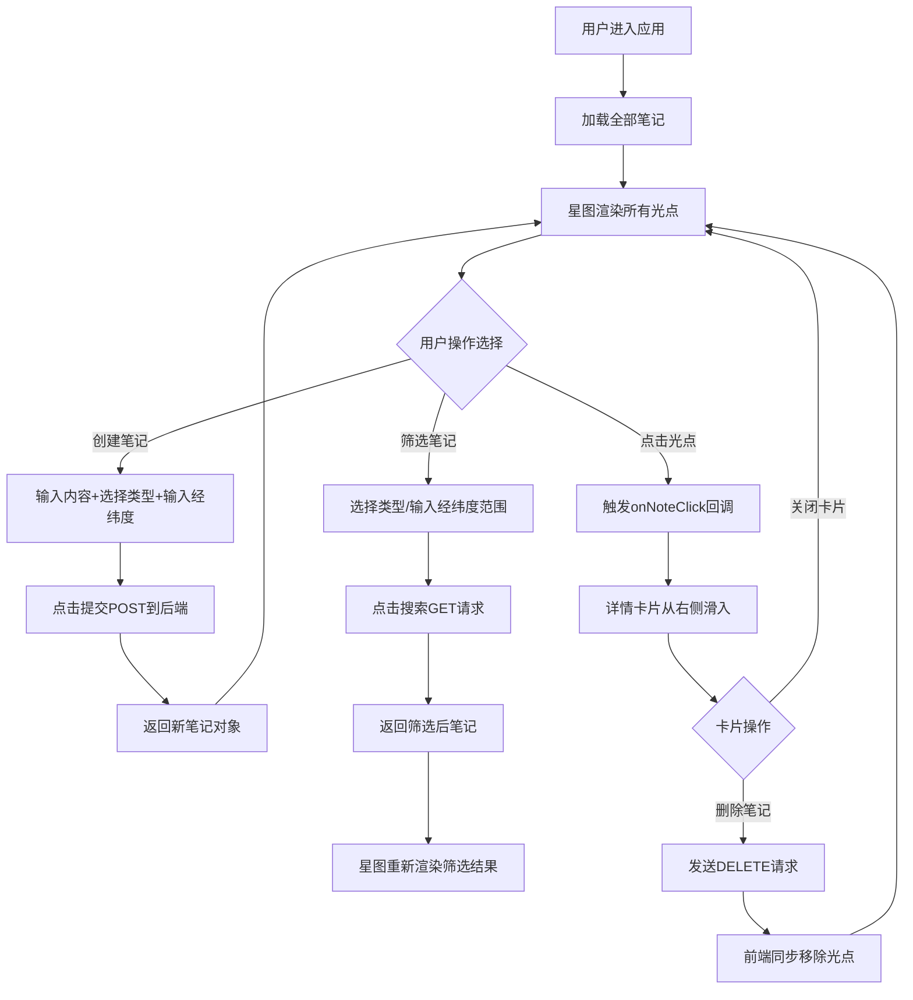

## 1. 产品概述

足迹星图是一款面向数字游民的个人笔记管理Web应用，帮助用户将遍布全球的数字足迹（待办、阅读笔记、旅行打卡、灵感碎片）通过地理位置和时间线编织成交互式可视化星图。

- 核心价值：将零散的笔记内容与地理位置关联，通过星空主题的可视化界面提供沉浸式的个人数字记忆浏览体验
- 目标用户：数字游民、旅行者、创意工作者、全球移动办公人群

## 2. 核心功能

### 2.1 用户角色
| 角色 | 注册方式 | 核心权限 |
|------|---------|----------|
| 普通用户 | 无需注册，本地使用 | 创建、查看、筛选、删除笔记 |

### 2.2 功能模块
1. **主界面**：星空主题背景、渐变标题栏、筛选栏、星图画布、笔记卡片
2. **笔记创建模块**：内容输入、类型选择、经纬度输入、提交按钮
3. **星图可视化模块**：Canvas绘制散点星图、光点呼吸光晕动画、点击交互
4. **筛选模块**：类型筛选下拉框、经纬度范围输入、搜索/清除按钮
5. **笔记详情模块**：卡片滑入动画、完整信息展示、随机星座SVG、删除按钮

### 2.3 页面详情
| 页面名称 | 模块名称 | 功能描述 |
|---------|---------|---------|
| 主页面 | 标题区域 | 显示应用名称「足迹星图」，采用渐变文字效果 |
| 主页面 | 笔记创建区 | 文本输入（500字上限）、类型下拉（待办/阅读/旅行/灵感）、经纬度输入、提交按钮 |
| 主页面 | 筛选栏 | 类型下拉（全部/待办/阅读/旅行/灵感）、经纬度范围输入、搜索按钮、清除按钮 |
| 主页面 | 星图画布 | 400x400 Canvas，按经纬度映射坐标，带星空渐变背景，呼吸光晕光点 |
| 主页面 | 笔记详情卡片 | 从右侧滑入，显示完整笔记信息+随机星座SVG，支持删除 |

## 3. 核心流程

主用户流程：用户在创建区输入笔记内容和位置 → 提交后笔记以光点形式出现在星图上 → 通过筛选栏按类型或位置范围筛选笔记 → 点击星图光点查看详情卡片 → 在卡片中可删除笔记。

## 4. 用户界面设计

### 4.1 设计风格
- **主色调**：深灰蓝#0B0C10（背景）、#1F2833（次级背景）、#45A29E（主强调色）、#C5C6C7（文字）
- **笔记类型颜色**：待办#FFD700（金色）、阅读#00CED1（深青）、旅行#FF69B4（粉红）、灵感#7B68EE（中紫）
- **按钮风格**：圆角8px，悬停scale(1.05)过渡0.2s
- **字体**：现代无衬线字体，标题渐变文字（#45A29E→#C5C6C7）
- **布局风格**：深色星空主题，毛玻璃半透明卡片，Canvas星图居中
- **视觉元素**：呼吸光晕动画、星空径向渐变背景、星座SVG装饰

### 4.2 页面设计概述
| 页面名称 | 模块名称 | UI元素 |
|---------|---------|--------|
| 主页面 | 标题区域 | 渐变文字、居中对齐、大号字体 |
| 主页面 | 笔记创建区 | 毛玻璃背景（backdrop-filter: blur(10px)，背景#1F2833，边框#45A29E），圆角输入框和下拉框 |
| 主页面 | 筛选栏 | 半透明毛玻璃效果，水平排列表单控件 |
| 主页面 | 星图画布 | 星空径向渐变背景（#1F2833→#0B0C10），光点呼吸动画（2秒周期透明度0.5→1） |
| 主页面 | 笔记卡片 | 毛玻璃背景，圆角12px，渐变星座SVG背景，滑入动画0.3s ease-out |

### 4.3 响应式设计
- **大屏（≥1024px）**：星图占70%宽度居中，卡片固定右侧占30%宽度，创建区和筛选栏顶部全宽
- **平板（768-1023px）**：星图占65%宽度，卡片在底部右下方浮动
- **手机（<768px）**：星图占满全宽，卡片从底部弹出（translateY(100%)滑入）

## 4.4 性能指标
- 星图渲染帧率：100个光点时≥30fps
- 操作响应：笔记创建/删除操作每秒可响应10次以上
- 动画流畅度：卡片开关动画≤300ms
