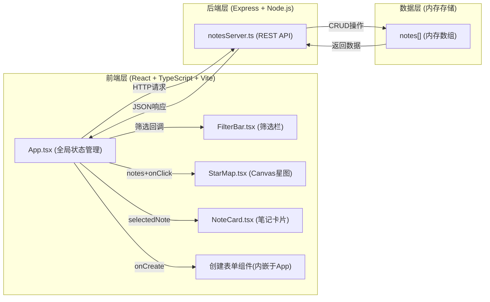
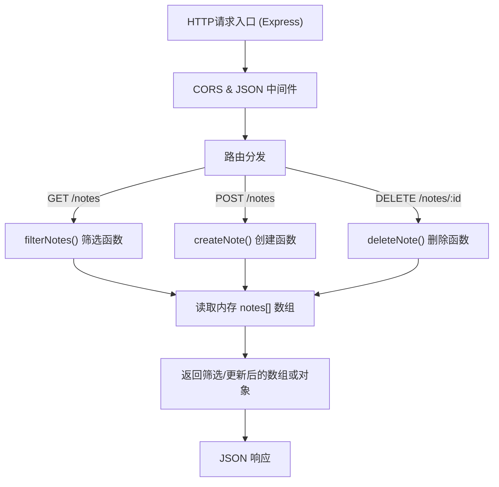
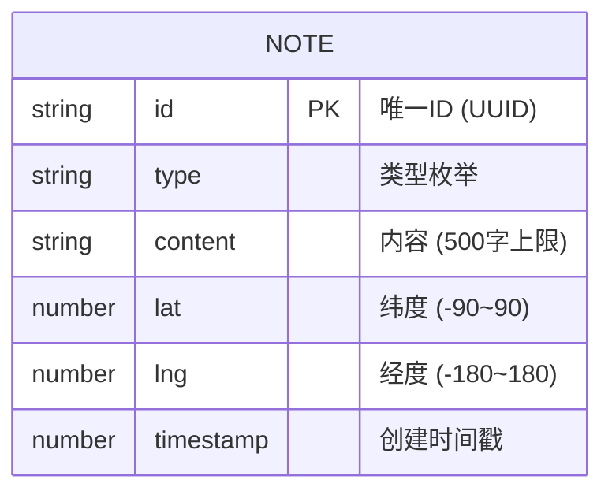

## 1. 架构设计



**数据流说明：**
1. App.tsx 作为状态中心，维护 notes 数组、filter 筛选条件、selectedNote 选中笔记、viewMode 视图模式
2. FilterBar 接收到用户输入后调用 setFilter 回调更新 App 状态 → App 发起 GET /notes 请求
3. StarMap 接收 notes 数组渲染光点 → 用户点击光点触发 onNoteClick → App 更新 selectedNote
4. NoteCard 接收到 selectedNote 渲染详情 → 用户点击删除 → App 发起 DELETE /notes/:id → 同步移除本地 notes
5. 创建表单 → 用户提交 → App 发起 POST /notes → 返回新笔记追加到 notes 数组

## 2. 技术栈说明

### 前端技术栈
- **框架**：React@18 + TypeScript@5（严格模式，ES2020模块）
- **构建工具**：Vite@5 + @vitejs/plugin-react@4
- **HTTP客户端**：原生 fetch API
- **可视化**：Canvas 2D API（星图渲染），内联 SVG（星座图案）
- **样式方案**：内联 CSS 样式（使用 CSSStyleDeclaration / style objects）+ CSS keyframes 动画

### 后端技术栈
- **框架**：Express@4
- **运行时**：Node.js + ts-node（开发模式直接运行TypeScript）
- **ID生成**：uuid@9
- **类型支持**：@types/express
- **CORS**：Vite代理配置（vite.config.js代理/api请求到Express后端）

### 项目文件结构
```
auto74/
├── package.json           # 项目依赖与启动脚本
├── vite.config.js         # Vite构建配置 + API代理
├── tsconfig.json          # TypeScript配置（严格模式）
├── index.html             # 应用入口HTML
├── server/
│   └── notesServer.ts     # Express后端（内存存储REST API）
└── src/
    ├── App.tsx            # React主组件（状态管理+API调用）
    └── components/
        ├── FilterBar.tsx  # 筛选栏组件
        ├── StarMap.tsx    # 星图Canvas组件
        └── NoteCard.tsx   # 笔记详情卡片组件
```

## 3. 路由定义

| 路由 | 用途 |
|------|------|
| / (Vite前端) | 渲染React应用，静态资源服务 |
| GET /api/notes | 获取笔记列表，支持查询参数筛选 |
| POST /api/notes | 创建新笔记 |
| DELETE /api/notes/:id | 删除指定笔记 |

Vite代理配置：所有 `/api/**` 请求转发到 `http://localhost:3001`

## 4. API 定义

### 数据类型定义

```typescript
type NoteType = 'todo' | 'reading' | 'travel' | 'inspiration';

interface Note {
  id: string;           // uuid生成的唯一ID
  type: NoteType;       // 笔记类型：待办/阅读/旅行/灵感
  content: string;      // 笔记内容，最多500字
  lat: number;          // 纬度，范围-90~90，默认0
  lng: number;          // 经度，范围-180~180，默认0
  timestamp: number;    // 创建时间戳（毫秒）
}

interface Filter {
  type: NoteType | 'all';  // 类型筛选，'all'表示全部
  lat?: number;            // 纬度中心点（可选）
  lng?: number;            // 经度中心点（可选）
  latRange?: number;       // 纬度范围（±度数，可选）
  lngRange?: number;       // 经度范围（±度数，可选）
}
```

### GET /api/notes

**查询参数：**
- `type`: string，可选，枚举值 `all|todo|reading|travel|inspiration`
- `lat`: number，可选，纬度中心点
- `lng`: number，可选，经度中心点
- `latRange`: number，可选，纬度±范围
- `lngRange`: number，可选，经度±范围

**响应：**
```json
{
  "success": true,
  "data": Note[]
}
```

**筛选逻辑：**
- type=all 或不传：不过滤类型
- type为具体值：仅返回匹配类型的笔记
- lat/lng + range存在：返回经纬度在 [中心点±范围] 之间的笔记

### POST /api/notes

**请求体：**
```json
{
  "type": "travel",
  "content": "今天在巴黎塞纳河畔阅读...",
  "lat": 48.8566,
  "lng": 2.3522
}
```

**响应（201）：**
```json
{
  "success": true,
  "data": {
    "id": "a1b2c3d4-...",
    "type": "travel",
    "content": "今天在巴黎塞纳河畔阅读...",
    "lat": 48.8566,
    "lng": 2.3522,
    "timestamp": 1717891200000
  }
}
```

**验证规则：**
- `type`: 必填，必须是4种枚举值之一
- `content`: 必填，字符串，长度1-500字符
- `lat`: 可选，数字，范围-90~90，不传或null默认0
- `lng`: 可选，数字，范围-180~180，不传或null默认0

### DELETE /api/notes/:id

**路径参数：**
- `id`: string，笔记的唯一ID

**响应：**
```json
{
  "success": true,
  "message": "Note deleted successfully"
}
```

**失败响应（404）：**
```json
{
  "success": false,
  "error": "Note not found"
}
```

## 5. 服务器架构



服务器为单体 Express 应用，无数据库层，所有数据存储于进程内存中（notes 数组变量）。服务端口默认 3001。

## 6. 数据模型

### 6.1 数据模型定义



### 6.2 初始化数据

为方便演示，服务器启动时向 notes 数组预置 5-8 条示例数据，覆盖四种类型和不同经纬度位置：

```typescript
const seedNotes: Note[] = [
  { id: uuid(), type: 'travel', content: '东京塔夜景，太美了！', lat: 35.6586, lng: 139.7454, timestamp: Date.now() - 86400000 * 5 },
  { id: uuid(), type: 'reading', content: '《百年孤独》第三章：家族的诅咒', lat: 48.8566, lng: 2.3522, timestamp: Date.now() - 86400000 * 4 },
  { id: uuid(), type: 'todo', content: '完成区块链项目白皮书初稿', lat: 37.7749, lng: -122.4194, timestamp: Date.now() - 86400000 * 3 },
  { id: uuid(), type: 'inspiration', content: '也许可以用声音频率驱动视觉生成艺术', lat: -33.8688, lng: 151.2093, timestamp: Date.now() - 86400000 * 2 },
  { id: uuid(), type: 'travel', content: '冰岛蓝湖温泉，零下十度的惬意', lat: 64.1265, lng: -21.8174, timestamp: Date.now() - 86400000 },
];
```

## 7. 调用关系与数据流向详细说明

| 源文件 | 目标 | 触发方式 | 数据载体 |
|--------|------|----------|----------|
| App.tsx | notesServer.ts (GET /api/notes) | useEffect + Filter回调 | Filter query params → Note[] |
| App.tsx | notesServer.ts (POST /api/notes) | 创建表单onSubmit | {type,content,lat,lng} → Note |
| App.tsx | notesServer.ts (DELETE /api/notes/:id) | NoteCard删除按钮 | id → success |
| App.tsx | FilterBar.tsx | props传递 | filter对象 + setFilter函数 |
| App.tsx | StarMap.tsx | props传递 | notes数组 + onNoteClick函数 |
| App.tsx | NoteCard.tsx | props传递 | selectedNote对象 + onDelete函数 |
| FilterBar.tsx | App.tsx | 回调调用 | 用户输入的筛选条件 |
| StarMap.tsx | App.tsx | 回调调用 | 用户点击的noteId |
| NoteCard.tsx | App.tsx | 回调调用 | 删除按钮点击（noteId） |
