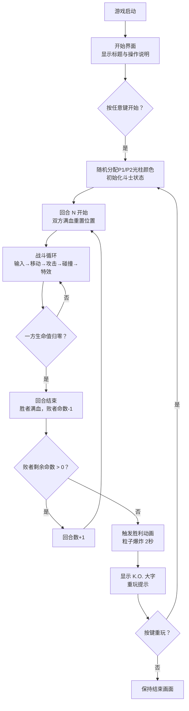
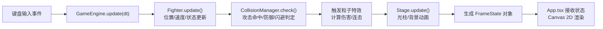

## 1. 产品概述
「霓虹擂台·光影斗士」是一款面向独立游戏爱好者的双人本地2D格斗网页游戏，两名玩家在同一设备上通过键盘操控各自的光影斗士，在充满赛博朋克风格的霓虹擂台上进行激烈的回合制对战。

- **目标用户**：独立游戏创作者、双人对战游戏爱好者、赛博朋克美学追随者
- **产品价值**：在浏览器中即可体验无需安装的高品质格斗游戏，以绚丽的霓虹粒子特效和流畅的打击反馈为核心卖点

## 2. 核心特性

### 2.1 用户角色
| 角色 | 注册方式 | 核心权限 |
|------|----------|----------|
| 玩家1（P1） | 无需注册，直接游戏 | 使用WASD移动、J攻击、K防御、L闪避 |
| 玩家2（P2） | 无需注册，直接游戏 | 使用方向键移动、1攻击、2防御、3闪避 |

### 2.2 功能模块
1. **游戏主场景**：Canvas 2D渲染的霓虹擂台、动态光柱背景、发光斗士实体
2. **战斗系统**：攻击/防御/闪避动作、连击计数、伤害计算、技能冷却
3. **粒子特效系统**：攻击命中粒子、防御屏障、连击金色光晕、胜利粒子爆炸
4. **音效系统**：Web Audio API生成的攻击命中音效、防御音效、闪避音效、胜利音效
5. **回合管理系统**：生命值/命数管理、回合切换、胜负判定、K.O.动画
6. **UI界面系统**：生命值条、回合数显示、技能冷却指示器、开始/结束界面

### 2.3 页面详情
| 页面名称 | 模块名称 | 功能描述 |
|----------|----------|----------|
| 开始界面 | 标题与说明 | 显示游戏名"霓虹擂台·光影斗士"、操作说明、按任意键开始提示 |
| 战斗场景 | 擂台渲染 | 椭圆发光平台、动态霓虹光柱（6种颜色随机切换）、深空蓝黑渐变背景 |
| 战斗场景 | 斗士渲染 | 8顶点不规则发光多边形斗士、随移动方向形变、半透明影子跟随 |
| 战斗场景 | 粒子渲染 | 三角形散射粒子、半透明防御屏障、金色连击光晕、全屏闪烁效果 |
| 战斗场景 | UI覆盖层 | 左右两侧生命值条（霓虹风格）、顶部回合数显示、技能冷却指示器 |
| 回合结束 | 胜负过渡 | 生命值归零判定、回合结束提示、1.5秒后重置 |
| 胜利界面 | K.O.动画 | 胜者粒子爆炸（2秒）、"K.O."大字显示、胜利粒子维持亮度30%、重玩提示 |

## 3. 核心流程

### 3.1 游戏主流程
玩家打开游戏 → 进入开始界面（标题+操作说明）→ 按任意键开始 → 随机分配P1/P2光柱颜色 → 第1回合开始 → 双方斗士操作对战 → 一方生命值归零 → 回合结束（胜者回满血量，败者减1命）→ 若败者仍有命，重置位置开始下一回合 → 若某方失去3条命 → 触发胜利动画（粒子爆炸+K.O.）→ 2秒后显示重玩提示 → 按键重玩或刷新页面

### 3.2 战斗帧循环流程
每一帧（requestAnimationFrame驱动）：读取键盘输入 → 更新斗士状态（移动/攻击/防御/闪避）→ 碰撞检测系统判定攻击命中/被防御/被闪避 → 计算伤害与连击数 → 更新粒子系统生命周期 → Stage更新光柱动画 → 输出当前帧状态对象 → Canvas渲染所有实体 + UI层

## 4. 用户界面设计

### 4.1 设计风格
- **主色调**：深空蓝黑渐变背景（#0A0A1A → #1A1A3A），6种霓虹色（红#FF0066、绿#00FF88、蓝#00CCFF、紫#A200FF、橙#FF8800、粉#FF33CC）
- **辅助色**：擂台中心淡蓝#88DDFF、连击金黄#FFD700、K.O.渐变（金黄→白色）
- **按钮/卡片风格**：半透明霓虹圆角卡片，背景 rgba(255,255,255,0.05)，边框 1px 霓虹色发光
- **字体**：UI文字使用 monospace 等宽字体，K.O.大字使用 'Arial Black'
- **视觉标志性元素**：发光多边形斗士、三角形粒子散射、动态光柱呼吸动画、椭圆径向渐变擂台

### 4.2 页面设计概览
| 页面名称 | 模块名称 | UI 元素 |
|----------|----------|---------|
| 开始界面 | 标题区 | 居中渐变色游戏名（字号48px，霓虹发光），下方操作说明表格（半透明卡片） |
| 开始界面 | 按键提示 | 底部闪烁文字"按任意键开始"（呼吸动画） |
| 战斗场景 | 背景层 | 深空蓝黑径向渐变背景，两侧6条霓虹光柱（3条/侧，呼吸闪烁动画） |
| 战斗场景 | 擂台层 | 椭圆发光平台，径向渐变 #88DDFF → 边缘透明，位置 canvas 垂直中下区域 |
| 战斗场景 | 斗士层 | 8顶点不规则发光多边形（颜色匹配光柱色），附带半透明影子（opacity 0.3） |
| 战斗场景 | 粒子层 | 攻击命中三角形粒子散射、防御半透明矩形屏障、连击金色光晕包裹斗士 |
| 战斗场景 | UI左 | P1生命值条（红底霓虹边框）、命数指示（3个圆点）、技能冷却条 |
| 战斗场景 | UI右 | P2生命值条、命数指示、技能冷却条 |
| 战斗场景 | UI顶部 | 回合数"ROUND N"居中显示，下方小字"P1 WINS: X  P2 WINS: Y" |
| 胜利界面 | 背景 | 纯黑背景，粒子爆炸维持30%亮度持续 |
| 胜利界面 | K.O.文字 | 居中字号64px 'Arial Black'，渐变金黄→白色，霓虹光晕 |
| 胜利界面 | 重玩提示 | 底部闪烁"按 R 键重新开始" |

### 4.3 响应式方案
- **桌面端**：Canvas 固定 800px × 600px，居中显示
- **移动端**：Canvas CSS 等比缩放到屏幕宽度的95%，内部坐标系仍为800×600（通过 scale transform 适配）
- **斗士/粒子自适应**：所有实体尺寸基于800×600坐标系，通过全局scale参数在移动端等比缩小
- **触屏降级**：检测到无键盘设备时，显示提示"请使用键盘设备进行双人对战"

### 4.4 性能预算
- **帧率目标**：稳定30FPS+，理想60FPS
- **单帧粒子上限**：≤150个（超出时优先淘汰生命末期粒子）
- **单帧碰撞检测**：≤60次（每个斗士最多30次攻击判定）
- **单帧耗时预算**：≤20ms（requestAnimationFrame 回调内）
- **音效实例**：同时播放≤8个（超出时自动终止最早的音效）
