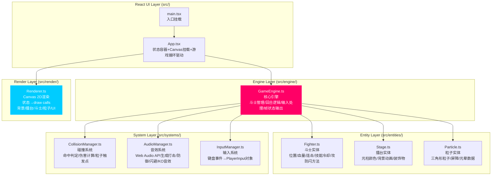

## 1. 架构设计

整体采用分层架构：**React UI层**负责状态持有与DOM挂载，**GameEngine引擎层**负责游戏逻辑与状态计算，**Entity实体层**封装斗士/擂台/粒子数据与行为，**System系统层**提供碰撞检测与音效等横切能力，**Render渲染层**纯函数将状态转换为Canvas绘制指令。



**数据流向（单向数据流）**：
`键盘事件 → InputManager → PlayerInput → GameEngine.update() → Fighter/Stage 状态变更 → CollisionManager 判定 → 生成 FrameState + ParticlePool → App 持有 → Renderer.draw(FrameState) → Canvas 像素`

## 2. 技术说明

| 类别 | 选型 | 版本 | 说明 |
|------|------|------|------|
| 前端框架 | React | ^18.3.1 | 函数组件 + Hooks 管理游戏状态与生命周期 |
| 构建工具 | Vite | ^5.4.0 | 极速HMR，@vitejs/plugin-react 支持TSX |
| 类型系统 | TypeScript | ^5.5.0 | strict:true，严格模式，resolveJsonModule |
| 渲染引擎 | Canvas 2D | - | 原生浏览器API，高性能批量绘制粒子 |
| 音频系统 | Web Audio API | - | 纯代码合成音效，无需外部音频文件 |
| 外部依赖 | 无额外第三方库 | - | 纯原生+React，轻量无负担 |

**项目初始化方式**：手动创建目录结构，编写 package.json → `npm install` → `npm run dev` 启动。

## 3. 文件结构与职责

```
auto75/
├── package.json              # 依赖声明、启动脚本
├── vite.config.js            # Vite构建配置（React插件）
├── tsconfig.json             # TS严格模式配置
├── index.html                # 入口HTML，挂载#root + 加载src/main.tsx
└── src/
    ├── main.tsx              # React入口，ReactDOM.createRoot渲染<App/>
    ├── App.tsx               # 主组件：创建GameEngine、启动rAF循环、接收FrameState、传递给Renderer
    ├── types.ts              # 全局类型定义（FrameState、FighterState、Particle、PlayerInput等）
    ├── engine/
    │   └── GameEngine.ts     # 核心引擎类：每帧update()输出FrameState
    ├── entities/
    │   ├── Fighter.ts        # 斗士类：状态+攻防闪方法
    │   ├── Stage.ts          # 擂台类：光柱颜色+背景动画
    │   └── ParticlePool.ts   # 粒子池：创建/更新/回收粒子（性能优化）
    ├── systems/
    │   ├── CollisionManager.ts   # 碰撞检测：AABB+攻击判定框
    │   ├── AudioManager.ts       # Web Audio合成器：生成各种音效
    │   └── InputManager.ts       # 键盘监听：输出P1/P2输入状态
    └── render/
        └── Renderer.ts           # Canvas渲染器：纯函数draw(ctx, state)
```

**文件调用关系（按执行顺序）**：
1. `main.tsx → App.tsx`：挂载根组件
2. `App.tsx → InputManager`：实例化并绑定键盘监听
3. `App.tsx → AudioManager`：实例化音效管理器
4. `App.tsx → GameEngine(fighter1, fighter2, stage, collisionMgr)`：实例化引擎
5. `App.tsx: useEffect(rAF loop)`：每帧 `gameEngine.update(dt) → frameState`
6. `App.tsx: useRef<canvas>` + `Renderer.draw(ctx, frameState)`：每帧渲染
7. `GameEngine.update → InputManager.getInput() → Fighter.move/attack/defend/dodge`
8. `GameEngine.update → CollisionManager.check(f1, f2) → {hitType, damage, contactPoint}`
9. `GameEngine.update → ParticlePool.spawnXXX(contactPoint)`
10. `GameEngine.update → Stage.update(dt)`：光柱呼吸动画
11. `Renderer.draw → drawBackground() → drawStage() → drawFighters() → drawParticles() → drawUI()`

## 4. 核心数据模型

### 4.1 TypeScript 类型定义

```typescript
// src/types.ts
export type NeonColor = '#FF0066' | '#00FF88' | '#00CCFF' | '#A200FF' | '#FF8800' | '#FF33CC';

export type FighterAction = 'idle' | 'moving' | 'attacking' | 'defending' | 'dodging' | 'hurt' | 'dead';

export interface PlayerInput {
  up: boolean; down: boolean; left: boolean; right: boolean;
  attack: boolean; defend: boolean; dodge: boolean;
  attackPressed: boolean; defendPressed: boolean; dodgePressed: boolean;
}

export interface FighterState {
  id: 'p1' | 'p2';
  x: number; y: number;           // 位置（基于800x600坐标系）
  vx: number; vy: number;         // 速度
  hp: number; maxHp: number;      // 生命值（单回合）
  lives: number;                  // 剩余命数（整场，初始3）
  action: FighterAction;
  actionTimer: number;            // 当前动作剩余时间（秒）
  facing: 1 | -1;                 // 朝向，1=右，-1=左
  comboCount: number;             // 连续命中次数
  comboTimer: number;             // 连击咆哮剩余时间（秒）
  nextAttackDouble: boolean;      // 下一击是否翻倍伤害
  attackCooldown: number;         // 攻击冷却剩余（秒）
  defendCooldown: number;         // 防御冷却剩余（秒）
  dodgeCooldown: number;          // 闪避冷却剩余（秒）
  color: NeonColor;               // 光柱/斗士颜色
  vertices: { x: number; y: number }[];  // 8个多边形顶点（相对坐标）
  defendShakeTimer: number;       // 防御后撤动画剩余
}

export interface Particle {
  id: number;
  type: 'hitTriangle' | 'defendBarrier' | 'comboGlow' | 'victoryExplosion' | 'screenFlash';
  x: number; y: number;
  vx: number; vy: number;
  life: number; maxLife: number;
  size: number;
  color: string;
  alpha: number;
  rotation: number;
  rotationSpeed: number;
}

export interface StageState {
  leftPillars: { color: NeonColor; brightness: number }[];   // 左侧3条光柱
  rightPillars: { color: NeonColor; brightness: number }[];  // 右侧3条光柱
  time: number;  // 全局时间，用于呼吸动画
}

export type GamePhase = 'startScreen' | 'roundStart' | 'fighting' | 'roundEnd' | 'victory';

export interface FrameState {
  phase: GamePhase;
  round: number;                   // 当前回合数
  p1: FighterState;
  p2: FighterState;
  stage: StageState;
  particles: Particle[];
  message: string;                 // 屏幕中央消息（如"ROUND 1"、"K.O."）
  messageTimer: number;            // 消息显示剩余时间
  screenFlashTimer: number;        // 全屏闪烁剩余时间（秒）
  victoryTimer: number;            // 胜利动画剩余时间（秒）
  winner: 'p1' | 'p2' | null;
  fps: number;
}
```

### 4.2 常量配置

```typescript
// 斗士物理常量
const FIGHTER_WIDTH = 50;
const FIGHTER_HEIGHT = 80;
const MOVE_SPEED = 250;       // px/s
const ATTACK_RANGE = 80;      // 攻击判定距离
const ATTACK_COOLDOWN = 0.4;  // 秒
const DEFEND_COOLDOWN = 0.8;
const DODGE_COOLDOWN = 1.2;
const DODGE_DISTANCE = 120;
const DODGE_DURATION = 0.25;
const ATTACK_DURATION = 0.2;
const DEFEND_DURATION = 0.3;
const BASE_DAMAGE = 15;
const DEFEND_DAMAGE_REDUCTION = 0.8;  // 防御减伤80%
const MAX_HP = 100;
const MAX_LIVES = 3;
const COMBO_THRESHOLD = 3;    // 3连击触发咆哮
const COMBO_GLOW_DURATION = 0.8;
const SCREEN_FLASH_DURATION = 0.1;
const ROUND_END_DELAY = 1.5;
const VICTORY_DURATION = 2.0;

// 粒子常量
const MAX_PARTICLES = 150;
const HIT_PARTICLE_MIN = 20;
const HIT_PARTICLE_MAX = 30;
const HIT_PARTICLE_LIFE = 0.6;
const HIT_PARTICLE_SPEED_MIN = 80;
const HIT_PARTICLE_SPEED_MAX = 120;
const DEFEND_BARRIER_LIFE = 0.2;
const DEFEND_BACK_OFFSET = 15;

// 擂台常量
const STAGE_CENTER_X = 400;
const STAGE_CENTER_Y = 450;
const STAGE_RADIUS_X = 300;
const STAGE_RADIUS_Y = 60;
const NEON_COLORS: NeonColor[] = ['#FF0066','#00FF88','#00CCFF','#A200FF','#FF8800','#FF33CC'];
```

## 5. 核心算法与系统设计

### 5.1 碰撞检测算法（AABB + 方向判定）

```
CollisionManager.check(p1, p2) → HitResult | null:
  对于每对 (attacker, defender)：
    1. 若 attacker.action !== 'attacking' → 跳过
    2. 计算攻击者攻击判定框：
       attackBox = {
         x: attacker.x + (attacker.facing === 1 ? FIGHTER_WIDTH : -ATTACK_RANGE),
         y: attacker.y + FIGHTER_HEIGHT * 0.2,
         w: ATTACK_RANGE,
         h: FIGHTER_HEIGHT * 0.6
       }
    3. 防御者身体 AABB：
       bodyBox = {
         x: defender.x, y: defender.y,
         w: FIGHTER_WIDTH, h: FIGHTER_HEIGHT
       }
    4. AABB 相交检测 → 若无交集 → 未命中
    5. 若 defender.action === 'dodging' → 闪避成功，返回 { type: 'dodge' }
    6. 若 defender.action === 'defending' 且 defender.facing === -attacker.facing → 防御成功
       返回 { type: 'defend', contactPoint, damage: BASE_DAMAGE * DEFEND_DAMAGE_REDUCTION }
    7. 否则命中成功 → 计算伤害（连击翻倍加成）
       返回 { type: 'hit', contactPoint, damage, comboCount }
```

**复杂度控制**：每帧仅检测 2 个攻击判定（P1→P2 和 P2→P1），实际 AABB 相交为 O(1)，满足 ≤60 次/帧约束。

### 5.2 粒子池管理（对象池避免GC）

- ParticlePool 内部维护固定 150 个 Particle 实例 + activeIds 集合
- spawnHitParticles(point, color)：从池中找 inactive 粒子 20-30 个，重置属性
- update(dt)：遍历 active 粒子，衰减 life += velocity*dt，life≤0 标记 inactive
- 超出150上限时按 life 升序淘汰即将消失的粒子
- 性能：零分配，避免数组频繁 push/splice

### 5.3 Web Audio 音效合成

AudioManager 懒创建 AudioContext（首次用户交互后），所有音效通过 OscillatorNode + GainNode 动态合成：

| 音效 | 合成参数 | 触发时机 |
|------|----------|----------|
| 攻击挥拳 | 方波 120Hz→80Hz 下滑，gain 0.15→0，0.15s | 按下攻击键 |
| 命中 | 锯齿波 200Hz→50Hz 下滑，gain 0.25→0，0.2s + white-noise burst | 攻击命中成功 |
| 防御成功 | 正弦波 400Hz→600Hz 上滑，gain 0.2→0，0.15s | 对方攻击被防御 |
| 闪避 | 高通噪声 + 正弦 800Hz→1200Hz，gain 0.15→0，0.2s | 闪避动作触发 |
| 连击咆哮 | 连续正弦叠加（C5→E5→G5 和弦），gain 0.3→0，0.4s | 3连击触发 |
| 回合结束 | 下行音阶（C4→G3→E3→C3），每个 0.2s | 生命值归零 |
| 胜利K.O. | 白噪声爆发 → 低频正弦 60Hz 长音，gain 0.4→0，2.0s | 整场失败 |

### 5.4 响应式适配

- CSS 层：`canvas { width: min(800px, 95vw); height: auto; aspect-ratio: 4/3; }`
- Canvas 层：`canvas.width=800; canvas.height=600` 内部坐标系不变
- 无需额外适配：浏览器自动按 CSS width/height 缩放绘制结果
- 移动端检测：`window.matchMedia('(pointer: coarse)')` → 显示键盘提示

## 6. 性能优化要点

| 瓶颈 | 优化策略 |
|------|----------|
| rAF 单帧耗时 | 分层绘制：静态背景（擂台+光柱）缓存到离屏 canvas，每 100ms 重绘一次，主循环直接 drawImage |
| 粒子数量 | 对象池 + 上限150 + 超量淘汰末期粒子 + 三角形批量 Path2D 一次性 stroke |
| 碰撞检测 | AABB O(1) + 仅攻击者处于 attacking 状态才检测 + 单次攻击帧只判定一次（attackTimer 首次触发） |
| Canvas 渲染 | 状态缓存：避免频繁 ctx.save/restore，同色粒子批量绘制，shadowBlur 仅斗士和擂台开启 |
| GC 压力 | 预分配 Particle 数组、Fighter 属性就地修改（不创建新对象）、FrameState 复用同引用 |
| 音效实例 | 最多 8 个并发 AudioNode，超出时 stop 最早的 GainNode |

## 7. 启动脚本

```json
{
  "scripts": {
    "dev": "vite --host 0.0.0.0",
    "build": "tsc && vite build",
    "preview": "vite preview"
  }
}
```

开发流程：`npm install` → `npm run dev` → 浏览器打开终端显示的 URL → 按任意键开始游戏。
