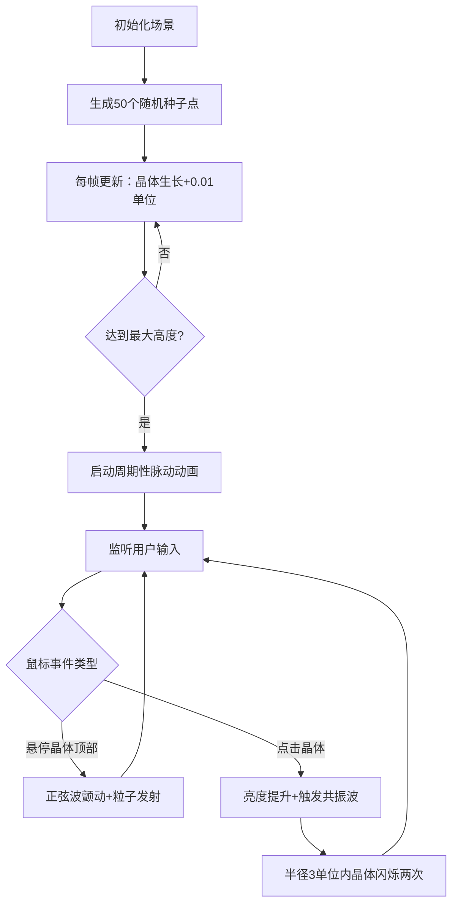

## 1. 产品概述

水晶森林·自生长雕塑是一个基于WebGL的三维交互式数字艺术可视化应用，旨在解决传统数字雕塑缺乏自然生长动态和随机演化美感的问题。用户在沉浸式三维空间中观察由程序化生成的晶体结构从地面缓缓"生长"，通过鼠标悬停、点击等交互触发颤动、粒子飘散和共振联动等有机动态效果。

- **目标用户**：数字艺术爱好者、交互艺术展览参观者、设计创意人员
- **产品价值**：创造具有生命力的数字雕塑体验，将程序化生成、物理动画与用户交互融合为沉浸式艺术作品

## 2. 核心功能

### 2.1 功能模块

1. **主场景页面**：三维晶体森林场景、自生长动画引擎、交互反馈系统、视角控制、性能监视界面

### 2.2 页面详情

| 页面名称 | 模块名称 | 功能描述 |
|-----------|-------------|---------------------|
| 主场景页面 | 晶体自生长引擎 | 50个种子点在半径10单位圆盘内随机分布，每帧Y轴+0.01单位生长，高度上限2-4单位随机，达到上限后2-3秒周期脉动缩放0.05单位 |
| 主场景页面 | 晶体程序化生成 | 基于噪声函数决定晶体形状（六棱柱/尖锥/不规则多面体）、颜色（色相120-300度渐变）、透明度（0.3-0.9） |
| 主场景页面 | 悬停交互反馈 | 射线检测悬停，顶部距离<0.5时正弦波颤动（振幅0.02，4-6Hz），发射20-40颗彩色粒子（半径0.02，速度0.1/秒，存活2秒） |
| 主场景页面 | 共振联动效果 | 点击晶体亮度1.5倍持续0.3秒，半径3单位内晶体色相偏移±30度闪烁两次恢复，形成链式反应波 |
| 主场景页面 | 视角控制系统 | 鼠标拖拽绕Y轴旋转，滚轮缩放范围3-20单位 |
| 主场景页面 | 场景布局渲染 | 地面半透明网格圆盘（半径12，网格1单位，透明度0.2），深空渐变背景（#0a0a2a→#1a002a） |
| 主场景页面 | 性能监视器 | 左上角显示FPS和晶体数量，右下角显示操作提示 |

## 3. 核心流程

## 4. 用户界面设计

### 4.1 设计风格

- **主色调**：冷色调科幻暗色系，蓝紫(#4a1a8a)→粉紫(#c77dff)渐变，高亮青(#00f5ff)
- **材质质感**：晶体半透明玻璃质感（透明度分层+边缘光晕），粒子发光材质，地面极细线网格
- **字体**：无衬线字体（Inter优先，回退系统默认），12px，白色半透明0.6
- **动画缓动**：easeInOutQuad，响应时间<100ms
- **布局**：全屏沉浸式，无UI控件，纯鼠标操作

### 4.2 页面设计概览

| 页面名称 | 模块名称 | UI元素 |
|-----------|-------------|-------------|
| 主场景页面 | 3D场景区域 | 深空渐变背景、半透明网格地面、发光玻璃质感晶体群、彩色粒子特效 |
| 主场景页面 | 性能监视器（左上角） | 半透明容器，两行文字：FPS数值、晶体总数，12px半透明白色 |
| 主场景页面 | 操作提示（右下角） | 三行文字："拖拽旋转视角"、"滚轮缩放"、"点击引发共振"，12px半透明白色 |

### 4.3 3D场景指引

- **环境**：深空渐变背景(#0a0a2a→#1a002a)，无HDRI，纯程序化氛围
- **光照**：环境光+多点补光，晶体使用自发光材质配合MeshPhysicalMaterial实现玻璃质感，边缘Fresnel效果
- **摄像机**：初始位置(0,5,10)，透视相机，OrbitControls控制（仅旋转+缩放），缩放范围3-20
- **构图**：晶体集中在半径10单位圆盘区域，地面半径12单位留边距，焦点位于场景中心
- **交互**：射线检测悬停/点击，每帧更新晶体矩阵，粒子系统使用BufferGeometry批量渲染
- **后期**：可选Bloom泛光效果增强发光质感
- **性能**：100根晶体同时活动时保持30FPS+，使用instancing或共享几何体，粒子单次发射≤50颗

### 4.4 响应式

全屏沉浸式布局，自适应窗口尺寸（ResizeObserver监听），鼠标操作为主，无移动端触屏优化需求。
