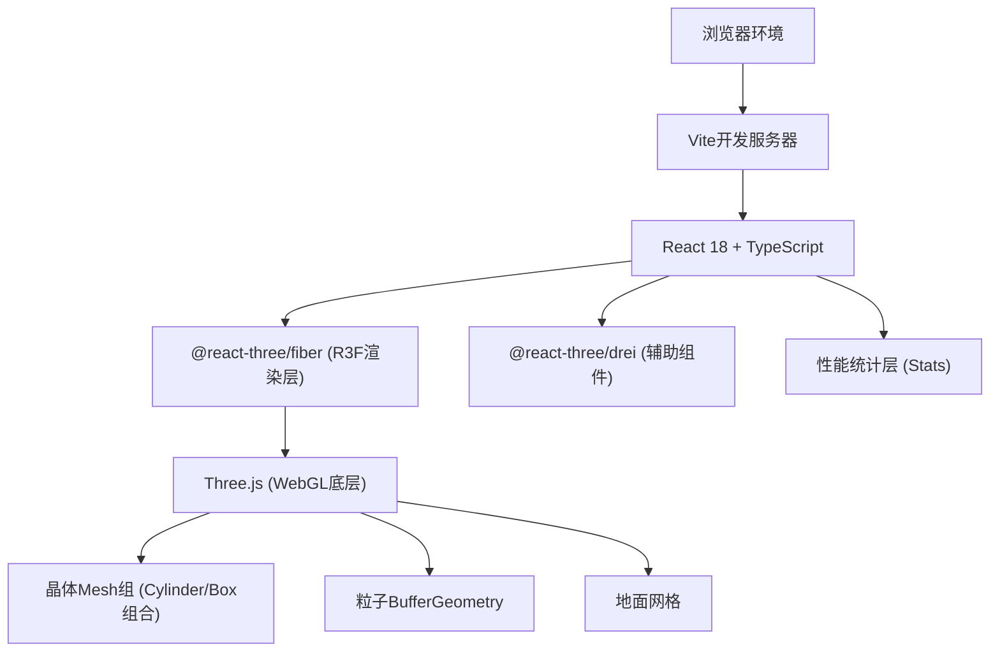
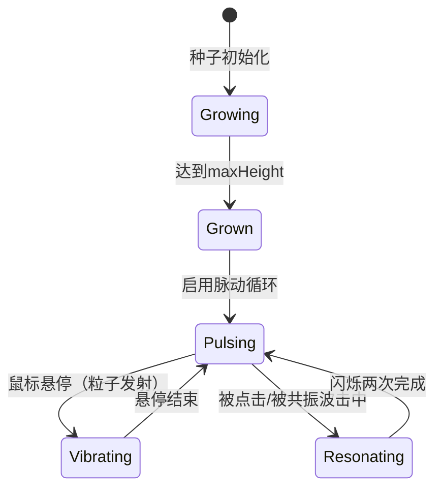

## 1. 架构设计



## 2. 技术说明

- **前端框架**：React 18 + TypeScript (严格模式, ES2020模块)
- **构建工具**：Vite + @vitejs/plugin-react (支持路径别名@/)
- **3D引擎**：Three.js + @react-three/fiber + @react-three/drei
- **后期处理**：@react-three/postprocessing (可选Bloom效果)
- **后端**：无 (纯前端静态应用)
- **数据库**：无 (所有状态为内存/帧内临时数据)

## 3. 目录结构与文件职责

```
auto77/
├── package.json              # 依赖与脚本配置
├── vite.config.js            # Vite构建配置 + 路径别名
├── tsconfig.json             # TS严格模式配置
├── index.html                # 入口页面 (全屏viewport)
└── src/
    ├── App.tsx               # 根组件: Canvas+背景+相机+Forest
    ├── components/
    │   ├── Forest.tsx        # 主逻辑: 晶体数组/生长循环/悬停/共振
    │   └── Crystal.tsx       # 单晶体: 几何体拼接/颤动/粒子接口
    └── utils/
        └── particleSystem.ts # 粒子系统: BufferGeometry生成/帧更新
```

## 4. 数据模型

### 4.1 晶体数据模型 (TypeScript Interface)

```typescript
interface CrystalData {
  id: number;
  seedX: number;           // 种子X位置 (圆盘分布)
  seedZ: number;           // 种子Z位置 (圆盘分布)
  height: number;          // 当前高度 (从0生长到maxHeight)
  maxHeight: number;       // 高度上限 2-4 随机
  shapeType: 'hexagon' | 'cone' | 'irregular'; // 晶体形状
  hue: number;             // 基础色相 120-300
  saturation: number;      // 饱和度 0.7-0.95
  lightness: number;       // 明度 0.3-0.6
  opacity: number;         // 透明度 0.3-0.9
  // 运行时状态
  isFullyGrown: boolean;   // 是否已达最大高度
  pulsePhase: number;      // 脉动相位 (生长完成后使用)
  pulseSpeed: number;      // 脉动频率 2-3秒/周期
  vibratePhase: number;    // 悬停颤动相位
  vibrateActive: boolean;  // 是否正在颤动
  brightnessBoost: number; // 共振时亮度提升 (1.0-1.5)
  resonanceShift: number;  // 共振色相偏移量
  resonanceFlashCount: number; // 剩余闪烁次数
}
```

### 4.2 粒子数据模型

```typescript
interface Particle {
  position: THREE.Vector3;
  velocity: THREE.Vector3;
  color: THREE.Color;
  life: number;       // 剩余生命值 (秒)
  maxLife: number;    // 最大生命值
}
```

## 5. 核心模块设计

### 5.1 App.tsx - 根组件
- R3F `<Canvas>` 配置：`camera={{ position: [0,5,10], fov: 50 }}`
- 背景色：`#0a0a2a`（深空蓝紫渐变可通过drei的GradientTexture或Shader实现）
- `<OrbitControls>`：enablePan=false，minDistance=3，maxDistance=20
- 引入 `<Forest>` 组件
- DOM层覆盖：性能监视器（左上）+ 操作提示（右下）

### 5.2 Forest.tsx - 主逻辑组件
- **状态管理**：`useState<CrystalData[]>` 保存50个晶体
- **初始化**：useEffect 一次性生成种子，使用极坐标随机：`r = 10 * sqrt(random), θ = 2π * random`
- **帧循环**：`useFrame((_, dt)` 内：
  1. 遍历更新每个晶体 height += 0.01（未达上限时）
  2. 生长完成后启用脉动：scale = 1 + 0.05 * sin(pulsePhase)
  3. 射线检测：使用Three.js Raycaster，监听pointermove，计算到晶体顶部距离
  4. 共振波扩散：点击后触发setTimeout链，半径3单位内晶体依次闪烁
- **渲染**：map遍历 `<Crystal key={id} data={crystal} />`

### 5.3 Crystal.tsx - 单晶体组件
- **几何体**：使用 CylinderGeometry（六棱柱/radiusTop收窄=尖锥）+ 顶部小ConeGeometry做不规则多面体拼接
- **材质**：MeshPhysicalMaterial，transparent=true，transmission（透射）模拟玻璃质感，配合自发光颜色
- **颤动动画**：vibrateActive时，position.y偏移 = 0.02 * sin(vibratePhase * 2π * (4~6Hz))
- **粒子触发**：悬停时调用particleSystem.emit(crystal.position, crystal.color)
- **颜色偏移**：共振时hue ±30度，闪烁两次后回到基础色相

### 5.4 particleSystem.ts - 粒子系统
- 使用共享 `BufferGeometry`，预分配最大粒子数（例如1000）位置/颜色数组
- `emit(origin: Vector3, color: Color, count=30)` 方法填充20-40颗新粒子
- `update(dt: number)` 每帧：位置 += 速度*dt，life -= dt，渐隐alpha，生命归零后重置到远处（或使用环形缓冲区复用索引）
- 材质：`PointsMaterial` + size=0.04，vertexColors=true，transparent=true，additive blending（发光叠加效果）

## 6. 性能优化策略

1. **几何体复用**：同类型晶体（hexagon/cone/irregular）共享Geometry实例
2. **BufferGeometry粒子**：避免逐粒子创建Mesh，统一Points渲染
3. **射线检测优化**：每帧仅做一次Raycast，缓存hover目标
4. **减少重渲染**：晶体属性通过ref直接修改three对象，不触发React re-render
5. **帧数控制**：`useFrame` 内使用delta time，确保60fps时生长速度正确

## 7. 交互状态机


